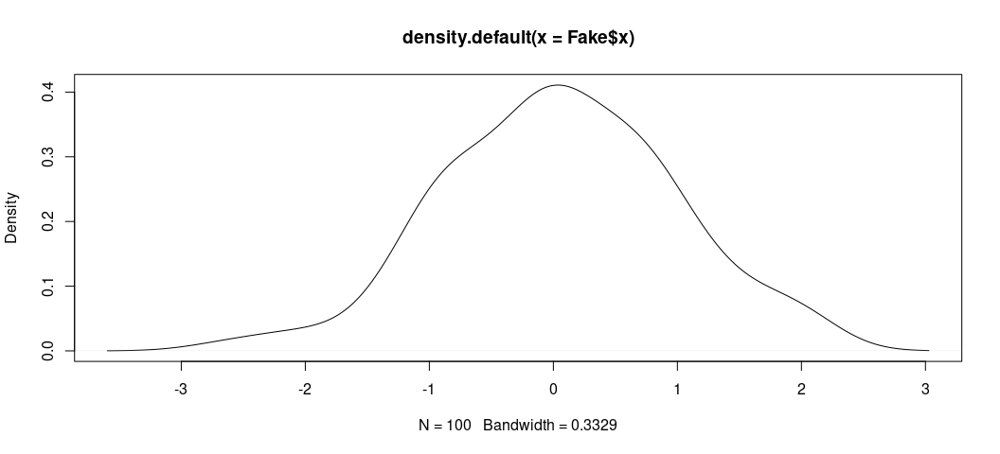
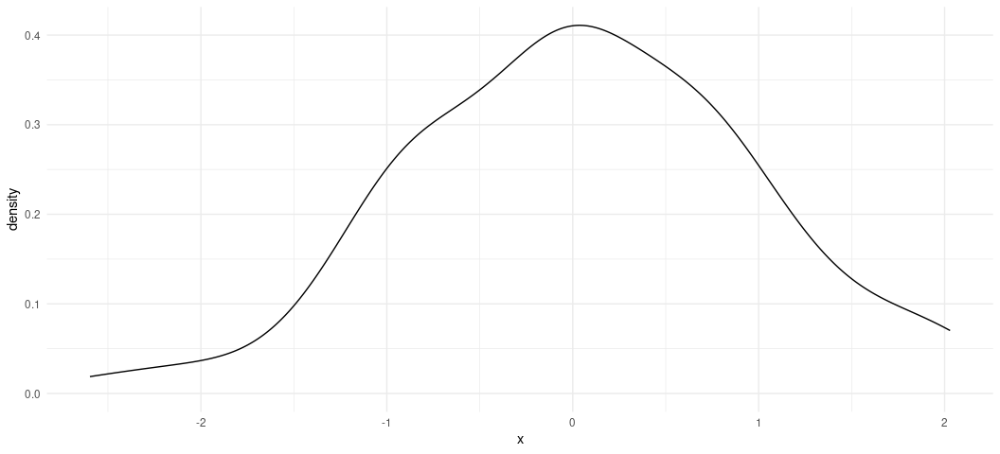
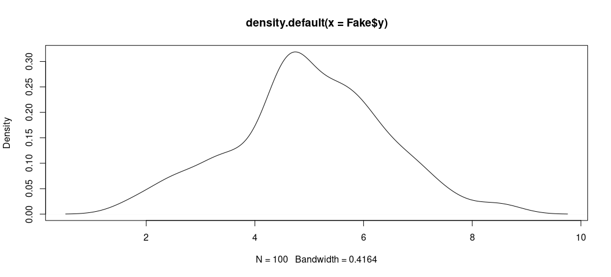

## R Packages/Data for This Session

You should’ve already installed the R packages for this lab session.
`{tidyverse}` will be for all things workflow and that’s all we’ll be
using today.

``` r
library(tidyverse)
#> ── Attaching core tidyverse packages ──────────────────────── tidyverse 2.0.0 ──
#> ✔ dplyr     1.1.2     ✔ readr     2.1.4
#> ✔ forcats   1.0.0     ✔ stringr   1.5.0
#> ✔ ggplot2   3.5.1     ✔ tibble    3.2.1
#> ✔ lubridate 1.9.2     ✔ tidyr     1.3.0
#> ✔ purrr     1.0.2     
#> ── Conflicts ────────────────────────────────────────── tidyverse_conflicts() ──
#> ✖ dplyr::filter() masks stats::filter()
#> ✖ dplyr::lag()    masks stats::lag()
#> ℹ Use the conflicted package (<http://conflicted.r-lib.org/>) to force all conflicts to become errors
```

For those of you wanting the packages we’ll be using today without
loading all of the {tidyverse}, run this. I won’t, but here are the
component packages.

``` r
# library(dplyr)    # the workhorse
# library(magrittr) # for the pipe
# library(tibble)   # for tibbles
# library(ggplot2)  # for plots
```

We’ll run one other command, because you may know how I feel by now
about `{ggplot2}`’s default theme. I have `{stevethemes}` and I’d really
like to use it here, but we want to stay strictly within `{tidyverse}`
today. So, we’ll do this.

``` r
theme_set(theme_minimal())
```

Cool beans. Let’s get going.

## Creating Fake Data to Learn About the Linear Model

The lecture uses actual (toy) data from the World Bank to introduce you
to the linear model in the bivariate case. Now, I think it might be time
for you to get it in the completely “fabricated” sense. In this lab
script, you are going to create data that you will use to learn more
about what the linear model with its OLS estimator is telling you (by
way of `lm()` output).

Take careful inventory of what’s going to happen here. We’re going to
set a reproducible seed, and then we’re going to create two new “random”
variables, called `x` and `e` from a normal distribution.

``` r
set.seed(8675309) # Jenny, I got your number...
tibble(x = rnorm(100),
       e = rnorm(100)) -> Fake

Fake
#> # A tibble: 100 × 2
#>          x       e
#>      <dbl>   <dbl>
#>  1 -0.997   0.745 
#>  2  0.722  -1.35  
#>  3 -0.617   0.330 
#>  4  2.03   -0.0127
#>  5  1.07   -0.464 
#>  6  0.987   0.205 
#>  7  0.0275  0.464 
#>  8  0.673  -0.757 
#>  9  0.572  -1.07  
#> 10  0.904  -0.263 
#> # ℹ 90 more rows
```

`x` is going to be our independent variable, which is exogenously
created prior to an observed outcome. `e` is going to be our error term,
which includes everything not included in the linear model. The presence
of an error term is an important assumption in OLS, and notice here that
the error term is created *independently from the x variable*. Yes,
they’re in the same data set, and yes they were created by the same
command. However, the generation of *x* and *e* are simultaneously
created, but completely independent from each other. If they were
correlated with each other, that would violate a major assumption about
endogeneity in the linear model (that we’ll belabor in another lab
script).

You can test that we successfully pulled this off with a correlation
test.

``` r
cor.test(Fake$x, Fake$e)
#> 
#>  Pearson's product-moment correlation
#> 
#> data:  Fake$x and Fake$e
#> t = 0.63308, df = 98, p-value = 0.5282
#> alternative hypothesis: true correlation is not equal to 0
#> 95 percent confidence interval:
#>  -0.1342806  0.2570170
#> sample estimates:
#>        cor 
#> 0.06382077
```

Notice that the correlation between *x* and *e* is about .06, but the
95% interval includes 0. The modest correlation we do observation is
indeed due to random chance.

Now, watch this. We’re going to create a new variable, *y*, that is a
linear function of *x* and *e*, plus some baseline value (intercept)
when *x* is 0.

``` r
Fake %>%
  mutate(y = 5 + x + e) -> Fake

Fake
#> # A tibble: 100 × 3
#>          x       e     y
#>      <dbl>   <dbl> <dbl>
#>  1 -0.997   0.745   4.75
#>  2  0.722  -1.35    4.38
#>  3 -0.617   0.330   4.71
#>  4  2.03   -0.0127  7.02
#>  5  1.07   -0.464   5.60
#>  6  0.987   0.205   6.19
#>  7  0.0275  0.464   5.49
#>  8  0.673  -0.757   4.92
#>  9  0.572  -1.07    4.51
#> 10  0.904  -0.263   5.64
#> # ℹ 90 more rows
```

Here’s how I want you to think about what you’re going to do here. By
simulating data to evaluate a model, you’re playing god to see how well
the model can capture the “true” parameters you’re generating. The
“true” value of *y* is 5 when *x* is 0. The “true” effect of *x* on *y*
is to increase *y* by 1 for every one-unit increase in *x*. The error
term here has equal footing to *x*, but recall that the error term (*e*)
includes everything else that influences *y* but is not included in the
model. It’s ultimately going to introduce noise into how well we can
capture the other true parameters.

The data are fake, sure, but the process of simulating so-called “random
variables” (drawn from a normal distribution with pre-defined
parameters) is useful for illustrating the properties of a statistical
model like this. It’ll also help to show what these data “look like.”
Here, for example, is the distribution of *x*. When you have granularity
in a variable like this (with so many trailing decimals), it’s useful to
jettison a bar chart or histogram (which has somewhat arbitrary bin
width) in favor of the density plot. The density plot may not have the
same easy takeaway as to what’s happening on the *y*-axis, but it’s
arguably more useful for getting the basic shape of a distribution.

There are two ways of doing this. Here’s the base R way.

``` r
plot(density(Fake$x))
```

<!-- -->

Here, we see the data look nice and “normal” with a clear central
tendency and a shape approximating a true bell curve.

Here’s the prettier ggplot way. ggplot stuff (by way of `{ggplot2}`)
comes default in `{tidyverse}`. Once you load `{tidyverse}`, you load
all the `{ggplot2}` functionality you could want.

``` r
Fake %>%
  ggplot(.,aes(x)) +
  geom_density() 
```

<!-- -->

`ggplot()`’s defaults want to draw attention to the fact that there’s
more a left skew than a right skew. In other words, the maximum of *x*
is ~2.02 whereas the minimum is about -2.59, but the shape of the data
still look normal. Any irregularities in shape could be attributed to
the fact we only drew 100 observations, which is fairly small set of
observations (all things considered).

We can do the same thing for the outcome variable *y*.

``` r
plot(density(Fake$y))
```

<!-- -->

Also, in `{ggplot2}` format…

``` r
Fake %>%
  ggplot(.,aes(y)) +
  geom_density()
```

<!-- -->

It’s worth reiterating the *y* is “endogenously” created, and the only
endogenous part of our data set. It is an outcome of two exogenous
variables (*x*, which we can measure, and *e*, which serves as a plug-in
for background noise in the underlying population).

Can OLS capture these known attributes about the data? We’ll use the
`lm()` function in R to find out. `lm()` is the base R function for
estimating linear models. It’s syntax is simple, especially in a simple
case like this. The two basic things you’ll want to feed it are the
formula, separated by a comma, then the name of the data set for which
you want to regress your dependent variable on your independent
variable(s). Here, we’re doing a super simple regression of *y* on *x*.
Then, we’ll get a summary of the model with `summary()`.

``` r
M1 <- lm(y ~ x, data=Fake)
summary(M1)
#> 
#> Call:
#> lm(formula = y ~ x, data = Fake)
#> 
#> Residuals:
#>     Min      1Q  Median      3Q     Max 
#> -2.5346 -0.7053  0.1223  0.7281  1.9631 
#> 
#> Coefficients:
#>             Estimate Std. Error t value Pr(>|t|)    
#> (Intercept)  4.94563    0.09956  49.677   <2e-16 ***
#> x            1.06807    0.10752   9.934   <2e-16 ***
#> ---
#> Signif. codes:  0 '***' 0.001 '**' 0.01 '*' 0.05 '.' 0.1 ' ' 1
#> 
#> Residual standard error: 0.994 on 98 degrees of freedom
#> Multiple R-squared:  0.5017, Adjusted R-squared:  0.4967 
#> F-statistic: 98.69 on 1 and 98 DF,  p-value: < 2.2e-16
```

Our question was whether OLS can capture the known population parameters
that we created. The answer is yes. Yes, it can. In a simple bivariate
case, you can see what this would look like visually with a scatterplot.
I want you to see what this is doing. First, we’re going to use our data
and, with the pipe operator (`%>%`), we’re going to pass the data to a
`ggplot()` function with a simple aesthetic (`aes()`) argument creating
an x-axis for `x` and `y` axis for `y`. Then, using `+` (which is the
`{ggplot2}` continuation operator), we’re going to create a scatterplot
with `geom_point()`. Then, using another continuation operator (`+`),
we’re going to use `geom_smooth()` to create a line of best fit for the
data. Importantly, you have to specify you want a linear smoother
(`method = "lm"`) to communicate what a simple bivariate case is doing.
The default is `method = "loess"`, which has its own nice features but
it’s not what we want here. Finally, we’re going to create two lines
over the plot. The first uses `geom_vline(xintercept = mean(Fake$x))` to
add a vertical line through the mean of `x`. The second uses
`geom_vline(yintercept = mean(Fake$y))` to create a horizontal line
through the mean of `y`. Notice that the line of best fit runs through
the intersection of both them.

``` r
Fake %>%
  ggplot(.,aes(x, y)) +
  geom_point() +
  geom_smooth(method = "lm") +
  geom_vline(xintercept = mean(Fake$x)) +
  geom_hline(yintercept = mean(Fake$y))
#> `geom_smooth()` using formula = 'y ~ x'
```

<!-- -->

## How to Evaluate Your Linear Model Output

This graph is great for visualizing a super simple bivariate case, but
things are never so simple. So, let’s walk through a little bit of the
important output from the model on its own terms. Let’s start with the
“coefficients”, since they are the main reason you’re doing this. We
mainly wanted to know if we could capture the “true” effect of *x* on
*y*. The “true” effect is 1. The OLS estimator says it’s about 1.06.
That’s technically wrong, sure, but the coefficient is what it is
because it’s also capturing the correlation between *x* and the error
term *e*, which we *don’t* get to include in the model. So, OLS says
it’s 1.06, which comes with a standard error of about .10. A standard
error below the estimate is about .961. A standard error above the
estimate is about 1.175.

Put another way, given estimation and fundamental uncertainty about the
model, our estimated effect of *x* on *y* is within a standard error of
what we know it actually is. We captured the true population parameter
of interest to us.

The other thing you want to know from your regression model is whether
the effect of your independent variable of interest on the dependent
variable is “statistically significant.” This term is very misleading,
to be frank. About 10 years ago, it appeared on this list of [scientific
ideas that scientists wish you’d stop
misusing](https://gizmodo.com/10-scientific-ideas-that-scientists-wish-you-would-stop-1591309822).
Briefly:

> “Statistically significant” is one of those phrases scientists would
> love to have a chance to take back and rename. “Significant” suggests
> importance; but the test of statistical significance, developed by the
> British statistician R.A. Fisher, doesn’t measure the importance or
> size of an effect; only whether we are able to distinguish it, using
> our keenest statistical tools, from zero. “Statistically noticeable”
> or “Statistically discernible” would be much better.

Notice what this means for what you’re doing. You’re not testing,
necessarily, whether you’ve identified the “true” effect when you
evaluate statistical significance. You’re testing whether you could rule
out something else: 0. That’s at least what gets returned to you here,
and the *t*-statistic that gets reported is conveniently just the
coefficient over the standard error. When the absolute value of that
*t*-statistic is large, and its associated *p*-value falls below some
threshold of interest to you, you can reject the null hypothesis and
assert that what you observed is highly improbable if the true effect is
0 with precision. That’s indeed the case here. The true effect is 1. We
observed 1.06. The *t*-statistic associated with that coefficient and
standard error is about 9.9. That’s comically large, given the
distribution of Student’s *t* for 98 degrees of freedom. The probability
of observing what we got is basically 0 if the true effect were 0 (and
it’s not, because it’s 1). So, you can reject the null hypothesis and
assert that what you got is closer to what it truly is, assuming
repeated sampling and fixed population parameters. The first part of
that may not apply here, but the second one does. We created the data.

### What About the Intercept?

You don’t evaluate “statistical significance” in the same way for the
*y*-intercept. There is no “null hypothesis” to note in the context of
the intercept. It’s just an estimate of *y* when *x* is 0. Here, we are
adequately capturing it’s true value (i.e. it’s actually 5, but we got
4.94). Dividing that estimated intercept over its standard error returns
a ridiculously large *t*-statistic that means you can comfortably rule
out 0. Then again, you weren’t testing that it’s 0. It’s just some
constant baseline for *y*.

Here’s another way of illustrating this. Let’s create another variable,
*y2*. It has this formula.

``` r
# I could alternatively write this as just `y2 = x + e`.
Fake %>%
  mutate(y2 = 0 + x  + e) -> Fake

Fake
#> # A tibble: 100 × 4
#>          x       e     y      y2
#>      <dbl>   <dbl> <dbl>   <dbl>
#>  1 -0.997   0.745   4.75 -0.252 
#>  2  0.722  -1.35    4.38 -0.625 
#>  3 -0.617   0.330   4.71 -0.287 
#>  4  2.03   -0.0127  7.02  2.02  
#>  5  1.07   -0.464   5.60  0.602 
#>  6  0.987   0.205   6.19  1.19  
#>  7  0.0275  0.464   5.49  0.491 
#>  8  0.673  -0.757   4.92 -0.0838
#>  9  0.572  -1.07    4.51 -0.493 
#> 10  0.904  -0.263   5.64  0.641 
#> # ℹ 90 more rows
```

Let’s run another regression.

``` r
M2 <- lm(y2 ~ x, Fake)
summary(M2)
#> 
#> Call:
#> lm(formula = y2 ~ x, data = Fake)
#> 
#> Residuals:
#>     Min      1Q  Median      3Q     Max 
#> -2.5346 -0.7053  0.1223  0.7281  1.9631 
#> 
#> Coefficients:
#>             Estimate Std. Error t value Pr(>|t|)    
#> (Intercept) -0.05437    0.09956  -0.546    0.586    
#> x            1.06807    0.10752   9.934   <2e-16 ***
#> ---
#> Signif. codes:  0 '***' 0.001 '**' 0.01 '*' 0.05 '.' 0.1 ' ' 1
#> 
#> Residual standard error: 0.994 on 98 degrees of freedom
#> Multiple R-squared:  0.5017, Adjusted R-squared:  0.4967 
#> F-statistic: 98.69 on 1 and 98 DF,  p-value: < 2.2e-16
```

Notice *x* is unaffected, but now the *y*-intercept is “statistically
insignificant?” Except that it’s not, because that’s not how you should
evaluate the *y*-intercept. The statistics you get back just tell you
the estimated value of *y* when *x* is 0 could be 0 (because that’s what
it is).

This is often why you’ll read regression tables that just outright omit
the *y*-intercept and take no effort to model them. I’ll only retort
that you may encounter or want to learn more complicated models, so
called “mixed (effects) models”, that include random intercepts for
different grouping clusters in a data set. For those models to converge,
they’ll often need a so-called “global” intercept in order to know
against what baseline a group may vary. This is why I encourage students
to get comfortable with scaling inputs into the model in order to create
more meaningful *y*-intercepts that, with real world data, might tell
the reader (and yourself) something about the typical value of *y*.

Indeed, that’s what the intercept is communicating here, plus-or-minus
error.

``` r
Fake %>%
  summarize(mean_y = mean(y),
            mean_y2 = mean(y2)) %>% data.frame
#>     mean_y     mean_y2
#> 1 5.001493 0.001493478
```

## Other Things You Should Know About Your OLS Model

I’ll go into the other things you should know about the OLS model, based
loosely on the order of importance of them.

### Fitted Values and Residuals

The OLS model draws a line of best fit through the data and that line of
best fit is the one that minimizes the sum of squared prediction errors.
This means there are estimates for a particular data point, given this
line of “best fit”, and invariably an “error” (which is the distance
between the estimated value of *y*, and what the “true” value of *y*
is).

In R speak, these are the fitted values and the residuals. The fitted
values are the estimated values of *y* for each data point (given the
regressors). You may also call these the *y*-hats. The residuals are the
distances between what was fitted and what the observation really is.
These are the estimates of *e* from the data-generating process.

You can extract them both pretty easily in R. Observe, for `M1`.

``` r
Fake %>%
  mutate(fitted = fitted(M1),
         resid = resid(M1)) -> Fake

Fake
#> # A tibble: 100 × 6
#>          x       e     y      y2 fitted   resid
#>      <dbl>   <dbl> <dbl>   <dbl>  <dbl>   <dbl>
#>  1 -0.997   0.745   4.75 -0.252    3.88  0.867 
#>  2  0.722  -1.35    4.38 -0.625    5.72 -1.34  
#>  3 -0.617   0.330   4.71 -0.287    4.29  0.427 
#>  4  2.03   -0.0127  7.02  2.02     7.11 -0.0965
#>  5  1.07   -0.464   5.60  0.602    6.08 -0.482 
#>  6  0.987   0.205   6.19  1.19     6.00  0.192 
#>  7  0.0275  0.464   5.49  0.491    4.97  0.516 
#>  8  0.673  -0.757   4.92 -0.0838   5.66 -0.748 
#>  9  0.572  -1.07    4.51 -0.493    5.56 -1.05  
#> 10  0.904  -0.263   5.64  0.641    5.91 -0.270 
#> # ℹ 90 more rows
```

Here’s a way to wrap your head around what this is telling you. For that
first row, the value of *x* is about -.997. The value of *y* is 4.75.
Given the line that minimizes the sum of squared prediction errors, the
coefficient for a one-unit change of *x* on *y* is about 1.06. The
*y*-intercept we estimate to be about 4.94.
`4.94 + 1.06*(-.997) = about 3.88`. That’s the fitted value of *y*. In
actuality, it’s about 4.75. 4.75 - 3.88 (alternatively: `y - y-hat` for
that observation) is about .867. That’s the error, or the residual you
see there. Do note there’s rounding error here for presentation, but
hopefully the principle is clear.

Of note, I don’t really know why R’s default `summary()` option includes
that kind of summary of the residuals *first*, but that’s the top thing
you see. Observe:

``` r
tibble(x = resid(M1)) %>%
  summarize(min = min(x),
            q1 = quantile(x, .25),
            median = median(x),
            q3 = quantile(x, .75),
            max = max(x)) %>% data.frame
#>       min         q1    median        q3      max
#> 1 -2.5346 -0.7053101 0.1223389 0.7280966 1.963144

summary(M1)
#> 
#> Call:
#> lm(formula = y ~ x, data = Fake)
#> 
#> Residuals:
#>     Min      1Q  Median      3Q     Max 
#> -2.5346 -0.7053  0.1223  0.7281  1.9631 
#> 
#> Coefficients:
#>             Estimate Std. Error t value Pr(>|t|)    
#> (Intercept)  4.94563    0.09956  49.677   <2e-16 ***
#> x            1.06807    0.10752   9.934   <2e-16 ***
#> ---
#> Signif. codes:  0 '***' 0.001 '**' 0.01 '*' 0.05 '.' 0.1 ' ' 1
#> 
#> Residual standard error: 0.994 on 98 degrees of freedom
#> Multiple R-squared:  0.5017, Adjusted R-squared:  0.4967 
#> F-statistic: 98.69 on 1 and 98 DF,  p-value: < 2.2e-16
```

Keep your fitted values and residuals handy, as they’ll be very useful
(really: necessary) information for model diagnostics. Another good way
of extracting them with the `augment()` function in the `{broom}`
package that is installed when you install `{tidyverse}`.

``` r
broom::augment(M1)
#> # A tibble: 100 × 8
#>        y       x .fitted  .resid   .hat .sigma  .cooksd .std.resid
#>    <dbl>   <dbl>   <dbl>   <dbl>  <dbl>  <dbl>    <dbl>      <dbl>
#>  1  4.75 -0.997     3.88  0.867  0.0229  0.995 0.00911      0.882 
#>  2  4.38  0.722     5.72 -1.34   0.0152  0.990 0.0143      -1.36  
#>  3  4.71 -0.617     4.29  0.427  0.0152  0.998 0.00145      0.432 
#>  4  7.02  2.03      7.11 -0.0965 0.0557  0.999 0.000295    -0.0999
#>  5  5.60  1.07      6.08 -0.482  0.0220  0.998 0.00270     -0.490 
#>  6  6.19  0.987     6.00  0.192  0.0202  0.999 0.000394     0.195 
#>  7  5.49  0.0275    4.97  0.516  0.0100  0.998 0.00138      0.522 
#>  8  4.92  0.673     5.66 -0.748  0.0145  0.996 0.00423     -0.758 
#>  9  4.51  0.572     5.56 -1.05   0.0132  0.993 0.00754     -1.06  
#> 10  5.64  0.904     5.91 -0.270  0.0185  0.999 0.000708    -0.274 
#> # ℹ 90 more rows
```

You obviously get other output with this function, which will come in
handy when we delve into model diagnostics in earnest.

### R-Squared

OLS textbooks sometimes encourage new students to read too much into
R-squared. Minimally, it tells you how well the model fits the data.
It’s bound between 0 and 1, and higher values = better fit. However, ask
yourself what primarily is the purpose of the regression model. Is it to
identify a causal effect? If so, those minimal OLS models regressing
some outcome *y* on a treatment will typically have very low R-squareds
even if the causal effect is identified. Is the goal to fit the data?
Then higher R-squared is obviously very nice but saturating the model
with regressors for the sake of juicing an R-squared may come with
biasing coefficients (making it more difficult to identify signals from
the din).

I do want to draw your attention to a few things. For one, in the simple
bivariate case, R-squared is quite literally Pearson’s *r*, squared.
Observe.

``` r
Fake %>% summarize(cor = cor(x, y), 
                   cor2 = cor^2) -> correlations

correlations
#> # A tibble: 1 × 2
#>     cor  cor2
#>   <dbl> <dbl>
#> 1 0.708 0.502
correlations %>% pull(2)
#> [1] 0.5017422
summary(M1)$r.squared
#> [1] 0.5017422
```

Second, you’ll see something called an adjusted R-squared. Simply, think
of this as a kind of penalty that downweights (sic?) the normal
(“multiple”) R-squared for the presence of additional parameters. It’s
why it’ll always want to be smaller than the other R-squared metric you
see. Here’s the hard way of calculating what comes default in R.

``` r
(1 - ((1-summary(M1)$r.squared)*(nobs(M1)-1)/(nobs(M1)-length(M1$coefficients))))
#> [1] 0.496658
```

In plain English: adjusted R-squared = `1 - (1 - R^2)*(n - 1)/n - k`. In
this case, the difference is small, but the adjusted R-squared is
telling you have more than one parameter here (i.e. the intercept).

Long story short: a high R-squared is nice, but it’s not necessary for
identifying a causal effect of *x* on *y*. There’s no agreement on what
a “good R-squared” looks like.

### Residual Standard Error

The residual standard error is the standard error of the residuals. It’s
not too hard to calculate in a simple case like this. Take the sum of
squared residuals and square those. Divide it over the degrees of
freedom in the model. There’s your residual standard error. You’ll see
the sum of squared residuals often referred to as the deviance of the
model.

``` r
sqrt(deviance(M1)/df.residual(M1)) 
#> [1] 0.9939681
sqrt(sum(resid(M1)^2)/98) 
#> [1] 0.9939681
```

There’s more you can do with that deviance. For example, does this look
familiar?

``` r
1 - (sum(resid(M1)^2)/(sum((Fake$y - mean(Fake$y))^2)))
#> [1] 0.5017422
```

It’s R-squared, right? You can also calculate R-squared as the deviance
over the total sum of squares. You might see that formula as
`1 - RSS/TSS` where the deviance is also known as the residual sum of
squares. You can also calculate R^2, more generally, as the sum of
fitted squares (so-called “Explained Squares”) over the total sum of
squares.

``` r
(sum((M1$fitted.values - mean(Fake$y))^2))/(sum((Fake$y - mean(Fake$y))^2))
#> [1] 0.5017422
```

### F-statistic

Simply, you’ll never use this. The F-statistic tests against a null
hypothesis that the model you estimate performs just as well as the
model that guesses just the mean of *y*. The moment you know anything
about your data-generating process is the moment you can start to safely
ignore this statistic. In our case, the F-statistic of 98.69 against 98
degrees of freedom comes with a *p*-value that is basically 0. This
model is better than an intercept-only model.

Want to fail this statistic? Do this.

``` r
Fake %>%
  mutate(noise = rnorm(100)) -> Fake

M3 <- lm(y ~ noise, data=Fake)
summary(M3)
#> 
#> Call:
#> lm(formula = y ~ noise, data = Fake)
#> 
#> Residuals:
#>     Min      1Q  Median      3Q     Max 
#> -3.2105 -0.6361 -0.1454  0.8449  3.5082 
#> 
#> Coefficients:
#>             Estimate Std. Error t value Pr(>|t|)    
#> (Intercept)  5.00114    0.14062  35.565   <2e-16 ***
#> noise       -0.07235    0.13833  -0.523    0.602    
#> ---
#> Signif. codes:  0 '***' 0.001 '**' 0.01 '*' 0.05 '.' 0.1 ' ' 1
#> 
#> Residual standard error: 1.406 on 98 degrees of freedom
#> Multiple R-squared:  0.002783,   Adjusted R-squared:  -0.007392 
#> F-statistic: 0.2735 on 1 and 98 DF,  p-value: 0.6022
```

See that *p*-value with that *F* statistic? I can’t say that this model
performs any better than an intercept only model. Well, duh.

## Conclusion

For now, take stock of the following things:

- *formula*: `lm()` is the function you want. You regress whatever your
  DV is on (`~`) whatever your independent variable (or variables) is
  called. If you have multiple IVs, it’ll be something like
  `y ~ x1 + x2`. Tell the formula your data come from whatever your data
  object is called.
- *coefficient*: the coefficient is the rise over run from the slope
  intercept equation, in as many words. A one-unit change in *x*
  coincides with an estimated change of \[INSERT COEFFICIENT VALUE
  HERE\] in *y*.
- *statistical significance*: you’re assessing the probability of what
  you observe (with the standard error) if the true effect is zero.
  Assess statistical significance by whatever evidentiary threshold you
  choose, but the convention is .05. Don’t bother interpreting
  “significance” for the intercept.
- *other model parameters*: R-square is nice when it’s high but it’s not
  necessary for identifying causal effects. Grabbing the fitted values
  and residuals from the model will be useful for important diagnostics.
