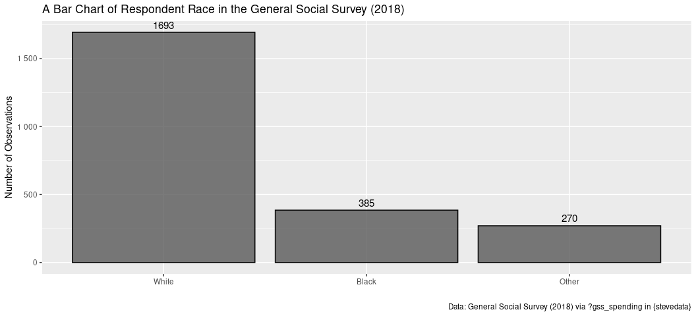
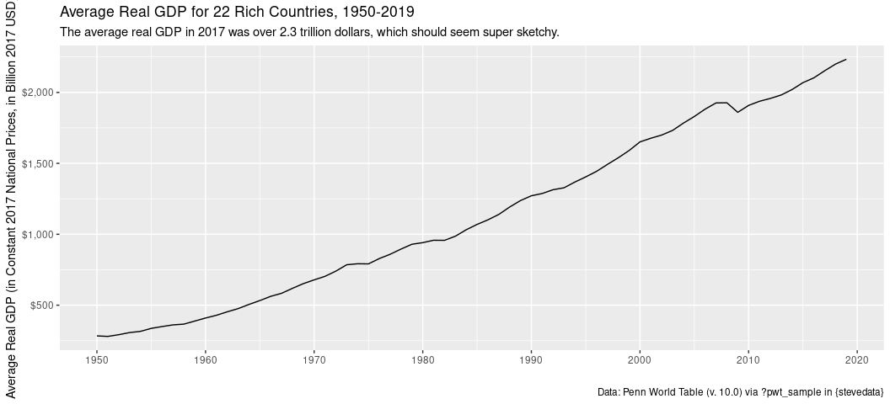
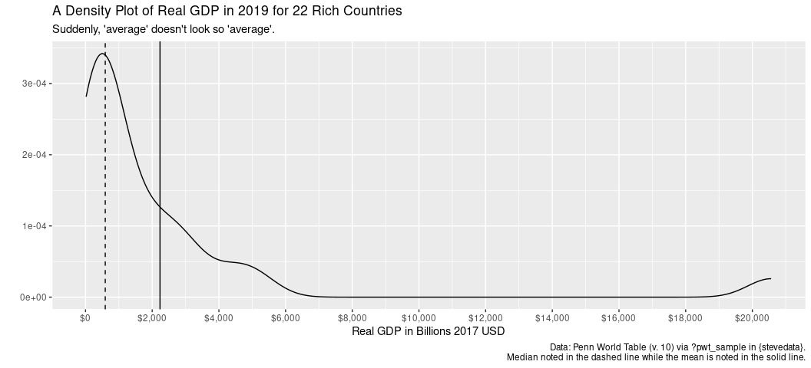
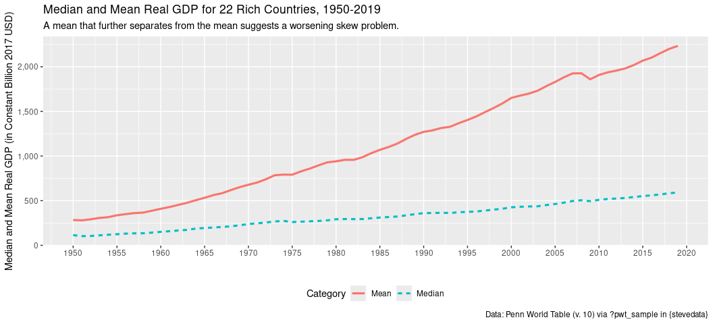
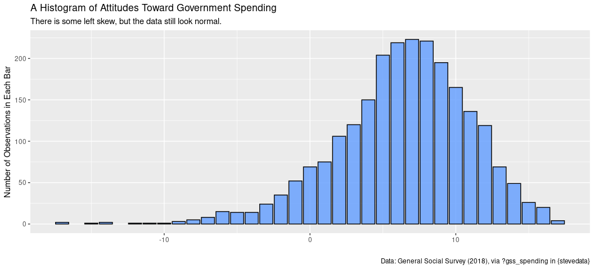
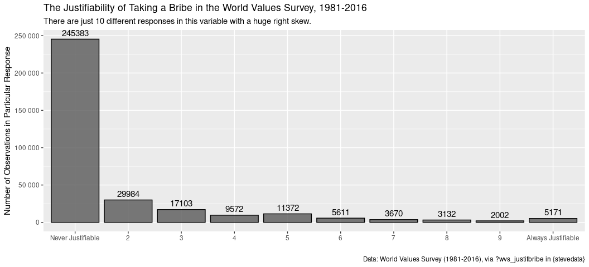

## R Packages/Data for This Session

You should’ve already installed the R packages for this lab session.
`{tidyverse}` will be for all things workflow and `{stevedata}` will be
for the toy data sets. Let’s load those libraries now. The order doesn’t
really matter here.

``` r
library(stevedata)
library(tidyverse)
#> ── Attaching core tidyverse packages ──────────────────────── tidyverse 2.0.0 ──
#> ✔ dplyr     1.1.1     ✔ readr     2.1.4
#> ✔ forcats   1.0.0     ✔ stringr   1.5.0
#> ✔ ggplot2   3.5.1     ✔ tibble    3.2.1
#> ✔ lubridate 1.9.2     ✔ tidyr     1.3.0
#> ✔ purrr     1.0.1     
#> ── Conflicts ────────────────────────────────────────── tidyverse_conflicts() ──
#> ✖ dplyr::filter() masks stats::filter()
#> ✖ dplyr::lag()    masks stats::lag()
#> ℹ Use the conflicted package (<http://conflicted.r-lib.org/>) to force all conflicts to become errors
```

One of you has an issue with `{tidyverse}` because of `{systemfonts}`.
These are basically the packages we’ll be using today with that in mind.
I won’t load them in this script, but you should “uncomment” (sic) them
and load them into your session.

``` r
# library(dplyr)
# library(tidyr)
# library(magrittr)
# library(ggplot2)
```

In your R session, please look up the documentation for the data set to
get a better idea as to what each variables are. Here’s how I want you
to think about this. You the smart researcher know that the `race`
column in `gss_spending` is a categorical variable where 1 = white
people, 2 = black people, and 3 = people who self-identify with another
race. However, your dumb computer and dumb R program don’t know that.
They just see numbers. You know the underlying information they
communicate. At least, you should know it.

I like to think my toy data sets are well annotated. If you want to read
the documentation file for one of my toy data sets, put a `?` before the
object name in the console. This should fire up the documentation file
in another Rstudio pane (i.e. where the plots typically go).

We’ll be using three toy data sets in this session. The first is
American attitudes toward national spending in the General Social Survey
(2018). The second is a sample of macroeconomic data from the Penn World
Table (from [the previous lab
session](http://eh6105.svmiller.com/lab-scripts/intro-r-rstudio.html)).
The third data set are attitudes about the justifiability of taking a
bribe in the World Values Survey.

``` r
# Check out documentation.
?gss_spending
?pwt_sample
?wvs_justifbribe
```

# Identifying Modes and Medians

If you know a variable of interest is discrete (i.e. it only has a
finite set of responses), your tools for assessing central tendency are
limited. There are two types here: unordered-categorical and
ordered-categorical. Unordered-categorical variables are cases where
numeric values communicate only differences. While we all learned in
elementary school that 2 is greater than 1, we gloss over that it’s also
true that 2 does not equal 1. They are distinct from each other.
Sometimes, we have a variable where that’s all the underlying
information available. Unordered-categorical variables are quite common
in the social sciences, even as we don’t necessarily like to acknowledge
them as such (because they are information-poor).

### Getting Modes for Unordered-Categorical Variables

For example, the `race` variable in the `gss_spending` is
unordered-categorical. We can see from the documentation that 1 = white,
2 = black, and 3 = other. However, we cannot say that 2 (black) is
greater than 1 (white) nor can we say that 3 (other) is two greater than
1 (white). Numerically, we know that’s true, but that’s just not the
information communicated in this variable. All we can say is that 2 != 1
(which is also true, but not something we really learned in grade school
math). Likewise, white != black.

Under those conditions, the most we can do with unordered-categorical
variables is to get the mode as an information-poor measure of central
tendency. The mode refers to the most commonly occurring value. R
doesn’t have a built-in mode function. That’s understandable since modes
aren’t very useful information and you can get it through other means.
However, we can write a simple function to extract the mode from a
variable.

``` r
# R doesn't have a built-in mode function. So let's write one.

getmode <- function(v) {
  uniqv <- unique(v)
  uniqv[which.max(tabulate(match(v, uniqv)))]
}

getmode(gss_spending$race)
#> [1] 1

gss_spending %>% summarize(mode = getmode(race))
#> # A tibble: 1 × 1
#>    mode
#>   <dbl>
#> 1     1
```

This tells us that there are more white people in the sample than there
are people identifying with any other race. This is not surprising. [We
already know](https://www.census.gov/quickfacts/fact/table/US/PST045219)
that white people are about 75% of the U.S. population (about 60%
disentangling out Hispanic \[like me\] as an ethnicity).

There are more creative means to get the mode and get more information
to boot. For example, here’s a “tidy” approach that leans on
`group_by()` and `count()`.

``` r
gss_spending %>%
  count(race) %>%
  # ^ you could stop here, but let's have more fun.
  # create more information...
  mutate(race_lab = c("White", "Black", "Other"),
         prop = n/sum(n)) %>%
  # creatively arrange the order of columns
  select(race, race_lab, everything())
#> # A tibble: 3 × 4
#>    race race_lab     n  prop
#>   <dbl> <chr>    <int> <dbl>
#> 1     1 White     1693 0.721
#> 2     2 Black      385 0.164
#> 3     3 Other      270 0.115
```

You could also graph this information. Do note I encourage using a
fancier `{ggplot2}` theme (like my `theme_steve()`) in `{stevethemes}`,
but this will do for this purpose.

``` r
gss_spending %>%
   count(race) %>%
   ggplot(., aes(as.factor(race), n)) +  
   geom_bar(color="black", alpha=0.8, stat="identity") +
   scale_y_continuous(labels = scales::comma_format(big.mark = " ")) +
   scale_x_discrete(labels = c("White","Black","Other")) +
   geom_text(aes(label=n), vjust=-.5, colour="black",
             position=position_dodge(.9), size=4) +
   labs(x = "",
        y = "Number of Observations",
        caption = "Data: General Social Survey (2018) via ?gss_spending in {stevedata}",
        title = "A Bar Chart of Respondent Race in the General Social Survey (2018)")
```

<!-- -->

### Getting Medians for Ordered-Categorical Variables

The second kind of discrete variable is called “ordered-categorical.”
These are variables where increasing (or decreasing) values communicate
“more” (or “less”) of some phenomenon being measured, but the distance
is inexact or even vague. Logically, ordered-categorical variables say 3
\> 1 where unordered-categorical variables say 3 != 1, though these
variables do not tell us that 3 is two greater than 1.

Ordered-categorical variables appear in several forms, but perhaps the
most common is a Likert item. Likert items give a statement to a
respondent and prompt the respondent to respond with their level of
agreement. This is often a five-point scale with responses of “strongly
disagree” (1), “disagree” (2), “neither agree nor disagree” (3), “agree”
(4), and “strongly agree” (5). If someone says they “strongly agree”
with the prompt, we can reasonably say they are in more agreement with
the prompt than someone who just “agrees”. But how much more are they in
agreement with the prompt? We can’t say because the only difference
between “strongly agree” and “agree” is a vague magnifier of “strongly”.
In other words, 5 \> 4, but 5 is not one greater than 4 in this context.

The most precise measure for central tendency for ordered-categorical
variables is the median. The median refers to the middlemost value where
half of the observations are above it and half of the observations are
below it. Fortunately, R has a built-in `median()` function. One
caution, though: if you have NAs in the column for which you want the
median, the output will return an NA. You can suppress that at your
discretion with `na.rm=T`.

Here’s an example of the highest degree obtained by the respondent in
the `gss_spending` data frame. Educational attainment is routinely
measured like this. Higher values = more educational attainment, which
broadly means “more education.” In the `gss_spending` data frame, the
`degree` variable assumes values of 0 (did not graduate high school), 1
(completed high school), 2 (completed junior college), 3 (completed
four-year bachelor’s equivalent), 4 (graduate degree). This would be the
median of that variable.

``` r
median(gss_spending$degree, na.rm=T)
#> [1] 1
```

That’s unsurprising the extent to which we know [only about 35% of
Americans have at least a four-year college
diploma](https://www.census.gov/newsroom/press-releases/2020/educational-attainment.html).

You can also calculate a cumulative percentage to get the same
information. The row where the cumulative percentage of responses
exceeds 50% is the row that contains the median.

``` r
gss_spending %>%
  count(degree) %>%
  mutate(degree_lab = c("Did Not Graduate HS", "High School", "Junior College", 
                        "Bachelor Degree", "Graduate Degree"),
         prop = n/sum(n),
         cumperc = cumsum(prop)*100) %>%
  select(degree, degree_lab, everything())
#> # A tibble: 5 × 5
#>   degree degree_lab              n   prop cumperc
#>    <dbl> <chr>               <int>  <dbl>   <dbl>
#> 1      0 Did Not Graduate HS   262 0.112     11.2
#> 2      1 High School          1178 0.502     61.3
#> 3      2 Junior College        196 0.0835    69.7
#> 4      3 Bachelor Degree       465 0.198     89.5
#> 5      4 Graduate Degree       247 0.105    100
```

## Identifying the Mean (and Standard Deviation)

Means are what would want in most applications, provided your data are
interval and could be plausibly described by the mean. The mean is the
statistical “average” of the data. They are reserved for data where
numerical values communicate exact differences.

For example, let’s go back to our `pwt_sample` data and calculate the
mean for the real GDP variable for each year, as well as the standard
deviation. Like the `median()` function, `mean()` and `sd()` throws up
an NA if there are missing observations. We can suppress that the same
way.

``` r
pwt_sample %>%
  summarize(mean_rgdpna = mean(rgdpna, na.rm=T),
            sd_rdgpna = sd(rgdpna, na.rm=T),
            .by = year)
#> # A tibble: 70 × 3
#>     year mean_rgdpna sd_rdgpna
#>    <int>       <dbl>     <dbl>
#>  1  1950     283633.   540370.
#>  2  1951     279853.   560884.
#>  3  1952     291816.   584176.
#>  4  1953     306871.   612224.
#>  5  1954     315290.   610298.
#>  6  1955     336535.   654213.
#>  7  1956     349391.   669280.
#>  8  1957     361120.   684516.
#>  9  1958     366450.   681544.
#> 10  1959     387933.   728801.
#> # ℹ 60 more rows
```

Remember to always look at your data before saying anything with
confidence about them, but a standard deviation that is larger than a
mean is usually a good indicator of a large, large spread in the data.
Since we’re dealing with GDP data you’ll have the GDPs of the United
States juxtaposed to Greece and Iceland, at least in this sample.

You can also graph this if you wanted to see mean real GDP over time for
these 22 countries.

``` r
pwt_sample %>%
  summarize(meanrgdp = mean(rgdpna, na.rm=T),
            .by = year) %>% 
  mutate(meanrgdpb = meanrgdp/1000) %>%
  ggplot(.,aes(year, meanrgdpb)) + 
  geom_line() +
  scale_x_continuous(breaks = seq(1950, 2020, by = 10)) +
  scale_y_continuous(labels = scales::dollar_format()) +
  labs(x = "",
       y = "Average Real GDP (in Constant 2017 National Prices, in Billion 2017 USD)",
       caption = "Data: Penn World Table (v. 10.0) via ?pwt_sample in {stevedata}",
       title = "Average Real GDP for 22 Rich Countries, 1950-2019",
       subtitle = "The average real GDP in 2017 was over 2.3 trillion dollars, which should seem super sketchy.")
```

<!-- -->

Nothing looks terribly amiss in that line chart, per se. You see a
little recession effect. You see the “lostness” of the 1970s, at least a
little. However, something is. Did you notice that the average real GDP
for these 22 countries in 2019 was over 2 trillion dollars? Something
seems fishy about that, because it is. These data are 22 select rich
countries, but the United States has an enormous GDP among even those
select rich countries. I use these data to underscore a basic problem
with the arithmetic mean for continuous variables: it is *very
sensitive* to skew (here: right skew). The U.S. is a clear anomaly among
these select rich countries. Indeed, it looks like the U.S. is four
times the size of the next biggest economy in 2019 and is about as big
as the next seven biggest economies (in these data) combined.

``` r
pwt_sample %>%
  filter(year == 2019) %>%
  mutate(rgdpb = rgdpna/1000) %>%
  select(country, year, rgdpb) %>%
  arrange(-rgdpb) %>%
  data.frame(.)
#>                     country year       rgdpb
#> 1  United States of America 2019 20563.59200
#> 2                     Japan 2019  5095.62350
#> 3                   Germany 2019  4312.88600
#> 4            United Kingdom 2019  3015.58275
#> 5                    France 2019  2963.64075
#> 6                     Italy 2019  2467.12875
#> 7                     Spain 2019  1895.66900
#> 8                    Canada 2019  1873.62525
#> 9                 Australia 2019  1315.58125
#> 10              Netherlands 2019   960.96438
#> 11              Switzerland 2019   648.57969
#> 12                  Belgium 2019   534.58587
#> 13                   Sweden 2019   531.64131
#> 14                  Austria 2019   476.65728
#> 15                  Ireland 2019   472.53750
#> 16                    Chile 2019   443.55059
#> 17                   Norway 2019   377.59797
#> 18                 Portugal 2019   329.15109
#> 19                  Denmark 2019   311.12172
#> 20                   Greece 2019   289.44516
#> 21                  Finland 2019   247.93434
#> 22                  Iceland 2019    17.63955
```

This is why economic indicators are often expressed by the median rather
than the mean. The mean is sensitive to outlier observations whereas the
median is robust to them. When you describe your interval-level
variables, do a quick comparison between the median and the mean to see
how far off the median is from the mean. Where the distance is large, it
points in the problem of outlier observations.

``` r
pwt_sample %>%
  filter(year == 2019) %>%
  mutate(rgdpb = rgdpna/1000) %>%
  ggplot(.,aes(rgdpb)) + 
  geom_density() +
  geom_vline(aes(xintercept = median(rgdpb, na.rm = T)), linetype="dashed") +
  geom_vline(aes(xintercept = mean(rgdpb, na.rm = T))) +
  scale_x_continuous(breaks = seq(0, 20000,by=2000),
                     labels = scales::dollar_format()) +
  labs(title = "A Density Plot of Real GDP in 2019 for 22 Rich Countries",
       x = "Real GDP in Billions 2017 USD",
       y = "",
       caption = "Data: Penn World Table (v. 10) via ?pwt_sample in {stevedata}.\nMedian noted in the dashed line while the mean is noted in the solid line.",
       subtitle = "Suddenly, 'average' doesn't look so 'average'.")
```

<!-- -->

Here’s another way of looking at it: plotting the yearly mean against
the yearly median. The extent to which the mean further separates from
the median implies a skew problem that is getting worse over time.

``` r
pwt_sample %>%
  mutate(rgdpb = rgdpna/1000) %>%
  summarize(Median = median(rgdpb, na.rm=T),
            Mean = mean(rgdpb, na.rm=T),
            .by = year) %>%
  gather(Category, value, Median:Mean, -year) %>%
  ggplot(.,aes(year,value, color=Category, linetype=Category)) +
  geom_line(linewidth=1.1) +
  scale_x_continuous(breaks = seq(1950, 2020, by =5)) +
  scale_y_continuous(labels = scales::comma) +
  theme(legend.position = "bottom") + labs(x = "",
       y = "Median and Mean Real GDP (in Constant Billion 2017 USD)",
       caption = "Data: Penn World Table (v. 10) via ?pwt_sample in {stevedata}",
       title = "Median and Mean Real GDP for 22 Rich Countries, 1950-2019",
       subtitle = "A mean that further separates from the mean suggests a worsening skew problem.")
```

<!-- -->

## An Aside: On “Dummy” Variables

I want to dedicate a special comment here to what are commonly called
“dummy” variables. “Dummy” variables (aka binary variables) are
variables that take on just two values—functionally 0 or 1. While some
dummies have an intuitive order (e.g. “democracy” vs. “not democracy”
implies “more democracy”), the phenomenon being measured is strictly
“there” or “not there.” This means they are a unique subset of nominal
variables, effectively saying they are unordered-categorical with just
two categories (“there” or “not there”, “success” vs. “fail”).

That said, I liken them to the carbon or water of the variable world in
that they behave in interesting ways and have some interesting
peculiarities/properties. With respect to central tendency, the mode and
median of a dummy variable will be the same value and the mean will
communicate the proportion of 1s. This assumes that your dummies are
recoded to 0/1, which you should *always* do. Dummies are often provided
to you as 1/2. Always recode those.

Let’s see what this looks like with the `sex` variable in
`gss_spending`. `sex` is a numeric vector for the respondent’s sex,
either female (1) or male (0).

``` r
gss_spending %>%
  # where sex = 1 for women, 0 for men
  summarize(mode = getmode(sex),
            median = median(sex),
            mean = mean(sex))
#> # A tibble: 1 × 3
#>    mode median  mean
#>   <dbl>  <dbl> <dbl>
#> 1     1      1 0.552
```

The above tells me that there are more women than men in the data (the
mode), the middlemost observation is a woman on this dummy variable (the
median), and that about 55.2% of the observations are women (the mean).

## An Aside: Ordinal or Interval? Or Something Else?

Practitioners love to treat technically ordinal data as interval.
There’s more you can do with an interval-level variable than you can
with an ordinal (ordered-categorical) variable. However, you have to ask
yourself just how advisable this is. For example, take yourself back to
college when you just turned 21. Are you truly one year older than your
20-year-old friend when it comes to identification at the off-campus
bar? Legally you are, but you might just be three weeks older than your
20-year-old friend. Here, you have information loss in the form of
days/weeks. Is someone who lists their yearly income at \$50,010 truly
10 dollars richer than someone who lists their yearly income at
\$50,000? Legally they are (i.e. Uncle Sam cares about dollars, not
cents), but you have information loss in the form of cents.

That said, we often describe age by reference to an average and we can
(provided there are no major issues of skew) understand an average
income. Certainly, practitioners would go-go-gadget a mean on those
variables. Here’s a general rule of thumb that I haven’t seen anyone
formalize out loud (even if there’s supporting scholarship you’ll read
for this) but nonetheless guides how we do this. First, check the number
of possible values. Second, check the skew. If you have at least 5—I
would caution at least 7, even to 10)—distinct values, you can *start*
to think of it as interval. However, check the distribution of the
variable. If you have a major skew problem, *don’t* treat it as interval
and consider another approach to modeling your variable.

Age is technically ordinal, but there are typically a wide number of
distinct ages in survey data spanning from 18 to the 80s and beyond.
Therein, differences between observations are granular enough that means
with decimals make some sense. Below, the mean is about 48.97. You can
reasonably conceptualize that as an average age of 48 that is 97% of the
way to turning 49.

``` r
gss_spending %>%
  summarize(mean = mean(age, na.rm=T),
            median = median(age, na.rm=T),
            distinct = n_distinct(age))
#> # A tibble: 1 × 3
#>    mean median distinct
#>   <dbl>  <dbl>    <int>
#> 1  49.0     48       73
```

Caveat, naturally: don’t try to explain age as some outcome if you’re
thinking ahead to a linear model. Age is a linear function of time. :P

The `sumnat` variable in my `gss_spending` data frame summarizes all
responses to spending toward all programs from the ordinal scale
provided in the original prompts (again: `?gss_spending` for more). It
has a small skew problem to the left, but it’s cast across 33 different
values.

``` r
gss_spending %>%
  summarize(mean = mean(sumnat, na.rm=T),
            median = median(sumnat, na.rm=T),
            distinct = n_distinct(sumnat))
#> # A tibble: 1 × 3
#>    mean median distinct
#>   <dbl>  <dbl>    <int>
#> 1  6.37      7       33
```

A diagnostic graph doesn’t suggest a major problem for skew either. It’s
not a disservice to this variable to summarize it with a mean.

``` r
gss_spending %>%
  ggplot(.,aes(sumnat)) +
  geom_bar(alpha=0.8, fill="#619cff",color="black") +
  labs(title = "A Histogram of Attitudes Toward Government Spending",
       subtitle = "There is some left skew, but the data still look normal.",
       caption = "Data: General Social Survey (2018), via ?gss_spending in {stevedata}",
       x = "", y = "Number of Observations in Each Bar")
```

<!-- -->

Some variables, however, are too damn ugly to think of as interval the
extent to which you want informative means and so on. Here’s an example
from the World Values Survey regarding the justifiability of taking a
bribe. This is part of a series of World Values Survey items where the
researcher lists various behaviors (e.g. abortion, divorce,
homosexuality, here: taking a bribe) and the respondent lists how
justifiable they think it is on a 1-10 scale. 10 = always justifiable. 1
= never justifiable. Here would be the summary statistics.

``` r
wvs_justifbribe %>%
  na.omit %>%
  summarize(mean = mean(f117, na.rm=T),
            median = median(f117, na.rm=T),
            distinct = n_distinct(f117))
#> # A tibble: 1 × 3
#>    mean median distinct
#>   <dbl>  <dbl>    <int>
#> 1  1.80      1       10
```

I’m anticipating a problem here. The mean is almost one off the median
with just 10 distinct values. A graph will bring the problem in full
light.

``` r
wvs_justifbribe %>%
  count(f117) %>%
  na.omit %>% # count() will also summarize the NAs, which we don't want.
  ggplot(.,aes(as.factor(f117), n)) +
  geom_bar(stat="identity", alpha=0.8, color="black") +
  scale_x_discrete(labels=c("Never Justifiable", "2", "3", "4",
                            "5", "6", "7", "8", "9", "Always Justifiable")) +
  scale_y_continuous(labels = scales::comma_format(big.mark = " ")) +
  geom_text(aes(label=n), vjust=-.5, colour="black",
            position=position_dodge(.9), size=4) +
  labs(y = "Number of Observations in Particular Response",
       x = "",
       title = "The Justifiability of Taking a Bribe in the World Values Survey, 1981-2016",
       caption = "Data: World Values Survey (1981-2016), via ?wvs_justifbribe in {stevedata}",
       subtitle = "There are just 10 different responses in this variable with a huge right skew.")
```

<!-- -->

Here’s what I recommend doing in an admittedly extreme situation like
this. First, no matter the 10 different values, *don’t* ask for a mean
from this. A mean won’t be terribly informative because the data have a
huge skew problem and a finite scale of possible responses. Two, the
median is at the most you can get here, but I’d caution against treating
it as useful information as well. Again, there’s a huge skew. Third, for
an extreme situation like this where more than 70% of the data are in
just one response, collapse the variable into a dummy variable. In this
case, 0 = taking a bribe is never justifiable and 1 = taking a bribe is
at least somewhat justifiable. I [did something like this with the exact
question](http://svmiller.com/research/external-territorial-threats-and-tolerance-of-corruption-a-privategovernment-distinction/);
others have too. Here’s how you’d basically do it. Your data basically
look like this.

``` r
wvs_justifbribe
#> # A tibble: 348,532 × 6
#>     s002  s003 country    s020   uid  f117
#>    <dbl> <dbl> <chr>     <dbl> <int> <dbl>
#>  1     1    32 Argentina  1984     1     1
#>  2     1    32 Argentina  1984     2     1
#>  3     1    32 Argentina  1984     3     1
#>  4     1    32 Argentina  1984     4     4
#>  5     1    32 Argentina  1984     5     5
#>  6     1    32 Argentina  1984     6     5
#>  7     1    32 Argentina  1984     7     5
#>  8     1    32 Argentina  1984     8     4
#>  9     1    32 Argentina  1984     9     1
#> 10     1    32 Argentina  1984    10     1
#> # ℹ 348,522 more rows

wvs_justifbribe %>%
  mutate(never_justifiable = ifelse(f117 == 1, 1, 0),
         somewhat_justifiable = ifelse(f117 == 1, 0, 1)) %>%
  select(uid, f117, never_justifiable:ncol(.)) 
#> # A tibble: 348,532 × 4
#>      uid  f117 never_justifiable somewhat_justifiable
#>    <int> <dbl>             <dbl>                <dbl>
#>  1     1     1                 1                    0
#>  2     2     1                 1                    0
#>  3     3     1                 1                    0
#>  4     4     4                 0                    1
#>  5     5     5                 0                    1
#>  6     6     5                 0                    1
#>  7     7     5                 0                    1
#>  8     8     4                 0                    1
#>  9     9     1                 1                    0
#> 10    10     1                 1                    0
#> # ℹ 348,522 more rows
```

You want to use the `mutate()` function to create a dummy variable
whereby if `f117` is 1, it’s 0. If it’s greater than 1, code it as 1.
Let’s use the `mutate()` wrapper to create a new `bribe_dummy` variable
that has this information. Pay careful attention to what the
`case_when()` function is doing in this context.

``` r
# Take our data frame, and...
wvs_justifbribe %>%
  # use the mutate() function to create a new column, using case_when(), where...
  mutate(bribe_dummy = case_when(
    # if f117 == 1, it's 0
    f117 == 1 ~ 0,
    # if it's f117 > 1 (or %in% c(2:10)), it's 1
    f117 > 1  ~ 1,
    # if it's anything else (here: NA), keep it as NA.
    TRUE ~ NA_real_
  )) -> Data # Create a new data object for now.
```

Let’s see what this did.

``` r
Data %>%
  distinct(f117, bribe_dummy) 
#> # A tibble: 11 × 2
#>     f117 bribe_dummy
#>    <dbl>       <dbl>
#>  1     1           0
#>  2     4           1
#>  3     5           1
#>  4     6           1
#>  5     2           1
#>  6     3           1
#>  7    NA          NA
#>  8     7           1
#>  9     8           1
#> 10     9           1
#> 11    10           1
```

Congrats on recoding your first variable! Notice too how you created a
new column that did not overwrite the original, so you can always
troubleshoot what you did to see if you messed up somewhere. Btw, since
I know this is going to be something you’ll need to know to do for a
homework question I’ll ask, let’s assume we’re interested in those that
are `NA` here. `NA` can mean multiple things, but what if we just assume
that they’re people that are withholding what they think about taking a
bribe and we want to perhaps understand that as a kind of dependent
variable? Here’s how we’d do that.

``` r
# Taking our data frame, and...

Data %>%
  # ...using mutate() to create a new column in the data where,
  # using case_when()
  mutate(missing_f117 = case_when(
    # if it's missing, it's a 1
    is.na(f117) ~ 1,
    # if it's anything else (`TRUE` in case_when() speak), it's 0 
    TRUE ~ 0
  )) -> Data # assign to object
```

Let’s see what this did.

``` r
Data %>% 
  distinct(f117, missing_f117)
#> # A tibble: 11 × 2
#>     f117 missing_f117
#>    <dbl>        <dbl>
#>  1     1            0
#>  2     4            0
#>  3     5            0
#>  4     6            0
#>  5     2            0
#>  6     3            0
#>  7    NA            1
#>  8     7            0
#>  9     8            0
#> 10     9            0
#> 11    10            0
```
