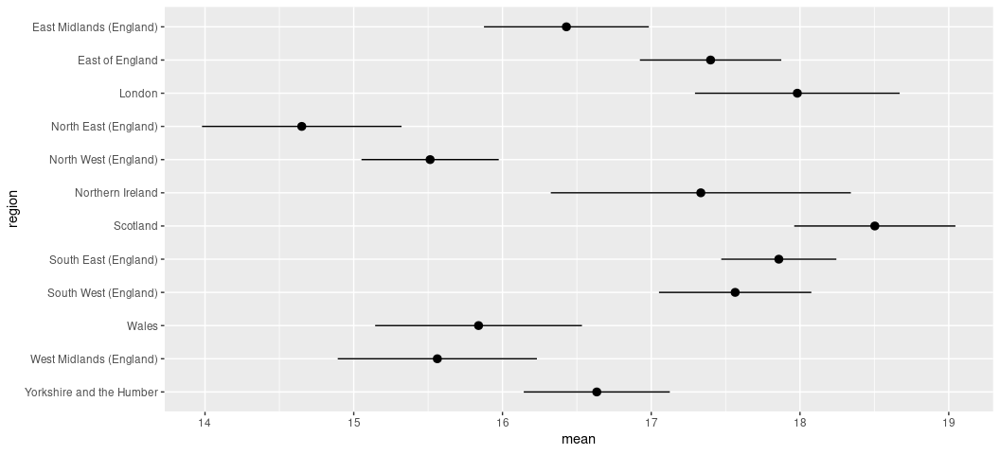
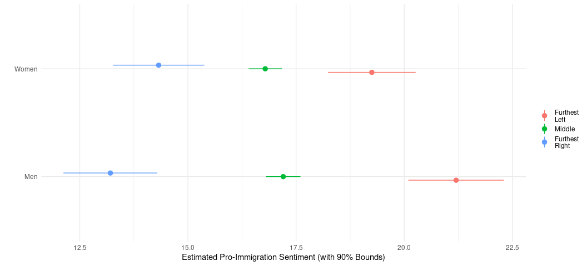

# R Packages/Data for This Session

You should’ve already installed the R packages for this lab session.
`{tidyverse}` will be for all things workflow and `{stevedata}` will
have the data sets we’ll be using today.

``` r
library(tidyverse)
#> ── Attaching core tidyverse packages ──────────────────────── tidyverse 2.0.0 ──
#> ✔ dplyr     1.1.1     ✔ readr     2.1.4
#> ✔ forcats   1.0.0     ✔ stringr   1.5.0
#> ✔ ggplot2   3.5.1     ✔ tibble    3.2.1
#> ✔ lubridate 1.9.2     ✔ tidyr     1.3.0
#> ✔ purrr     1.0.1     
#> ── Conflicts ────────────────────────────────────────── tidyverse_conflicts() ──
#> ✖ dplyr::filter() masks stats::filter()
#> ✖ dplyr::lag()    masks stats::lag()
#> ℹ Use the conflicted package (<http://conflicted.r-lib.org/>) to force all conflicts to become errors
library(stevedata)

# For those of you without `{tidyverse}`, do this:
# library(dplyr)
# library(tibble)
# library(magrittr)
# library(forcats)
# library(ggplot2)
```

## Building Toward Multiple Regression

Last time we had a lab, we just focused on bivariate linear model with
fake data that we created. The goal of that exercise was to show you
what the linear model looked like when you had maximum control over the
model parameters. We’ll use some actual data this time. This is a survey
data set from the United Kingdom in 2018-19, largely probing individual
attitudes toward immigration. You can find out more about this data set
by typing `?ESS9GB` into Rstudio. You can also [go
here](http://svmiller.com/stevedata/reference/ESS9GB.html) for a web
version of the codebook.

``` r
ESS9GB
#> # A tibble: 1,905 × 19
#>    name      essround edition  idno cntry region   brncntr stintrvw   endintrvw 
#>    <chr>        <dbl> <chr>   <dbl> <chr> <chr>      <dbl> <date>     <date>    
#>  1 ESS9e01_2        9 1.2        39 GB    West Mi…       1 2018-09-11 2018-09-11
#>  2 ESS9e01_2        9 1.2       135 GB    South W…       1 2018-09-07 2018-09-07
#>  3 ESS9e01_2        9 1.2       142 GB    South E…       1 2018-11-03 2018-11-03
#>  4 ESS9e01_2        9 1.2       146 GB    Norther…       1 2018-10-06 2018-10-17
#>  5 ESS9e01_2        9 1.2       164 GB    Norther…       1 2018-10-31 2018-10-31
#>  6 ESS9e01_2        9 1.2       191 GB    Norther…       1 2018-10-27 2018-10-27
#>  7 ESS9e01_2        9 1.2       213 GB    South W…       1 2018-11-08 2018-11-08
#>  8 ESS9e01_2        9 1.2       238 GB    London         1 2019-01-31 2019-01-31
#>  9 ESS9e01_2        9 1.2       245 GB    East of…       1 2018-09-07 2018-09-07
#> 10 ESS9e01_2        9 1.2       265 GB    East Mi…       1 2019-02-10 2019-02-10
#> # ℹ 1,895 more rows
#> # ℹ 10 more variables: imbgeco <dbl>, imueclt <dbl>, imwbcnt <dbl>,
#> #   immigsent <dbl>, agea <dbl>, female <dbl>, eduyrs <dbl>, uempla <dbl>,
#> #   hinctnta <dbl>, lrscale <dbl>
```

You can also see read some blog posts where I make considerable use of
these data here:

- [What Do We Know About British Attitudes Toward Immigration? A
  Pedagogical Exercise of Sample Inference and
  Regression](http://svmiller.com/blog/2020/03/what-explains-british-attitudes-toward-immigration-a-pedagogical-example/)
- [How Should You Think About Your Priors for a Bayesian
  Analysis?](http://svmiller.com/blog/2021/02/thinking-about-your-priors-bayesian-analysis/)

Understand that some of that is slightly more complex than what we’ll be
doing here, but I’d rather inundate you with things to look at and read
rather than give you nothing at all.

Our primary dependent variable in this model will be the `immigsent`
variable, which is an additive index of three variables also included in
the data set. These prompts, verbatim, each range from 0 to 10 and
ask 1) Would you say it is generally bad or good for the United
Kingdom’s economy that people come to live here from other countries?
(`imbgeco`), 2) And… would you say that the United Kingdom’s cultural
life is generally undermined or enriched by people coming to live here
from other countries? (`imueclt`), and 3) Is the United Kingdom made a
worse or a better place to live by people coming to live here from other
countries? (`imwbcnt`). The `immigsent` variable simply adds all three
together, resulting in a scale that ranges from 0 to 30. You can
interpret 0 as being maximally anti-immigrant/immigration and 30 being
maximally pro-immigrant/immigration. Higher values = more
pro-immigration sentiment. Let’s build toward multiple regression by
starting in the simple bivariate, like we did in lecture. We’ll start by
exploring an uncontroversial argument that we should expect
pro-immigration sentiment to be much lower in North East than other
parts of the United Kingdom. Why “North East”? This is the region where
Newcastle is. Newcastle, rightly or wrongly, has a reputation of being
[“Brexit
Central”.](https://bylinetimes.com/2019/07/17/calling-the-north-east-of-england-brexit-central-is-simplistic-and-snobbish/)
We have the means to explore this with the `region` variable. Let’s take
a look at it.

``` r
ESS9GB %>% distinct(region)
#> # A tibble: 12 × 1
#>    region                  
#>    <chr>                   
#>  1 West Midlands (England) 
#>  2 South West (England)    
#>  3 South East (England)    
#>  4 Northern Ireland        
#>  5 London                  
#>  6 East of England         
#>  7 East Midlands (England) 
#>  8 North West (England)    
#>  9 Scotland                
#> 10 Yorkshire and the Humber
#> 11 North East (England)    
#> 12 Wales
```

Perfect. I see I have 12 familiar regions to me in the data to explore,
but I have no “North East” dummy variable. No matter, it’s a simple
matter to create one like this.

``` r
ESS9GB %>%
  mutate(northeast = ifelse(region == "North East (England)", 1, 0)) -> Data
```

Note: I’m creating a new data frame here for convenience sake.

Now let’s do a simple regression, regressing the immigration sentiment
variable on whether the respondent is in the North East.

``` r
M1 <- lm(immigsent ~ northeast, data=Data)
summary(M1)
#> 
#> Call:
#> lm(formula = immigsent ~ northeast, data = Data)
#> 
#> Residuals:
#>      Min       1Q   Median       3Q      Max 
#> -17.0235  -4.0235   0.9765   4.9765  15.3495 
#> 
#> Coefficients:
#>             Estimate Std. Error t value Pr(>|t|)    
#> (Intercept)  17.0235     0.1668 102.051  < 2e-16 ***
#> northeast    -2.3730     0.7070  -3.357 0.000805 ***
#> ---
#> Signif. codes:  0 '***' 0.001 '**' 0.01 '*' 0.05 '.' 0.1 ' ' 1
#> 
#> Residual standard error: 6.972 on 1848 degrees of freedom
#>   (55 observations deleted due to missingness)
#> Multiple R-squared:  0.00606,    Adjusted R-squared:  0.005522 
#> F-statistic: 11.27 on 1 and 1848 DF,  p-value: 0.0008051
```

By the way, in a super simple case like this where *y* is continuous and
*x* is binary, this is basically what the *t*-test will tell you as
well.

``` r
t.test(immigsent ~ northeast, Data)
#> 
#>  Welch Two Sample t-test
#> 
#> data:  immigsent by northeast
#> t = 3.3873, df = 114.62, p-value = 0.0009679
#> alternative hypothesis: true difference in means between group 0 and group 1 is not equal to 0
#> 95 percent confidence interval:
#>  0.9852718 3.7606949
#> sample estimates:
#> mean in group 0 mean in group 1 
#>        17.02347        14.65049
```

In this simple difference of means, the mean immigration sentiment where
`northeast` is 0 is 17.02. The mean immigration sentiment where
`northeast` is 1 is 14.65. The difference between those two numbers is
basically the regression coefficient. It’s the “North East” effect,
which basically decreases immigration sentiment by about 2.37. That
effect is highly unlikely to be zero. You knew that because we went over
statistical significance and null hypothesis testing. You also know
that, one assumes, from just kind of eye-balling the United Kingdom with
a polite curiosity. Again, “rightly or wrongly.”

You can also do the same thing and look for differences between Scotland
and not-Scotland.

``` r
Data %>%
  mutate(scotland = ifelse(region == "Scotland", 1, 0)) -> Data

M2 <- lm(immigsent ~ scotland, Data)
summary(M2)
#> 
#> Call:
#> lm(formula = immigsent ~ scotland, data = Data)
#> 
#> Residuals:
#>      Min       1Q   Median       3Q      Max 
#> -18.5030  -4.7335   0.2665   5.2665  13.2665 
#> 
#> Coefficients:
#>             Estimate Std. Error t value Pr(>|t|)    
#> (Intercept)  16.7335     0.1699   98.47   <2e-16 ***
#> scotland      1.7695     0.5690    3.11   0.0019 ** 
#> ---
#> Signif. codes:  0 '***' 0.001 '**' 0.01 '*' 0.05 '.' 0.1 ' ' 1
#> 
#> Residual standard error: 6.975 on 1848 degrees of freedom
#>   (55 observations deleted due to missingness)
#> Multiple R-squared:  0.005206,   Adjusted R-squared:  0.004668 
#> F-statistic: 9.671 on 1 and 1848 DF,  p-value: 0.0019
```

The model here suggests that pro-immigration sentiment in not-Scotland
is 16.73. The “Scotland” effect increases pro-immigration sentiment by
1.76. The *t* statistic suggest that if the true differences between
Scotland and not-Scotland is 0, what we got would have been observed
about .19% of the time, on average.

What if we wanted to tease out more information for all regions? This
would be a kind of “fixed effects” analysis, which is a somewhat
misleading and confusing way of saying “take a categorical variable, and
create a series of dummy variables from it.” You could do this manually,
or you can have R do it for you.

``` r
M3 <- lm(immigsent ~ factor(region), Data)
summary(M3)
#> 
#> Call:
#> lm(formula = immigsent ~ factor(region), data = Data)
#> 
#> Residuals:
#>     Min      1Q  Median      3Q     Max 
#> -18.503  -4.503   0.497   5.349  15.350 
#> 
#> Coefficients:
#>                                        Estimate Std. Error t value Pr(>|t|)    
#> (Intercept)                             16.4296     0.5811  28.275  < 2e-16 ***
#> factor(region)East of England            0.9694     0.7655   1.266  0.20558    
#> factor(region)London                     1.5526     0.8751   1.774  0.07619 .  
#> factor(region)North East (England)      -1.7791     0.8962  -1.985  0.04727 *  
#> factor(region)North West (England)      -0.9162     0.7428  -1.233  0.21755    
#> factor(region)Northern Ireland           0.9038     1.0662   0.848  0.39674    
#> factor(region)Scotland                   2.0735     0.7926   2.616  0.00897 ** 
#> factor(region)South East (England)       1.4281     0.7129   2.003  0.04531 *  
#> factor(region)South West (England)       1.1347     0.7781   1.458  0.14496    
#> factor(region)Wales                     -0.5905     0.9427  -0.626  0.53115    
#> factor(region)West Midlands (England)   -0.8676     0.8567  -1.013  0.31131    
#> factor(region)Yorkshire and the Humber   0.2043     0.7744   0.264  0.79194    
#> ---
#> Signif. codes:  0 '***' 0.001 '**' 0.01 '*' 0.05 '.' 0.1 ' ' 1
#> 
#> Residual standard error: 6.924 on 1838 degrees of freedom
#>   (55 observations deleted due to missingness)
#> Multiple R-squared:  0.02502,    Adjusted R-squared:  0.01919 
#> F-statistic: 4.289 on 11 and 1838 DF,  p-value: 2.437e-06
```

I want to stop right here and explain what this procedure is doing.
First, you have 12 regions, but you get 11 regression coefficients. In
this procedure, something must be a baseline. Second, if you don’t give
R any guidance, the “baseline” becomes whatever is first in alphabetical
order. In this case, that is “East Midlands (England)”, which is the
region where Leicester and Nottingham are (if Premier League squads may
help orient you). What this “fixed effects” communicates, then, is the
difference between East of England (i.e. where Norwich, Essex and
Cambridge are) relative to East Midlands (and if there is a discernible
difference), the difference between London and East Midlands (and if
it’s discernible), the difference between North East and East Midlands
(and if it’s discernible), and so on. Here, we’d suggest discernible
differences relative to the baseline of London, North East, Scotland,
and South East (i.e. where Brighton, Canterbury, and Dover are).
Pro-immigration sentiment is higher in London, South East, and Scotland
relative to East Midlands and lower in North East relative to East
Midlands.

A few other things. For one, you could basically tease much of this out
through doing a comparison of means. This procedure doesn’t demonstrate
“significance”, but calculating standard errors and creating lower and
upper bounds around that mean will illustrate a little bit more about
what the regression model is telling you.

``` r
Data %>%
  summarize(mean = mean(immigsent, na.rm=T),
            sd = sd(immigsent, na.rm=T),
            n = n(),
            se = sd/sqrt(n()),
            lwr = mean - se,
            upr = mean + se,
            .by = region) %>%
  data.frame
#>                      region     mean       sd   n        se      lwr      upr
#> 1   West Midlands (England) 15.56198 7.485422 125 0.6695165 14.89247 16.23150
#> 2      South West (England) 17.56425 7.001609 187 0.5120084 17.05224 18.07625
#> 3      South East (England) 17.85765 6.566774 288 0.3869509 17.47070 18.24460
#> 4          Northern Ireland 17.33333 7.941879  62 1.0086197 16.32471 18.34195
#> 5                    London 17.98214 7.345995 114 0.6880155 17.29413 18.67016
#> 6           East of England 17.39896 6.704429 199 0.4752644 16.92370 17.87423
#> 7   East Midlands (England) 16.42958 6.764947 149 0.5542061 15.87537 16.98378
#> 8      North West (England) 15.51339 6.936599 226 0.4614157 15.05198 15.97481
#> 9                  Scotland 18.50303 7.043960 169 0.5418431 17.96119 19.04487
#> 10 Yorkshire and the Humber 16.63388 6.767111 190 0.4909378 16.14294 17.12482
#> 11     North East (England) 14.65049 6.905111 106 0.6706837 13.97980 15.32117
#> 12                    Wales 15.83908 6.594348  90 0.6951054 15.14398 16.53419
```

Graphing it will help.

``` r
Data %>%
  summarize(mean = mean(immigsent, na.rm=T),
            sd = sd(immigsent, na.rm=T),
            n = n(),
            se = sd/sqrt(n()),
            lwr = mean - se,
            upr = mean + se,
            .by = region) %>%
  # The next two lines are super-hacky ways of making the plot read in order.
  arrange(desc(region)) %>%
  mutate(region = fct_inorder(region)) %>%
  # Notice below: region is x-axis, mean is y-axis, and I've outlined that I
  # want the `lwr` and `upr` columns to be mins and maxes for what's coming
  # next...
  ggplot(., aes(region, mean, ymin=lwr, ymax=upr)) + 
  # ...the point-range. This will create a dot at `mean` and bounds 
  # that correspond with the ymin and ymax variables.
  geom_pointrange() +
  # Put your coords down flip them and reverse them.
  coord_flip()
```

<!-- -->

What if you wanted to make London the baseline? You could manually
create your own dummy variables, or you can turn that “region” variable
into a more informative factor through the use of the `{forcats}`
package (which is loaded with `{tidyverse}`). Let’s use `fct_relevel()`
for this purpose. Using `fct_relevel()` in the way I do below, I’m
basically telling R that this new `region2` variable is a factor and
it’s specific order is 1) London and 2) after that, I don’t care, and
just proceed alphabetically as you wish.

``` r
Data %>%
  mutate(region2 = fct_relevel(region, "London")) -> Data

Data %>% summary
#>      name              essround   edition               idno      
#>  Length:1905        Min.   :9   Length:1905        Min.   :   39  
#>  Class :character   1st Qu.:9   Class :character   1st Qu.:12350  
#>  Mode  :character   Median :9   Mode  :character   Median :24627  
#>                     Mean   :9                      Mean   :24597  
#>                     3rd Qu.:9                      3rd Qu.:37088  
#>                     Max.   :9                      Max.   :48626  
#>                                                                   
#>     cntry              region             brncntr     stintrvw         
#>  Length:1905        Length:1905        Min.   :1   Min.   :2018-09-01  
#>  Class :character   Class :character   1st Qu.:1   1st Qu.:2018-09-29  
#>  Mode  :character   Mode  :character   Median :1   Median :2018-10-18  
#>                                        Mean   :1   Mean   :2018-10-27  
#>                                        3rd Qu.:1   3rd Qu.:2018-11-12  
#>                                        Max.   :1   Max.   :2019-02-16  
#>                                                                        
#>    endintrvw             imbgeco          imueclt        imwbcnt      
#>  Min.   :2018-09-01   Min.   : 0.000   Min.   : 0.0   Min.   : 0.000  
#>  1st Qu.:2018-10-01   1st Qu.: 5.000   1st Qu.: 4.0   1st Qu.: 4.000  
#>  Median :2018-10-18   Median : 6.000   Median : 6.0   Median : 5.000  
#>  Mean   :2018-10-27   Mean   : 5.698   Mean   : 5.7   Mean   : 5.447  
#>  3rd Qu.:2018-11-12   3rd Qu.: 7.000   3rd Qu.: 8.0   3rd Qu.: 7.000  
#>  Max.   :2019-02-16   Max.   :10.000   Max.   :10.0   Max.   :10.000  
#>  NA's   :4            NA's   :18       NA's   :28     NA's   :29      
#>    immigsent          agea           female           eduyrs     
#>  Min.   : 0.00   Min.   :15.00   Min.   :0.0000   Min.   : 3.00  
#>  1st Qu.:12.25   1st Qu.:39.00   1st Qu.:0.0000   1st Qu.:11.00  
#>  Median :17.00   Median :55.00   Median :1.0000   Median :13.00  
#>  Mean   :16.89   Mean   :53.67   Mean   :0.5412   Mean   :14.05  
#>  3rd Qu.:22.00   3rd Qu.:69.00   3rd Qu.:1.0000   3rd Qu.:16.00  
#>  Max.   :30.00   Max.   :90.00   Max.   :1.0000   Max.   :41.00  
#>  NA's   :55      NA's   :12                       NA's   :12     
#>      uempla           hinctnta         lrscale         northeast      
#>  Min.   :0.00000   Min.   : 1.000   Min.   : 0.000   Min.   :0.00000  
#>  1st Qu.:0.00000   1st Qu.: 2.000   1st Qu.: 4.000   1st Qu.:0.00000  
#>  Median :0.00000   Median : 5.000   Median : 5.000   Median :0.00000  
#>  Mean   :0.01995   Mean   : 5.171   Mean   : 4.961   Mean   :0.05564  
#>  3rd Qu.:0.00000   3rd Qu.: 8.000   3rd Qu.: 6.000   3rd Qu.:0.00000  
#>  Max.   :1.00000   Max.   :10.000   Max.   :10.000   Max.   :1.00000  
#>                    NA's   :290      NA's   :179                       
#>     scotland                           region2   
#>  Min.   :0.00000   South East (England)    :288  
#>  1st Qu.:0.00000   North West (England)    :226  
#>  Median :0.00000   East of England         :199  
#>  Mean   :0.08871   Yorkshire and the Humber:190  
#>  3rd Qu.:0.00000   South West (England)    :187  
#>  Max.   :1.00000   Scotland                :169  
#>                    (Other)                 :646
```

Now, let’s do this again.

``` r
M4 <- lm(immigsent ~ region2, Data)
summary(M4)
#> 
#> Call:
#> lm(formula = immigsent ~ region2, data = Data)
#> 
#> Residuals:
#>     Min      1Q  Median      3Q     Max 
#> -18.503  -4.503   0.497   5.349  15.350 
#> 
#> Coefficients:
#>                                 Estimate Std. Error t value Pr(>|t|)    
#> (Intercept)                      17.9821     0.6543  27.484  < 2e-16 ***
#> region2East Midlands (England)   -1.5526     0.8751  -1.774 0.076188 .  
#> region2East of England           -0.5832     0.8225  -0.709 0.478393    
#> region2North East (England)      -3.3317     0.9453  -3.524 0.000435 ***
#> region2North West (England)      -2.4687     0.8013  -3.081 0.002095 ** 
#> region2Northern Ireland          -0.6488     1.1078  -0.586 0.558158    
#> region2Scotland                   0.5209     0.8477   0.614 0.538998    
#> region2South East (England)      -0.1245     0.7738  -0.161 0.872196    
#> region2South West (England)      -0.4179     0.8342  -0.501 0.616473    
#> region2Wales                     -2.1431     0.9895  -2.166 0.030460 *  
#> region2West Midlands (England)   -2.4202     0.9079  -2.666 0.007752 ** 
#> region2Yorkshire and the Humber  -1.3483     0.8307  -1.623 0.104755    
#> ---
#> Signif. codes:  0 '***' 0.001 '**' 0.01 '*' 0.05 '.' 0.1 ' ' 1
#> 
#> Residual standard error: 6.924 on 1838 degrees of freedom
#>   (55 observations deleted due to missingness)
#> Multiple R-squared:  0.02502,    Adjusted R-squared:  0.01919 
#> F-statistic: 4.289 on 11 and 1838 DF,  p-value: 2.437e-06
```

This time, you’re benchmarking any comparisons to London. Just because
there’s no difference between London and Scotland here doesn’t mean
there’s no difference between Scotland and East Midlands. What you do
with so-called “fixed effects” depends on what you want to accomplish.
Does it matter that something is the baseline? If so, make it the
baseline and compare everything else to it. Do you not care, and you’re
just doing this because you want to partial out these potential
categorical effects while you focus on some other regressors? Then don’t
bother with the details, because it’s mostly immaterial to what you want
to accomplish.

## Multiple Regression

Now, let’s a do a multiple regression. Let’s see if we can’t regress the
immigration sentiment variable on the Scotland dummy variable, whether
the respondent is a woman, and the respondent’s ideology on a 0-10 scale
where 0 is the most to the right, and 10 is the most to the left. You
knew how to do this in the bivariate case, but what do you do to the
formula when you have multiple independent variables? Simple as this:

``` r
M5 <- lm(immigsent ~ scotland + female + lrscale, Data)
summary(M5)
#> 
#> Call:
#> lm(formula = immigsent ~ scotland + female + lrscale, data = Data)
#> 
#> Residuals:
#>      Min       1Q   Median       3Q      Max 
#> -19.9503  -4.1965   0.7144   4.9605  14.0774 
#> 
#> Coefficients:
#>             Estimate Std. Error t value Pr(>|t|)    
#> (Intercept) 20.38127    0.49521  41.156  < 2e-16 ***
#> scotland     1.45623    0.57385   2.538   0.0112 *  
#> female      -0.43092    0.32923  -1.309   0.1908    
#> lrscale     -0.63696    0.08515  -7.480 1.19e-13 ***
#> ---
#> Signif. codes:  0 '***' 0.001 '**' 0.01 '*' 0.05 '.' 0.1 ' ' 1
#> 
#> Residual standard error: 6.757 on 1687 degrees of freedom
#>   (214 observations deleted due to missingness)
#> Multiple R-squared:  0.03758,    Adjusted R-squared:  0.03587 
#> F-statistic: 21.96 on 3 and 1687 DF,  p-value: 6.007e-14
```

In other words: separate however many *x* variables you want in the
equation with a `+` sign. The formula above could be read as “using the
`lm()` function, regress `immigsent` on `scotland` and `female` and
`lrscale` from the `Data` data set.” Let’s walk through the basic
takeaways from the model:

- The estimated pro-immigration sentiment for a man, not residing in
  Scotland, who is furthest to the political left is 20.38. In this
  case, the y-intercept actually exists. This parameter isn’t total
  nonsense, at least on paper.
- Partialing out everything else in the model (“ceteris paribus”), the
  effect of going from not-Scotland to “Scotland” increases
  pro-immigration sentiment by 1.45 points on our scale. If the true
  “Scotland effect” were 0, we’d expect to have observed this effect, on
  average, about 1.12% of the time. We’d suggest that “Scotland effect”
  is statistically significant.
- The partial effect of being a woman versus a man (“ceteris paribus”)
  is to decrease pro-immigration sentiment by -.43 points. However, the
  corresponding *t*-statistic and *p*-value suggests that such an effect
  would be observed about 19% of the time if there truly was no effect.
  Thus, the parameters are consistent with a null hypothesis of no
  relationship between pro-immigration sentiment and gender. We can’t
  discern a difference between men and women exist here with respect to
  this outcome variable.
- Partialing out the Scotland effect and potential gender differences,
  we see an unsurprising effect of ideology on pro-immigration
  sentiment. Higher levels of ideological affinity with the right
  coincide with lower levels of pro-immigration sentiment. The unit
  effect is -.63 and that effect is incidentally the most precise in the
  model. There is a clear ideology effect in our model.

## Interactive Effects

Let’s walk through the issue of what to do when you think there might be
an interactive relationship among *x* and *z* in their relationship with
*y*. I’m going to keep this example simple. We noticed there were no
gender differences, but is that because it depends on ideology? Let’s
see, and notice how we’re going to see it below. When you want to see if
two (or more, but let’s focus on just two) things interact, you put an
asterisk (`*`) between the variables in the right-hand side of the
equation. Like this:

``` r
M7 <- lm(immigsent ~ scotland + female*lrscale, Data)
summary(M7)
#> 
#> Call:
#> lm(formula = immigsent ~ scotland + female * lrscale, data = Data)
#> 
#> Residuals:
#>      Min       1Q   Median       3Q      Max 
#> -19.6005  -4.2097   0.7691   5.1946  14.7929 
#> 
#> Coefficients:
#>                Estimate Std. Error t value Pr(>|t|)    
#> (Intercept)     21.1989     0.6717  31.562  < 2e-16 ***
#> scotland         1.4440     0.5735   2.518   0.0119 *  
#> female          -1.9481     0.9046  -2.154   0.0314 *  
#> lrscale         -0.7992     0.1239  -6.449 1.47e-10 ***
#> female:lrscale   0.3064     0.1702   1.801   0.0720 .  
#> ---
#> Signif. codes:  0 '***' 0.001 '**' 0.01 '*' 0.05 '.' 0.1 ' ' 1
#> 
#> Residual standard error: 6.752 on 1686 degrees of freedom
#>   (214 observations deleted due to missingness)
#> Multiple R-squared:  0.03942,    Adjusted R-squared:  0.03715 
#> F-statistic:  17.3 on 4 and 1686 DF,  p-value: 6.435e-14
```

Notice that two variables we interacted produced three regression
coefficients. The `female` coefficient is the gender difference when
`lrscale` is 0 (i.e. the respondent is furthest to the left). The
`lrscale` coefficient is the effect of increasing ideological affinity
to the right when `female` is 0 (i.e. the effect of ideology on men).
The `female:lrscale` communicates a way of thinking about how the two
interact with each other, and whether that interaction is “significant”.
Here, it is (albeit at the .10 level). The “Scotland effect” variable is
not affected by this and is still an “all else equal” partial effect.

I want to use this as an illustrative case. *Be careful* in how you
interpret your interactions, and how you model them. We got lucky here
that that the data have naturally occurring 0s, but what is “0”—and
whether there’s a 0 at all—will influence what exactly the regression
summary tells you. For example, let’s center the data so that 0 is the
people in the middle of the scale. Observe:

``` r
Data %>%
  mutate(c_lrscale = lrscale - 5) -> Data

Data %>%
  distinct(lrscale, c_lrscale) %>%
  arrange(lrscale)
#> # A tibble: 12 × 2
#>    lrscale c_lrscale
#>      <dbl>     <dbl>
#>  1       0        -5
#>  2       1        -4
#>  3       2        -3
#>  4       3        -2
#>  5       4        -1
#>  6       5         0
#>  7       6         1
#>  8       7         2
#>  9       8         3
#> 10       9         4
#> 11      10         5
#> 12      NA        NA
```

Take very quick inventory of what this did. We took the raw data and
subtracted 5 from it. Now, 0 are people who would place themselves in
the ideological middle. 5 are the people furthest to the right and -5
are the people furthest to the left. We didn’t really “change” 0, as
much as we shifted it.

Now, watch.

``` r
M8 <- lm(immigsent ~ scotland + female*c_lrscale, Data)
summary(M8)
#> 
#> Call:
#> lm(formula = immigsent ~ scotland + female * c_lrscale, data = Data)
#> 
#> Residuals:
#>      Min       1Q   Median       3Q      Max 
#> -19.6005  -4.2097   0.7691   5.1946  14.7929 
#> 
#> Coefficients:
#>                  Estimate Std. Error t value Pr(>|t|)    
#> (Intercept)       17.2030     0.2426  70.914  < 2e-16 ***
#> scotland           1.4440     0.5735   2.518   0.0119 *  
#> female            -0.4161     0.3291  -1.264   0.2063    
#> c_lrscale         -0.7992     0.1239  -6.449 1.47e-10 ***
#> female:c_lrscale   0.3064     0.1702   1.801   0.0720 .  
#> ---
#> Signif. codes:  0 '***' 0.001 '**' 0.01 '*' 0.05 '.' 0.1 ' ' 1
#> 
#> Residual standard error: 6.752 on 1686 degrees of freedom
#>   (214 observations deleted due to missingness)
#> Multiple R-squared:  0.03942,    Adjusted R-squared:  0.03715 
#> F-statistic:  17.3 on 4 and 1686 DF,  p-value: 6.435e-14
```

Compare this to the output of `M7`. Notice how the gender dummy variable
isn’t significant? Except, again, you have to be careful because the
`female` dummy is now the difference between men and women for those in
the middle, not the far left. The interactive coefficient didn’t move,
but the gender variable did. The ideology constituent effect didn’t move
because men are still the baseline. Just be careful about what’s
actually happening in an interaction.

I wanted to close with a caveat about interactions. Just because the
overall interactive effect is insignificant, or just because component
terms of the interaction are insignificant, doesn’t mean there isn’t
something potentially interesting happening in your interactions. If the
interaction is statistically significant, you should *definitely* look
at it to see what the interaction looks like. If it’s insignificant, you
should still look at it. After all, you’re the one that felt compelled
to interact two things. Go look at what you did just to see for
yourself.

Here’s what we’ll do. We’ll create a simple prediction grid. Let the
ideology variable be either 0 (furthest to the left), 5 (in the middle),
or 10 (furthest to the right). Let the `female` variable range from 0
to 1. Then, given the model we estimated, we’re going to get predictions
from the model and standard errors around those predictions. Let the
Scotland effect be 0 for convenience sake. Then, we’ll create
conceivable lower and upper bounds around these estimates and graph
them.

Note: it’s killing me to not ask you to install `{modelr}` for this, but
you should absolutely install `{modelr}` for this. It makes it way less
tedious.

``` r
tibble(lrscale = c(0, 5, 10, 0, 5, 10),
       female = c(0,0,0,1,1,1),
       scotland = 0) -> newdat

newdat # Look at our hypothetical data/prediction grid.
#> # A tibble: 6 × 3
#>   lrscale female scotland
#>     <dbl>  <dbl>    <dbl>
#> 1       0      0        0
#> 2       5      0        0
#> 3      10      0        0
#> 4       0      1        0
#> 5       5      1        0
#> 6      10      1        0

Preds <- predict(M7, newdata = newdat, se.fit = TRUE)

Preds # Look at our predictions.
#> $fit
#>        1        2        3        4        5        6 
#> 21.19887 17.20297 13.20707 19.25074 16.78684 14.32294 
#> 
#> $se.fit
#>         1         2         3         4         5         6 
#> 0.6716501 0.2425894 0.6591887 0.6158585 0.2340980 0.6426349 
#> 
#> $df
#> [1] 1686
#> 
#> $residual.scale
#> [1] 6.752303

Preds %>% as_tibble() %>% # Coerce to a tibble, and...
  # bind_cols to the prediction grid/hypothetical data, and...
  bind_cols(newdat, .) %>% 
  # select just what we want, to look at  it...
  select(lrscale:se.fit)
#> # A tibble: 6 × 5
#>   lrscale female scotland   fit se.fit
#>     <dbl>  <dbl>    <dbl> <dbl>  <dbl>
#> 1       0      0        0  21.2  0.672
#> 2       5      0        0  17.2  0.243
#> 3      10      0        0  13.2  0.659
#> 4       0      1        0  19.3  0.616
#> 5       5      1        0  16.8  0.234
#> 6      10      1        0  14.3  0.643
```

Since I can see that performed how I wanted it to. Let’s make it pretty.

``` r
Preds %>% as_tibble() %>%
  bind_cols(newdat, .) %>% 
  select(lrscale:se.fit) %>%
  # Okay, there's going to be some hackiness (sic). First, we're going to create
  # lower and upper bounds that are 90% intervals around +/- the standard error.
  # Next, we're going to create a categorical variable from the female variable
  # in a way that's super obvious. Next. We're going to create a categorical
  # variable from the `lrscale` variable (ideo_lbl) that adds more intuitive 
  # labels. The \n you see there forces a linebreak for legibility in the label.
  # You'll see what it does. Using the fct_inorder() forces it to be ordered
  # because, otherwise, it would display 0, 10, 5 (i.e. furthest, furthest, 
  # middle) because of the alphabetical order. Because our data are already
  # ordered, this is just a shortcut/cheat code to do what we want to do. In
  # this case, it's because I know y'all might help to see the left in red and 
  # the right in blue.
  mutate(lwr = fit - 1.645*se.fit,
         upr = fit + 1.645*se.fit,
         gndr_lbl = ifelse(female == 0, "Men", "Women"),
         ideo_lbl = case_when(
           lrscale == 0 ~ "Furthest\nLeft",
           lrscale == 5 ~ "Middle",
           lrscale == 10 ~ "Furthest\nRight"
         ),
         ideo_lbl = fct_inorder(ideo_lbl)) %>%
  ggplot(.,aes(gndr_lbl, fit, ymin=lwr, ymax=upr, color=ideo_lbl)) +
  geom_pointrange(position = position_dodge(width = .1)) +
  coord_flip() +
  theme_minimal() +
  labs(x = "", y = "Estimated Pro-Immigration Sentiment (with 90% Bounds)",
       color = "")
```

<!-- -->

What this tells me: the effect of increasing ideology on pro-immigration
sentiment is stronger for the men than it is the women. For women
furthest to the left, their mean pro-immigration sentiment is 19.3.
Furthest to the right: 14.3. That’s a min-max difference of about 5
points. For the men: the estimated pro-immigration sentiment for
non-Scottish dudes furthest to the left is 21.2, which is interestingly
higher than the women furthest to the left. However, the estimated
pro-immigration sentiment for the men furthest to the right is 13.2.
That’s a min-max difference of 8 points. Kinda cool, and kinda
interesting as I’m doing this on the fly for the sake of this class.

There, is I suppose, an alternate interpretation that is largely
consistent with the data but communicates a different mechanism
happening here. In the above interpretation, I largely channeled the
effect of ideology through men and women. There could also be a story to
tell about why there is an apparent gender difference among those
furthest to the left but no real gender differences among those furthest
to the right. In this potential interpretation, there is a potential
gender mechanism that’s being clustered on ideology, and why is it that
the men and women are more like each other on this matter (in this
simple model) among the most right whereas they are more different among
those most to the left.

I’ll defer to you to make sense of the findings as you see fit, and why
you think you see what you see (provided you treat such an obviously
simple model as gospel truth about the UK population at this point in
time). No matter, always look at your data. You might find something
cool in there.
