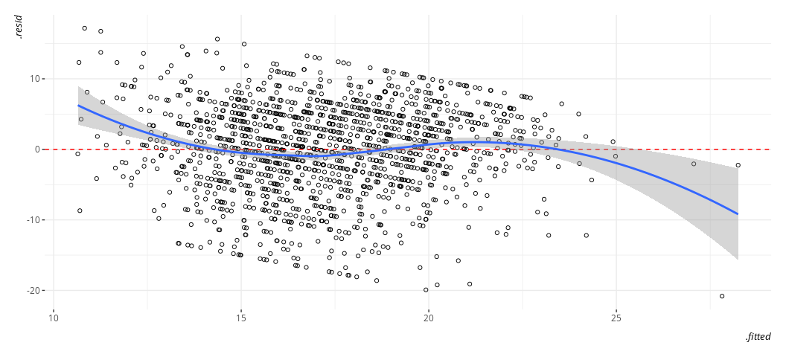
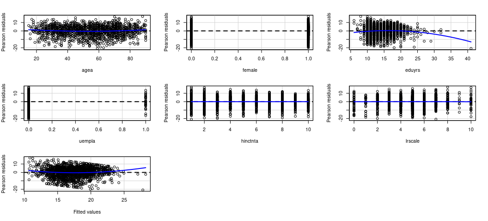
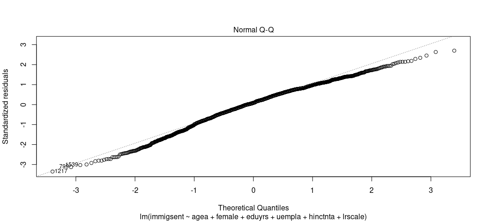
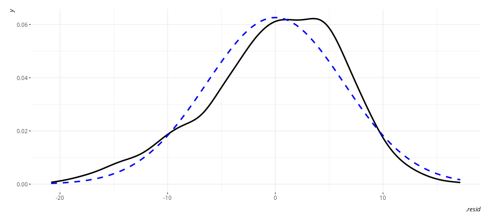
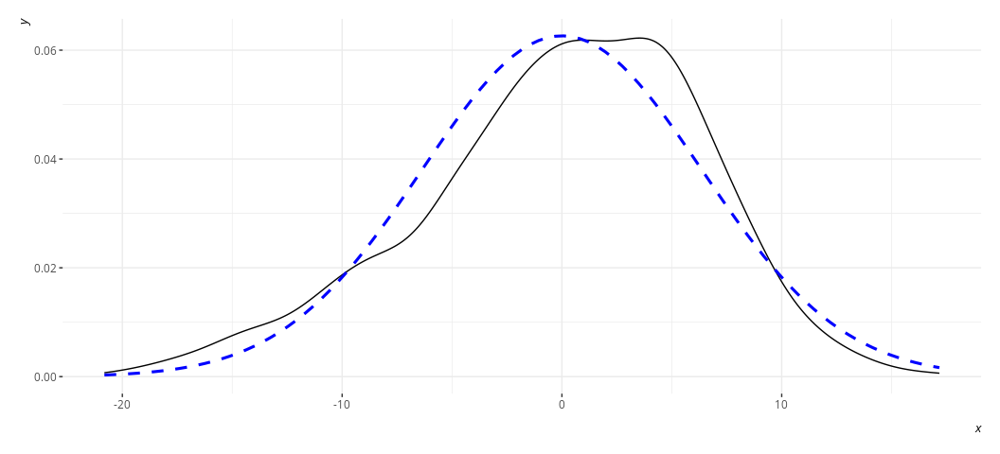
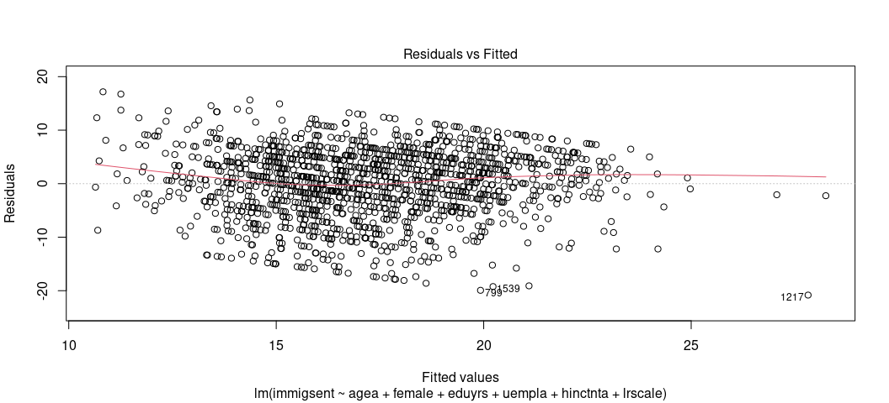

## R Packages/Data for This Session

You should’ve already installed the R packages for this lab session.
`{tidyverse}` will be for all things workflow and that’s all we’ll be
using today. `{stevedata}` will have data sets and `{stevemisc}` has
some assorted helper functions. `{lmtest}` has some formal diagnostic
tests. Do note that `options(warn = -1)` is just going to globally
disable R warnings, which, in this script, will apply to the
`linloess_plot()` function. Be very careful in your use of this global
override. I’m going to introduce you as well to the `{modelsummary}`
package too, which you may want to install. It’ll make model comparisons
a lot easier.

``` r
options(warn = -1)
library(tidyverse)
#> ── Attaching core tidyverse packages ──────────────────────── tidyverse 2.0.0 ──
#> ✔ dplyr     1.1.1     ✔ readr     2.1.4
#> ✔ forcats   1.0.0     ✔ stringr   1.5.0
#> ✔ ggplot2   3.5.1     ✔ tibble    3.2.1
#> ✔ lubridate 1.9.2     ✔ tidyr     1.3.0
#> ✔ purrr     1.0.1     
#> ── Conflicts ────────────────────────────────────────── tidyverse_conflicts() ──
#> ✖ dplyr::filter() masks stats::filter()
#> ✖ dplyr::lag()    masks stats::lag()
#> ℹ Use the conflicted package (<http://conflicted.r-lib.org/>) to force all conflicts to become errors
library(stevedata)
library(stevemisc)
#> 
#> Attaching package: 'stevemisc'
#> 
#> The following object is masked from 'package:lubridate':
#> 
#>     dst
#> 
#> The following object is masked from 'package:dplyr':
#> 
#>     tbl_df
library(stevethemes) # optional, but I want it...
library(lmtest)
#> Loading required package: zoo
#> 
#> Attaching package: 'zoo'
#> 
#> The following objects are masked from 'package:base':
#> 
#>     as.Date, as.Date.numeric
library(modelsummary) # optional, but you'll love it. Install it.
library(fixest) # optional, but you'll love it and should install it.
library(modelr) # for bootstrapping, also optional.

theme_set(theme_steve()) # optional, but I want it...
```

## The Data We’ll Be Using

I’ll be using the `ESS9GB` data set in `{stevedata}`. You can find more
information about this data set by typing this into your Rstudio
console.

``` r
?ESS9GB
```

You can also go to my website to read more about it too.

- [What Do We Know About British Attitudes Toward Immigration? A
  Pedagogical Exercise of Sample Inference and
  Regression](http://svmiller.com/blog/2020/03/what-explains-british-attitudes-toward-immigration-a-pedagogical-example/)

Let’s suppose we want to model how positively Brits think about
immigration and immigrants in this European Social Survey round from
2018-19. That information is captured in the `immigsent` variable in the
data set, itself an additive index of three other variables. Following
the stuff I put on my website, I want to understand attitudes about
immigration and immigrants as a function of the respondent’s age in
years (`agea`), whether the respondent is a woman (`female`), years of
education (`eduyrs`), whether the respondent is temporarily unemployed
but looking for work (`uempla`), the household income of the respondent
(in deciles, `hinctnta`), and the respondent’s ideology on an 11-point
left-right scale (`lrscale`). Higher values of `immigsent` indicates
greater positive orientation or receptiveness to immigrants/immigration.

``` r
M1 <- lm(immigsent ~ agea + female + eduyrs + uempla + hinctnta + lrscale, 
         ESS9GB, na.action = na.exclude)
```

Notice the `na.action = na.exclude` argument in the `lm()` function. For
most real world data sets where you want R to ignore the missing data,
but maintain the original dimensions of the data set, you’ll want to
include this argument in the formula.

This regression returns the following results. We observe significant
partial associations ideology, household income, and years of education,
though we see no discernible associations/effects for age, the
respondent’s gender, and the unemployment variable. The unemployment
variable might be a little surprising from the political economy of
immigration framework, but see [this paper of
mine](http://svmiller.com/research/economic-anxiety-ethnocentrism-immigration-1992-2017/)
for skepticism about these arguments in the American context and see
this [blog
post](http://svmiller.com/blog/2021/02/thinking-about-your-priors-bayesian-analysis/)
that riffs on the unemployment effect as a weak data problem.

``` r
summary(M1)
#> 
#> Call:
#> lm(formula = immigsent ~ agea + female + eduyrs + uempla + hinctnta + 
#>     lrscale, data = ESS9GB, na.action = na.exclude)
#> 
#> Residuals:
#>      Min       1Q   Median       3Q      Max 
#> -20.8172  -3.9026   0.5488   4.6513  17.1745 
#> 
#> Coefficients:
#>             Estimate Std. Error t value Pr(>|t|)    
#> (Intercept) 11.65506    1.06062  10.989  < 2e-16 ***
#> agea        -0.00185    0.01013  -0.183    0.855    
#> female      -0.24834    0.33773  -0.735    0.462    
#> eduyrs       0.48809    0.04878  10.007  < 2e-16 ***
#> uempla      -1.10153    1.20362  -0.915    0.360    
#> hinctnta     0.33757    0.06139   5.498 4.52e-08 ***
#> lrscale     -0.58259    0.08813  -6.611 5.37e-11 ***
#> ---
#> Signif. codes:  0 '***' 0.001 '**' 0.01 '*' 0.05 '.' 0.1 ' ' 1
#> 
#> Residual standard error: 6.383 on 1447 degrees of freedom
#>   (451 observations deleted due to missingness)
#> Multiple R-squared:  0.1485, Adjusted R-squared:  0.145 
#> F-statistic: 42.08 on 6 and 1447 DF,  p-value: < 2.2e-16
```

Now, let’s do some diagnostic testing.

## Linearity

OLS assumes some outcome *y* is a linear function of some right-hand
predictors you include in the model. That is, the estimated value itself
follows that linear formula, and the values themselves are “additive”
(i.e. y = a + b + c). There are various diagnostic tests for the
linearity assumption, including some outright statistical tests that are
either not very good at what they purport to do (Rainbow test), or
awkwardly implemented (Harvey-Collier test).

This is why I encourage you to explore this visually. For one, start
with arguably the most useful OLS diagnostic plot: the fitted-residual
plot. Grab the fitted values from the model and the residuals and create
a scatterplot from them. Then, overlay a LOESS smoother over it to check
for any irregularities. By definition, the “rise over run” line is flat
at 0. The LOESS smoother will communicate whether that’s actually a line
of good fit.

First, let’s use the `augment()` function in `{broom}` to extract some
pertinent information from the model and store it in the data itself.

``` r
broom::augment(M1, data=ESS9GB) -> ESS9GB
```

Now, let’s create the plot. There’s actually a base R function that will
do this for you beginners.

``` r
plot(M1, which=1)
```

<!-- -->

You should do this in `{ggplot2}` though, because there’s more you can
do with it.

``` r
ESS9GB %>%
  ggplot(.,aes(.fitted, .resid)) +
  geom_point(pch = 21) +
  geom_hline(yintercept = 0, linetype="dashed", color="red") +
  geom_smooth(method = "loess")
#> `geom_smooth()` using formula = 'y ~ x'
```

<!-- -->

Oh yeah, that’s not ideal. The fitted-residual plot is broadly useful
for other things too (i.e. it’s pointing to some discreteness in the
DV), but it’s also pointing to a line through the data that looks like a
water slide.

One limitation of the fitted-residual plot, however, is that it won’t
tell you where exactly the issue might be. That’s why I wrote the
`linloess_plot()` in `{stevemisc}`. This plot takes a model object and,
for each right-hand side variable, draws a rise-over-run line of best
fit and the LOESS smoother. Do note this tells you nothing about binary
IVs, but binary IVs aren’t the problem here.

``` r
linloess_plot(M1, pch=21)
#> `geom_smooth()` using formula = 'y ~ x'
#> `geom_smooth()` using formula = 'y ~ x'
```

<!-- -->

{car} has this one for you, if you’d like. I’ll concede it works better
than my function at the moment.

``` r
car::residualPlots(M1)
```

<!-- -->

    #>            Test stat Pr(>|Test stat|)    
    #> agea          2.5954        0.0095427 ** 
    #> female        0.3704        0.7111441    
    #> eduyrs       -3.4281        0.0006249 ***
    #> uempla       -0.6858        0.4929313    
    #> hinctnta      0.0584        0.9534036    
    #> lrscale      -0.2296        0.8184699    
    #> Tukey test    3.2353        0.0012149 ** 
    #> ---
    #> Signif. codes:  0 '***' 0.001 '**' 0.01 '*' 0.05 '.' 0.1 ' ' 1

The thing I like about this plot is that it can point to multiple
problems, though it won’t point you in the direction of any potential
interactions. No matter, here it shows any proxy for the education-level
of the respondent in a developed European country like the United
Kingdom is going to have two sources of weirdness. For one, very few
respondents will have so few years of education indicating they are
something like a primary school dropout. They exist, and they can be
anyone in the native-born UK population for all I know, but they’re
rare. Second, you’ll have some career students (överliggare, I believe
you Swedes call them). They also exist, but they’re rare. Maybe you want
to implement some kind of left- and right-truncation. Wonder what that
might be here.

``` r
ESS9GB %>% count(eduyrs) %>% na.omit %>%
  ggplot(.,aes(as.factor(eduyrs), n)) + geom_bar(stat='identity')
```

<!-- -->

Hmm. How about this: below 10: 10. Above 20: 20. We’ll truncate the data
on the left and right end.

``` r
ESS9GB %>%
  mutate(eduyrsrc = case_when(
    # if it's 10 or below: 10
    eduyrs <= 10 ~ 10,
    # if it's 20 or above: 20
    eduyrs >= 20 ~ 20,
    # if it's anything else (i.e. in those bounds): keep it as is.
    TRUE ~ eduyrs
  )) -> ESS9GB
```

There’s also some interesting patterns about ideology too. It looks like
those heap in the middle of this (11-point) scale of ideology are
behaving differently than those who lean left or those who lean right.
That might imply that the ideology variable might be better recoded as a
categorical variable. In other words, something like this.

``` r
ESS9GB %>% 
  mutate(ideocat = case_when(
    lrscale < 5 ~ "Left",
    lrscale == 5 ~ "Center",
    lrscale > 5 ~ "Right"
  )) %>%
  mutate(ideocat = fct_relevel(ideocat, "Center")) -> ESS9GB
```

The solutions here are largely up to you. Let’s re-estimate the model
with the following changes. We’ll include our truncated education
variable, square the age variable, and introduce the ideology variable
as a fixed effect (in lieu of the `lrscale` variable). Let’s see what
that does.

``` r
M2 <- lm(immigsent ~ agea + I(agea^2) + female + eduyrsrc + 
           uempla + hinctnta + ideocat, 
         ESS9GB, na.action = na.exclude)
summary(M2)
#> 
#> Call:
#> lm(formula = immigsent ~ agea + I(agea^2) + female + eduyrsrc + 
#>     uempla + hinctnta + ideocat, data = ESS9GB, na.action = na.exclude)
#> 
#> Residuals:
#>      Min       1Q   Median       3Q      Max 
#> -20.3399  -3.8792   0.6662   4.6014  17.1040 
#> 
#> Coefficients:
#>                Estimate Std. Error t value Pr(>|t|)    
#> (Intercept)   9.4675626  1.5915209   5.949 3.38e-09 ***
#> agea         -0.1320220  0.0566580  -2.330   0.0199 *  
#> I(agea^2)     0.0012239  0.0005317   2.302   0.0215 *  
#> female       -0.0750439  0.3358441  -0.223   0.8232    
#> eduyrsrc      0.5960518  0.0572118  10.418  < 2e-16 ***
#> uempla       -1.0226944  1.1905698  -0.859   0.3905    
#> hinctnta      0.3344254  0.0630226   5.306 1.29e-07 ***
#> ideocatLeft   2.6748059  0.4034819   6.629 4.75e-11 ***
#> ideocatRight -0.0055570  0.4153486  -0.013   0.9893    
#> ---
#> Signif. codes:  0 '***' 0.001 '**' 0.01 '*' 0.05 '.' 0.1 ' ' 1
#> 
#> Residual standard error: 6.311 on 1445 degrees of freedom
#>   (451 observations deleted due to missingness)
#> Multiple R-squared:  0.1689, Adjusted R-squared:  0.1643 
#> F-statistic: 36.72 on 8 and 1445 DF,  p-value: < 2.2e-16
```

From this changed model, we don’t see a discernible difference between
the right and center, but we do see evidence of a curvilinear age
effect. How else you choose to deal with this is up to you, but these
diagnostics at least point to the problem and the discussion here at
least suggests some potential fixes. Just be mindful that any polynomial
effects you include in a model have to be justified by you, the one
doing the higher-order polynomials. Always be prepared to explain
anything you’re doing.

## Independence

The OLS model assumes the independence of the model’s errors and that
any pair of errors are going to be uncorrelated with each other. Past
observations (and past errors) should not inform other pairs of errors.
In formal terms, this assumption seems kind of Greek to students. In
practice, think of it this way. A lot of the theoretical intuition
behind OLS is assuming something akin to a simple random sample of the
population. You learned central limit theorem by this point and how you
can simulate that. However, you may have a data set that does not look
like this.

In other words, this assumption is going to be violated like mad in any
design that has a time-series, spatial, or multilevel component. For
students new to this stuff, you should be able to anticipate ahead of
time when your errors are no longer independent of each other.

The implications of non-independent errors—aka “serial correlation” or
“autocorrelation”—are generally more about the variance of the estimator
than the estimator itself. That said, there is reason to believe the
standard errors are wrong and this can have important implications for
statistical inference you’d like to do. No matter, this is a huge
assumption about OLS ans violating it ultimately means OLS loses its
inferential value. The data are no longer randomly sampled in that
sense.

Once you know under what conditions that autocorrelation is going to
happen, you can probably skip this and go right to assorted tricks that
you know will work given the nature of your serial correlation. If you
have a random walk time series, you know those can typically be
first-differenced in order to strip out the source of autocorrelation If
you have some type of “spatial” serial autocorrelation (e.g. citizens
nested in countries, students nested in schools), you can employ some
kind of fixed effects or random effects to outright model the source of
unit heterogeneity. No matter, the “textbook” tests for these are
typically in the time series case and involve the Durbin-Watson test or
the Breusch-Godfrey test.

Of the two, practitioners I’ve read seem to favor the latter over the
former. The Durbin-Watson test has some pretty strong assumptions and
only looks for a order-1 autocorrelation. No matter, it has some
informational value when you get deeper into the weeks of time series
stuff. Both can be estimated by way of the `{lmtest}` package. Let’s go
back to our first model and apply both.

``` r
dwtest(M1)
#> 
#>  Durbin-Watson test
#> 
#> data:  M1
#> DW = 1.9486, p-value = 0.163
#> alternative hypothesis: true autocorrelation is greater than 0
bgtest(M1)
#> 
#>  Breusch-Godfrey test for serial correlation of order up to 1
#> 
#> data:  M1
#> LM test = 0.90782, df = 1, p-value = 0.3407
```

The “null” hypothesis of both tests is “no autocorrelation.” The
alternative hypothesis is “autocorrelation.” When the *p*-value is
sufficiently small, it indicates a problem. Here, they suggest no real
problem and no further fix is needed. That is not terribly surprising in
this case, as the data are a random sample from the population and done
in a mostly time-invariant way. If there was a serial/spatial
correlation to fix, consider some kind of region fixed effects in this
case. It’d be something like this.

``` r
M3 <- update(M1, ~. + factor(region)) 
# ^ update M1, keep everything as is, add region fixed effects
summary(M3)
#> 
#> Call:
#> lm(formula = immigsent ~ agea + female + eduyrs + uempla + hinctnta + 
#>     lrscale + factor(region), data = ESS9GB, na.action = na.exclude)
#> 
#> Residuals:
#>      Min       1Q   Median       3Q      Max 
#> -20.8870  -3.7189   0.6907   4.5214  16.4952 
#> 
#> Coefficients:
#>                                        Estimate Std. Error t value Pr(>|t|)    
#> (Intercept)                            11.59296    1.20152   9.649  < 2e-16 ***
#> agea                                   -0.00296    0.01016  -0.291   0.7708    
#> female                                 -0.19460    0.33542  -0.580   0.5619    
#> eduyrs                                  0.47774    0.04884   9.782  < 2e-16 ***
#> uempla                                 -0.95502    1.19492  -0.799   0.4243    
#> hinctnta                                0.31474    0.06174   5.098 3.89e-07 ***
#> lrscale                                -0.58534    0.08792  -6.658 3.95e-11 ***
#> factor(region)East of England           0.91292    0.79241   1.152   0.2495    
#> factor(region)London                    0.66388    0.93409   0.711   0.4774    
#> factor(region)North East (England)     -1.72860    0.91451  -1.890   0.0589 .  
#> factor(region)North West (England)     -0.02655    0.78661  -0.034   0.9731    
#> factor(region)Northern Ireland          1.30212    1.10180   1.182   0.2375    
#> factor(region)Scotland                  2.04198    0.82419   2.478   0.0133 *  
#> factor(region)South East (England)      1.13603    0.74895   1.517   0.1295    
#> factor(region)South West (England)      0.93027    0.80640   1.154   0.2489    
#> factor(region)Wales                    -1.03543    0.99713  -1.038   0.2993    
#> factor(region)West Midlands (England)  -1.34344    0.90135  -1.490   0.1363    
#> factor(region)Yorkshire and the Humber -0.20694    0.80913  -0.256   0.7982    
#> ---
#> Signif. codes:  0 '***' 0.001 '**' 0.01 '*' 0.05 '.' 0.1 ' ' 1
#> 
#> Residual standard error: 6.325 on 1436 degrees of freedom
#>   (451 observations deleted due to missingness)
#> Multiple R-squared:  0.1703, Adjusted R-squared:  0.1605 
#> F-statistic: 17.34 on 17 and 1436 DF,  p-value: < 2.2e-16
```

Do note fixed effects in this application have a tendency to “demean”
other things in the model, though they’re not telling you much here.
Indeed, you didn’t have much of a problem.

No matter, if you have autocorrelation, you have to tackle it outright
or your OLS model has no inferential value. The exact fix depends on the
exact nature of the problem, which will definitely depend on you knowing
your data well and what you’re trying to accomplish.

## Normality (of the Errors)

OLS assumes the *errors* are normally distributed. This is often
conflated with an assumption that the outcome variable is normally
distributed. That’s not quite what it is. It does imply that the
conditional distribution of the dependent variable is normal but that is
not equivalent to assuming the marginal distribution of the dependent
variable is normal. At the end of the day, the assumption of normality
is more about the errors than the dependent variable even as the
assumption about the former does strongly imply an assumption about the
latter.

Violating the assumption of a normal distribution of the errors is not
as severe as a violation of some of the other assumptions. The normality
assumption is not necessary for point estimates to be unbiased. In one
prominent textbook on statistical methods, Gelman and Hill (2007, p. 46)
say the normality assumption is not important at all because it has no
strong implication for the regression line. I think this follows because
Gelman and Hill (2007)—later Gelman, Hill, and Vehtari (2020)—are
nowhere near as interested in null hypothesis testing as your typical
social scientist likely is. No matter, violating the assumption of a
normal distribution of errors has some implication for drawing a line
that reasonably approximates individual data points (if not the line
itself, per se). Thus, you may want to check it, certainly if you have a
small data set.

My misgiving with these normality tests is that they *all* suck, even at
what they’re supposed to do. The “textbook” normality tests involve
extracting the residuals from the model and checking if their
distribution is consistent with data that could be generated by a normal
distribution. The two implementations here are typically base R. One is
the Shapiro-Wilk test. The other is the Kolmogorv-Smirnov test. There
are more—like the Anderson-Darling test—which you can also do and is
communicating the same thing. You can explore a few of these in the
`{nortest}` package.

``` r
shapiro.test(resid(M1))
#> 
#>  Shapiro-Wilk normality test
#> 
#> data:  resid(M1)
#> W = 0.98373, p-value = 9.782e-12
ks.test(resid(M1), y=pnorm)
#> 
#>  One-sample Kolmogorov-Smirnov test
#> 
#> data:  resid(M1)
#> D = 0.3919, p-value < 2.2e-16
#> alternative hypothesis: two-sided
```

When *p*-values are sufficiently small, these tests are saying “I can
determine these weren’t generated by some kind of normal distribution.”
My misgiving with these particular tests are multiple. One, you can dupe
them pretty easily with a related distribution that looks like it, but
is not it (e.g. Student’s *t*). For example, let me cheese the Shapiro
test with the Poisson distribution.

``` r
set.seed(8675309)
shapiro.test(lambdas <- rpois(1000, 100))
#> 
#>  Shapiro-Wilk normality test
#> 
#> data:  lambdas <- rpois(1000, 100)
#> W = 0.99791, p-value = 0.2457
# c.f. http://svmiller.com/blog/2023/12/count-models-poisson-negative-binomial/
```

I should not have passed this test, and yet I did. These aren’t normally
distributed. They’re Poisson-distributed, and can’t be reals. Second,
thse normality tests are deceptively just a test of sample size. The
more observations you have, the more sensitive the test is to any
observation in the distribution that looks anomalous. Three, textbooks
typically say to use the K-S test if you have a large enough sample
size, but, from my experience, that’s the test that’s most easily duped.

Here’s what I recommend instead, knowing that the normality assumption
of errors is one of the least important assumptions: visualize this
instead. For one, the “textbook” visual diagnostic is the Q-Q plot. This
is actually a default plot in base R for linear models if you know where
to look.

``` r
plot(M1, which=2)
```

<!-- -->

The Q-Q plots the theoretical quantiles of the residuals against the
standardized residuals. Ideally, they all fall on a nice line. Here,
they don’t, suggesting a problem. The negative residuals are more
negative than expected and the positive residuals are more positive than
expected.

I mentioned in lecture that a better way of gauging just how severe the
issue is will involve generating a density plot of the residuals against
a stylized density plot matching the description of the residuals
(i.e. with a mean of 0 and a standard deviation equal to the standard
deviation of the residuals). It would look something like this.

``` r
ESS9GB %>%
  ggplot(.,aes(.resid)) +
  geom_density(size = 1.1) +
  stat_function(fun = dnorm, color="blue",
                args = list(mean = 0, 
                            sd = sd(ESS9GB$.resid, na.rm=T)),
                linetype="dashed", size=1.1) 
```

<!-- -->

Btw, `rd_plot()` in `{stevemisc}` will do this for you. Here’s what it’s
doing.

``` r
rd_plot <- function(mod) {
  
  sdr <- sd(resid(mod), na.rm=T)
  
  hold_this <- data.frame(x = resid(mod))
  
  ggplot(hold_this, aes(x)) +
    geom_density() +
    stat_function(fun = dnorm, color="blue",
                  args = list(mean = 0, sd = sdr),
                  linetype="dashed", linewidth=1.1)
  
}

rd_plot(M1)
```

<!-- -->

In this plot, the black solid line is a density plot of the actual
residuals whereas the blue, dashed line is a density plot of a normal
distribution with a mean of 0 and a standard deviation equal to the
standard deviation of the residuals. The real thing will always be kind
of lumpy in some ways when you’re using actual data. Ask yourself how
bad it is. I’d argue that the distribution is not ideal though the
normality of the residuals is reasonably approximated.

Your solution to this particular “problem” will depend on what exactly
you’re doing in the first place. The instances in which these plots look
really problematic will be situations like these. Your model may have
relatively few covariates and the covariates you do include are dummy
variables. If you have *so* few observations in the model (i.e. I can
count the number of observations in the model on one or three hands),
any distribution of residuals will look crazy. That’s *probably* not
your case,especially as you’ve thought through the data-generating
process for your dependent variable. It’s more likely the case that you
have a discrete dependent variable and you’re trying to impose OLS on
it. The end result is a subset of residuals that look kind of wonky at
the tails of the distribution. Under those conditions, it makes more
sense to use the right model for the nature of your dependent variable.
If your DV is binary, consider a logistic regression. If you’re trying
to model variation in a 5-item Likert measure, consider the ordinal
logistic regression. If you have a proportion with observations
appearing at the exact limit of the proportion, consider some kind of
beta regression. Are you trying to model a “count” variable (i.e. an
integer), especially one that has some kind of skew? Maybe you want a
Poisson regression, or negative binomial.

Either way, the solution to the non-normality of the residuals involves
outright modeling the kind of data that presents this kind of
non-normality. The assumption, to be clear, is about the *errors*, but
the “problem” and the “solution” often point to what exactly your
dependent variable looks like and whether OLS is the right model for the
job.

## Equal Error Variance (Homoskedasticity)

The final diagnostic test you should run on the OLS model involves
assessing whether the distribution of residuals is constant across the
range of the model. OLS assumes that the variance of the errors is the
same regardless of the particular value of x. This is often called
“homoskedasticity”, mostly in juxtaposition to the violation of this
assumption: “heteroskedasticity.” The change of prefix should be clear
to what is implied here. Heteroskedasticity often means the errors are
typically a function of something else in the model.

The implications for violating the assumption of homoskedasticity are
more nuisance than real problem. Unequal/non-constant variance does not
affect the `XB` part of the regression model, but it does have
implications for predicting individual data points. Here, the
implication is similar to the implication of violating the assumption of
normally distributed errors. However, it’s more severe than the
non-normality of residuals. If null hypothesis significance testing is
part of your research design (and it is), heteroskedasticity means the
standard errors of your estimates are wrong. Worse yet: they’ll be wrong
in ways you don’t know until you start digging further into what your
data and model look like.

There are two ways to assess whether you have a heteroskedasticity
problem in your OLS model. The first is the fitted-residual plot. You
can ask for that again. This time, have your eye draw kind of an upper
bound and lower bound on the *y*-axis (for the residuals). Are those
lines flat/pattern-less? Tell-tale cases of heteroskedasticity like we
discussed in lecture are cases where you have a cone pattern emerge. It
may not be as obvious as it was in that case, but you might be able to
tease out some kind of non-constant pattern.

``` r
plot(M1, which=1)
```

<!-- -->

I think I see a pattern, and certainly the pattern of residuals don’t
look like random buckshot like I’d want. Fortunately, there’s an actual
test you can use that’s available in the `{lmtest}` package. It’s the
Breusch-Pagan test. The null hypothesis of the test is homoskedasticity.
The alternate hypothesis is heteroskedasticity. If the *p*-value is
sufficiently small, you have a problem.

``` r
bptest(M1)
#> 
#>  studentized Breusch-Pagan test
#> 
#> data:  M1
#> BP = 26.601, df = 6, p-value = 0.000172
```

Looks like we have a problem, but what’s the solution? Unfortunately,
there’s no quick fix, per se, because any single solution to
heteroskedasticity depends on the exact nature of heteroskedasticity and
whether you know for sure that’s the case. If you have positive reals on
either side of the regression equation, and there’s some kind of
positive skew that’s causing residuals to fan out, you can consider some
kind of logarithmic transformation to impose normality on the
variable(s). Is it an outlier/influence observation that’s causing this?
If so, consider punting out the observation from the model. At least,
consider it. I’ll note that outliers/influence are not sufficient
justification to exclude an observation from a regression model. You
should only do that if it’s *unrepresentative* of the underlying
population, not necessarily because it’s anomalous in the underlying
population.

Therefore, “solutions” to heteroskedasticity are often just alternative
specifications of the model and seeing if the core results from the base
model change in any meaningful way. There are a few paths you may want
to explore.

The basic “textbook” approach is weighted least squares. I mentioned in
lecture that this approach is kind of convoluted. It’s not complicated.
It’s just convoluted. The procedure here starts with running the
offending model (which we already did; it’s `M1`). Then, grab the
residuals and fitted values from the model. Next, regress the absolute
value of the residuals on the fitted values of the original model.
Afterward, extract those fitted values, square them and divide 1 over
those values. Finally, apply those as weights in the linear model once
more for a re-estimation.

It’s not a lot of work. It’s tedious, but it’s not a lot of work. Note
that we already extracted the fitted values and residuals from `M1` and
added them to the `ESS9GB` data frame. Let’s [draw the
owl](https://knowyourmeme.com/memes/how-to-draw-an-owl) now. Here’s
where I’ll reiterate that if your base data have missing values that you
want to ignore, it’s good practice to specify the `na.action=na.exclude`
argument so that fitted values and residuals from the model will
maintain the original dimensions of the data.

``` r
M4 <- lm(abs(.resid) ~ .fitted, data=ESS9GB,
         na.action = na.exclude)

ESS9GB %>%
  mutate(wts = 1/(fitted(M4)^2)) -> ESS9GB

M5 <- update(M1,  ~., 
             weights = wts)

# summary(M5)
# ^ This would be if you wanted to look at the model you just ran

# Instead, let's format it into a nice table.
modelsummary(list("OLS" = M1, 
                  "WLS" = M5),
             stars = TRUE,
             caption = "A Caption for This Table. Hi Mom!",
             gof_map = c("nobs", "adj.r.squared"))
```

<table style="width:53%;">
<colgroup>
<col style="width: 19%" />
<col style="width: 16%" />
<col style="width: 16%" />
</colgroup>
<thead>
<tr class="header">
<th></th>
<th>OLS</th>
<th>WLS</th>
</tr>
</thead>
<tbody>
<tr class="odd">
<td>(Intercept)</td>
<td>11.655***</td>
<td>12.148***</td>
</tr>
<tr class="even">
<td></td>
<td>(1.061)</td>
<td>(1.041)</td>
</tr>
<tr class="odd">
<td>agea</td>
<td>-0.002</td>
<td>-0.003</td>
</tr>
<tr class="even">
<td></td>
<td>(0.010)</td>
<td>(0.010)</td>
</tr>
<tr class="odd">
<td>female</td>
<td>-0.248</td>
<td>-0.242</td>
</tr>
<tr class="even">
<td></td>
<td>(0.338)</td>
<td>(0.336)</td>
</tr>
<tr class="odd">
<td>eduyrs</td>
<td>0.488***</td>
<td>0.468***</td>
</tr>
<tr class="even">
<td></td>
<td>(0.049)</td>
<td>(0.046)</td>
</tr>
<tr class="odd">
<td>uempla</td>
<td>-1.102</td>
<td>-1.082</td>
</tr>
<tr class="even">
<td></td>
<td>(1.204)</td>
<td>(1.246)</td>
</tr>
<tr class="odd">
<td>hinctnta</td>
<td>0.338***</td>
<td>0.370***</td>
</tr>
<tr class="even">
<td></td>
<td>(0.061)</td>
<td>(0.061)</td>
</tr>
<tr class="odd">
<td>lrscale</td>
<td>-0.583***</td>
<td>-0.643***</td>
</tr>
<tr class="even">
<td></td>
<td>(0.088)</td>
<td>(0.088)</td>
</tr>
<tr class="odd">
<td>Num.Obs.</td>
<td>1454</td>
<td>1454</td>
</tr>
<tr class="even">
<td>R2 Adj.</td>
<td>0.145</td>
<td>0.156</td>
</tr>
</tbody><tfoot>
<tr class="odd">
<td colspan="3"><ul>
<li>p &lt; 0.1, * p &lt; 0.05, ** p &lt; 0.01, *** p &lt; 0.001</li>
</ul></td>
</tr>
</tfoot>
&#10;</table>

Btw, `{stevemisc}` can do this for you.

``` r
modelsummary(list("OLS" = M1, 
                  "WLS" = M5,
                  "Auto WLS" = wls(M1)),
             stars = TRUE,
             caption = "A Caption for This Table. Hi Mom!",
             gof_map = c("nobs", "adj.r.squared"))
```

<table style="width:69%;">
<colgroup>
<col style="width: 19%" />
<col style="width: 16%" />
<col style="width: 16%" />
<col style="width: 16%" />
</colgroup>
<thead>
<tr class="header">
<th></th>
<th>OLS</th>
<th>WLS</th>
<th>Auto WLS</th>
</tr>
</thead>
<tbody>
<tr class="odd">
<td>(Intercept)</td>
<td>11.655***</td>
<td>12.148***</td>
<td>12.148***</td>
</tr>
<tr class="even">
<td></td>
<td>(1.061)</td>
<td>(1.041)</td>
<td>(1.041)</td>
</tr>
<tr class="odd">
<td>agea</td>
<td>-0.002</td>
<td>-0.003</td>
<td>-0.003</td>
</tr>
<tr class="even">
<td></td>
<td>(0.010)</td>
<td>(0.010)</td>
<td>(0.010)</td>
</tr>
<tr class="odd">
<td>female</td>
<td>-0.248</td>
<td>-0.242</td>
<td>-0.242</td>
</tr>
<tr class="even">
<td></td>
<td>(0.338)</td>
<td>(0.336)</td>
<td>(0.336)</td>
</tr>
<tr class="odd">
<td>eduyrs</td>
<td>0.488***</td>
<td>0.468***</td>
<td>0.468***</td>
</tr>
<tr class="even">
<td></td>
<td>(0.049)</td>
<td>(0.046)</td>
<td>(0.046)</td>
</tr>
<tr class="odd">
<td>uempla</td>
<td>-1.102</td>
<td>-1.082</td>
<td>-1.082</td>
</tr>
<tr class="even">
<td></td>
<td>(1.204)</td>
<td>(1.246)</td>
<td>(1.246)</td>
</tr>
<tr class="odd">
<td>hinctnta</td>
<td>0.338***</td>
<td>0.370***</td>
<td>0.370***</td>
</tr>
<tr class="even">
<td></td>
<td>(0.061)</td>
<td>(0.061)</td>
<td>(0.061)</td>
</tr>
<tr class="odd">
<td>lrscale</td>
<td>-0.583***</td>
<td>-0.643***</td>
<td>-0.643***</td>
</tr>
<tr class="even">
<td></td>
<td>(0.088)</td>
<td>(0.088)</td>
<td>(0.088)</td>
</tr>
<tr class="odd">
<td>Num.Obs.</td>
<td>1454</td>
<td>1454</td>
<td>1454</td>
</tr>
<tr class="even">
<td>R2 Adj.</td>
<td>0.145</td>
<td>0.156</td>
<td>0.156</td>
</tr>
</tbody><tfoot>
<tr class="odd">
<td colspan="4"><ul>
<li>p &lt; 0.1, * p &lt; 0.05, ** p &lt; 0.01, *** p &lt; 0.001</li>
</ul></td>
</tr>
</tfoot>
&#10;</table>

Re-estimating the model by way of weighted least squares reveals no real
changes. Some parameters moved around a little bit, but everything is
basically within a standard error of each other.

Another approach is to do what is (informally) called on an “on-the-fly”
standard error correction. In these cases, the point estimates from the
original model remain the same, but adjustments are made to the standard
errors based on the model’s variance-covariance matrix. There are any
numbers of ways of doing this—and, again, ad hoc standard error
corrections are multiple and depend on what exactly you’re trying to
accomplish (or think you’re accomplishing). If you’re interested in this
stuff, you should download the `{sandwich}` package and explore your
options in there. For now, let’s use the `{fixest}` package and have
this do our work for us.

``` r
M6 <- feols(immigsent ~  agea + female + eduyrs + uempla + hinctnta + lrscale,
            data = ESS9GB, se = "hetero")
#> NOTE: 451 observations removed because of NA values (LHS: 55, RHS: 427).

# summary(M6)
# ^ If you wanted to look at what you just estimated.
```

Let’s see what happens.

``` r
modelsummary(list("OLS" = M1, 
                  "WLS" = M5,
                  "HRSE" = M6),
             stars = TRUE,
             caption = "A Caption for This Table. Hi Mom!",
             gof_map = c("nobs", "adj.r.squared"))
```

<table style="width:69%;">
<colgroup>
<col style="width: 19%" />
<col style="width: 16%" />
<col style="width: 16%" />
<col style="width: 16%" />
</colgroup>
<thead>
<tr class="header">
<th></th>
<th>OLS</th>
<th>WLS</th>
<th>HRSE</th>
</tr>
</thead>
<tbody>
<tr class="odd">
<td>(Intercept)</td>
<td>11.655***</td>
<td>12.148***</td>
<td>11.655***</td>
</tr>
<tr class="even">
<td></td>
<td>(1.061)</td>
<td>(1.041)</td>
<td>(1.183)</td>
</tr>
<tr class="odd">
<td>agea</td>
<td>-0.002</td>
<td>-0.003</td>
<td>-0.002</td>
</tr>
<tr class="even">
<td></td>
<td>(0.010)</td>
<td>(0.010)</td>
<td>(0.010)</td>
</tr>
<tr class="odd">
<td>female</td>
<td>-0.248</td>
<td>-0.242</td>
<td>-0.248</td>
</tr>
<tr class="even">
<td></td>
<td>(0.338)</td>
<td>(0.336)</td>
<td>(0.337)</td>
</tr>
<tr class="odd">
<td>eduyrs</td>
<td>0.488***</td>
<td>0.468***</td>
<td>0.488***</td>
</tr>
<tr class="even">
<td></td>
<td>(0.049)</td>
<td>(0.046)</td>
<td>(0.059)</td>
</tr>
<tr class="odd">
<td>uempla</td>
<td>-1.102</td>
<td>-1.082</td>
<td>-1.102</td>
</tr>
<tr class="even">
<td></td>
<td>(1.204)</td>
<td>(1.246)</td>
<td>(1.343)</td>
</tr>
<tr class="odd">
<td>hinctnta</td>
<td>0.338***</td>
<td>0.370***</td>
<td>0.338***</td>
</tr>
<tr class="even">
<td></td>
<td>(0.061)</td>
<td>(0.061)</td>
<td>(0.064)</td>
</tr>
<tr class="odd">
<td>lrscale</td>
<td>-0.583***</td>
<td>-0.643***</td>
<td>-0.583***</td>
</tr>
<tr class="even">
<td></td>
<td>(0.088)</td>
<td>(0.088)</td>
<td>(0.099)</td>
</tr>
<tr class="odd">
<td>Num.Obs.</td>
<td>1454</td>
<td>1454</td>
<td>1454</td>
</tr>
<tr class="even">
<td>R2 Adj.</td>
<td>0.145</td>
<td>0.156</td>
<td>0.145</td>
</tr>
</tbody><tfoot>
<tr class="odd">
<td colspan="4"><ul>
<li>p &lt; 0.1, * p &lt; 0.05, ** p &lt; 0.01, *** p &lt; 0.001</li>
</ul></td>
</tr>
</tfoot>
&#10;</table>

Not much is changing, though it’s not lost on me that the standard
errors that are moving the most are the ones we identified as
potentially problematic in the lin-loess plot we ran earlier into this
script.

Finally, one other alternative estimation approach is the bootstrap. To
be clear, there’s no single bootstrap. There are multiple bootstraps.
This particular bootstrap is the simple bootstrap where the original
data set is randomly sampled, with replacement, *M* times to create *M*
replicates of the original data set with the same number of rows as the
original data. The model is then re-estimated *M* times on each of these
replicates. The model parameters returned are the mean of the
coefficients and the bootstrapped standard error is equal to the
standard deviation of the coefficients/estimates. In other words, the
simple bootstrap is mimicking a sampling distribution, which was the
design of Bradley Efron (the guy that pioneered this procedure).

Here’s how you’d do that. Using the `{modelr}` package and its
`bootstrap()` function, we’ll create 1,000 replicates of the original
data. These are special tibble-lists, that are called `strap` in the
ensuing data frame. Then, using the `map()` function in `{purrr}`, which
comes by way of the `{tidyverse}`, we’re going to re-run `M1` on each of
these replicates/resamples as another column and then “tidy” the
results. Then, we’re going to extract them with the `unnest()` function.
The reproducible seed will ensure you and I get the same results from
the bootstrap resample procedure. I have [a blog post that explains this
in greater
detail](http://svmiller.com/blog/2020/03/bootstrap-standard-errors-in-r/).

``` r
set.seed(8675309)
# Starting with the original data used in M1.
model.frame(M1) %>%
  # draw 1000 bootstrap resamples
  modelr::bootstrap(n = 1000) %>%
  # estimate the model 1000 times
  mutate(results = map(strap, ~ update(M1, data = .))) %>%
  # extract results using `broom::tidy`
  mutate(results = map(results, tidy)) %>%
  # unnest and summarize
  unnest(results) -> bootM1
```

Take a moment to appreciate that you just ran 1,000 regressions on a
1,000 data replicates in a matter of seconds. Thirty years ago, that
would’ve taken a weekend at a supercomputer at some American university
with a billion dollar endowment. Neat, huh?

Moving on, I want to reiterate that the bootstrapped regression summary
is the mean of the estimates and the standard deviation of the
estimates. I’d be something like this.

``` r
bootM1 %>%
  group_by(term)  %>%
  summarize(std.error = sd(estimate),
            estimate = mean(estimate)) %>%
    select(term, estimate, `std.error`)
#> # A tibble: 7 × 3
#>   term        estimate std.error
#>   <chr>          <dbl>     <dbl>
#> 1 (Intercept) 11.6       1.16   
#> 2 agea        -0.00212   0.00992
#> 3 eduyrs       0.492     0.0584 
#> 4 female      -0.269     0.327  
#> 5 hinctnta     0.333     0.0648 
#> 6 lrscale     -0.580     0.0998 
#> 7 uempla      -1.15      1.35
```

It’d be beneficial to have `{modelsummary}` do this for us. Since this
really isn’t a `{modelsummary}` class, I’ll just have to [point you
here](https://vincentarelbundock.github.io/modelsummary/articles/modelsummary.html#bootstrap)
for some clarification as to what’s happening here.

``` r
tidy_custom.boot <- function(x, ...) {
  set.seed(8675309)
  model.frame(x) %>%
    # draw 1000 bootstrap resamples
    modelr::bootstrap(n = 1000) %>%
    # estimate the model 1000 times
    mutate(results = map(strap, ~ update(x, data = .))) %>%
    # extract results using `broom::tidy`
    mutate(results = map(results, tidy)) %>%
    # unnest and summarize
    unnest(results) %>%
    group_by(term) %>%
    summarize(std.error = sd(estimate),
              estimate = mean(estimate))
}

M7 <- M1 # Copy M1 to a new model
class(M7) = c("lm", "boot") 
# ^ prepares {modelsummary} to summarize this model through a bootstrap.

modelsummary(list("OLS" = M1, 
                  "WLS" = M5,
                  "HRSE" = M6,
                  "Bootstrap" = M7),
             stars = TRUE,
             caption = "A Caption for This Table. Hi Mom! Everyone Say 'Hi' to My Mom!",
             notes = "Seriously say 'hi' to my mom. She's in Ohio with my two cats.",
             gof_map = c("nobs", "adj.r.squared"))
```

<table style="width:86%;">
<colgroup>
<col style="width: 19%" />
<col style="width: 16%" />
<col style="width: 16%" />
<col style="width: 16%" />
<col style="width: 16%" />
</colgroup>
<thead>
<tr class="header">
<th></th>
<th>OLS</th>
<th>WLS</th>
<th>HRSE</th>
<th>Bootstrap</th>
</tr>
</thead>
<tbody>
<tr class="odd">
<td>(Intercept)</td>
<td>11.655***</td>
<td>12.148***</td>
<td>11.655***</td>
<td>11.647***</td>
</tr>
<tr class="even">
<td></td>
<td>(1.061)</td>
<td>(1.041)</td>
<td>(1.183)</td>
<td>(1.157)</td>
</tr>
<tr class="odd">
<td>agea</td>
<td>-0.002</td>
<td>-0.003</td>
<td>-0.002</td>
<td>-0.002</td>
</tr>
<tr class="even">
<td></td>
<td>(0.010)</td>
<td>(0.010)</td>
<td>(0.010)</td>
<td>(0.010)</td>
</tr>
<tr class="odd">
<td>female</td>
<td>-0.248</td>
<td>-0.242</td>
<td>-0.248</td>
<td>-0.269</td>
</tr>
<tr class="even">
<td></td>
<td>(0.338)</td>
<td>(0.336)</td>
<td>(0.337)</td>
<td>(0.327)</td>
</tr>
<tr class="odd">
<td>eduyrs</td>
<td>0.488***</td>
<td>0.468***</td>
<td>0.488***</td>
<td>0.492***</td>
</tr>
<tr class="even">
<td></td>
<td>(0.049)</td>
<td>(0.046)</td>
<td>(0.059)</td>
<td>(0.058)</td>
</tr>
<tr class="odd">
<td>uempla</td>
<td>-1.102</td>
<td>-1.082</td>
<td>-1.102</td>
<td>-1.146</td>
</tr>
<tr class="even">
<td></td>
<td>(1.204)</td>
<td>(1.246)</td>
<td>(1.343)</td>
<td>(1.351)</td>
</tr>
<tr class="odd">
<td>hinctnta</td>
<td>0.338***</td>
<td>0.370***</td>
<td>0.338***</td>
<td>0.333***</td>
</tr>
<tr class="even">
<td></td>
<td>(0.061)</td>
<td>(0.061)</td>
<td>(0.064)</td>
<td>(0.065)</td>
</tr>
<tr class="odd">
<td>lrscale</td>
<td>-0.583***</td>
<td>-0.643***</td>
<td>-0.583***</td>
<td>-0.580***</td>
</tr>
<tr class="even">
<td></td>
<td>(0.088)</td>
<td>(0.088)</td>
<td>(0.099)</td>
<td>(0.100)</td>
</tr>
<tr class="odd">
<td>Num.Obs.</td>
<td>1454</td>
<td>1454</td>
<td>1454</td>
<td>1454</td>
</tr>
<tr class="even">
<td>R2 Adj.</td>
<td>0.145</td>
<td>0.156</td>
<td>0.145</td>
<td>0.145</td>
</tr>
<tr class="odd">
<td colspan="5"><ul>
<li>p &lt; 0.1, * p &lt; 0.05, ** p &lt; 0.01, *** p &lt; 0.001</li>
</ul></td>
</tr>
</tbody><tfoot>
<tr class="even">
<td colspan="5">Seriously say ‘hi’ to my mom. She’s in Ohio with my two
cats.</td>
</tr>
</tfoot>
&#10;</table>

If you had `{sandwich}` installed and ready to go, you could also do it
this way. `coeftest()` uses `{lmtest}`, which you should’ve installed
already.

``` r
set.seed(8675309)
coeftest(M1, vcov = sandwich::vcovBS(M1, R = 1000))
#> 
#> t test of coefficients:
#> 
#>               Estimate Std. Error t value  Pr(>|t|)    
#> (Intercept) 11.6550571  1.1566761 10.0763 < 2.2e-16 ***
#> agea        -0.0018496  0.0099172 -0.1865    0.8521    
#> female      -0.2483372  0.3270907 -0.7592    0.4478    
#> eduyrs       0.4880932  0.0583921  8.3589 < 2.2e-16 ***
#> uempla      -1.1015334  1.3505118 -0.8156    0.4148    
#> hinctnta     0.3375713  0.0647572  5.2129 2.128e-07 ***
#> lrscale     -0.5825911  0.0997979 -5.8377 6.523e-09 ***
#> ---
#> Signif. codes:  0 '***' 0.001 '**' 0.01 '*' 0.05 '.' 0.1 ' ' 1
```

FYI, `{modelsummary}` appears to be able to do this as well without
having to bootstrap it yourself. In this function, notice that the
“Bootstrap” model is just `M1`. We are using the `vcov` argument here to
bootstrap for us. This should work provided you have `{sandwich}`
installed.

``` r
set.seed(8675309) # Note: this is optional
modelsummary(list("OLS" = M1,
                  "WLS" = M5,
                  "HRSE" = M6,
                  "Bootstrap" = M1),
             stars = TRUE,
             vcov = c("classical", "classical", "classical", "bootstrap"),
             R = 1000,
             gof_map = c("nobs", "adj.r.squared"))
```

<table style="width:86%;">
<colgroup>
<col style="width: 19%" />
<col style="width: 16%" />
<col style="width: 16%" />
<col style="width: 16%" />
<col style="width: 16%" />
</colgroup>
<thead>
<tr class="header">
<th></th>
<th>OLS</th>
<th>WLS</th>
<th>HRSE</th>
<th>Bootstrap</th>
</tr>
</thead>
<tbody>
<tr class="odd">
<td>(Intercept)</td>
<td>11.655***</td>
<td>12.148***</td>
<td>11.655***</td>
<td>11.655***</td>
</tr>
<tr class="even">
<td></td>
<td>(1.061)</td>
<td>(1.041)</td>
<td>(1.183)</td>
<td>(1.157)</td>
</tr>
<tr class="odd">
<td>agea</td>
<td>-0.002</td>
<td>-0.003</td>
<td>-0.002</td>
<td>-0.002</td>
</tr>
<tr class="even">
<td></td>
<td>(0.010)</td>
<td>(0.010)</td>
<td>(0.010)</td>
<td>(0.010)</td>
</tr>
<tr class="odd">
<td>female</td>
<td>-0.248</td>
<td>-0.242</td>
<td>-0.248</td>
<td>-0.248</td>
</tr>
<tr class="even">
<td></td>
<td>(0.338)</td>
<td>(0.336)</td>
<td>(0.337)</td>
<td>(0.327)</td>
</tr>
<tr class="odd">
<td>eduyrs</td>
<td>0.488***</td>
<td>0.468***</td>
<td>0.488***</td>
<td>0.488***</td>
</tr>
<tr class="even">
<td></td>
<td>(0.049)</td>
<td>(0.046)</td>
<td>(0.059)</td>
<td>(0.058)</td>
</tr>
<tr class="odd">
<td>uempla</td>
<td>-1.102</td>
<td>-1.082</td>
<td>-1.102</td>
<td>-1.102</td>
</tr>
<tr class="even">
<td></td>
<td>(1.204)</td>
<td>(1.246)</td>
<td>(1.343)</td>
<td>(1.351)</td>
</tr>
<tr class="odd">
<td>hinctnta</td>
<td>0.338***</td>
<td>0.370***</td>
<td>0.338***</td>
<td>0.338***</td>
</tr>
<tr class="even">
<td></td>
<td>(0.061)</td>
<td>(0.061)</td>
<td>(0.064)</td>
<td>(0.065)</td>
</tr>
<tr class="odd">
<td>lrscale</td>
<td>-0.583***</td>
<td>-0.643***</td>
<td>-0.583***</td>
<td>-0.583***</td>
</tr>
<tr class="even">
<td></td>
<td>(0.088)</td>
<td>(0.088)</td>
<td>(0.099)</td>
<td>(0.100)</td>
</tr>
<tr class="odd">
<td>Num.Obs.</td>
<td>1454</td>
<td>1454</td>
<td>1454</td>
<td>1454</td>
</tr>
<tr class="even">
<td>R2 Adj.</td>
<td>0.145</td>
<td>0.156</td>
<td>0.145</td>
<td>0.145</td>
</tr>
</tbody><tfoot>
<tr class="odd">
<td colspan="5"><ul>
<li>p &lt; 0.1, * p &lt; 0.05, ** p &lt; 0.01, *** p &lt; 0.001</li>
</ul></td>
</tr>
</tfoot>
&#10;</table>

The summary here suggests that while we have heteroskedastic errors,
there does not appear to be any major concern for the standard errors of
our estimates. That doesn’t mean it can’t happen, and I can point you to
some examples of assorted heteroskedasticity corrections having major
substantive implications. No matter, the “solution” to heteroskedastic
standard errors are more “solutions”, multiple, and involve doing
robustness tests on your original model to see how sensitive the major
inferential takeaways are to these alternative estimation procedures.
