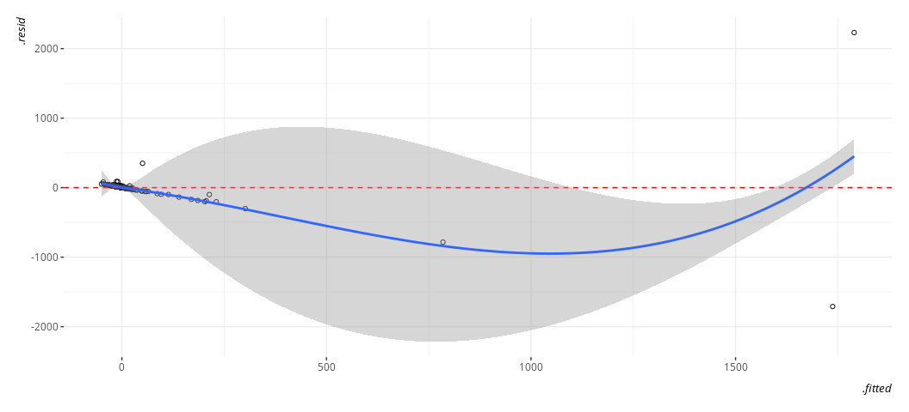
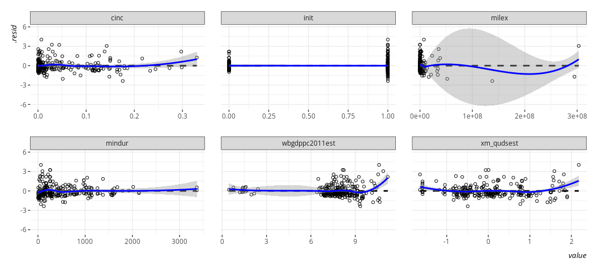
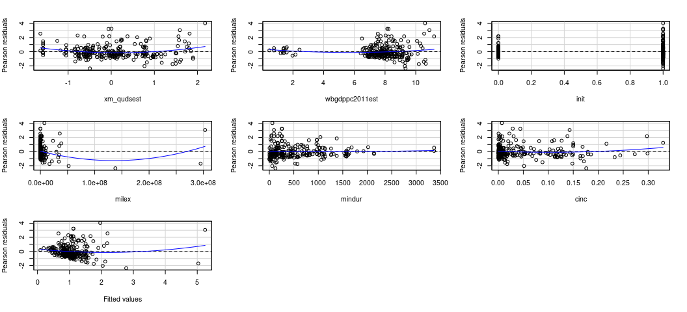
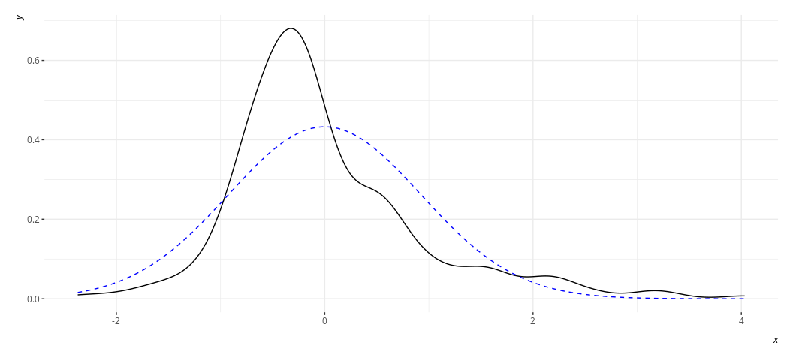

## Elsewhere in My R Cinematic Universe

I will be doing *a lot* of self-plagiarism in this particular script. I
taught earlier versions of to MA students [in this
department](http://eh6105.svmiller.com/lab-scripts/ols-diagnostics.html),
and [to PhD students at my previous
employer](http://post8000.svmiller.com/lab-scripts/ols-diagnostics-lab.html).
This version is a bit more streamlined, but the verbosity of previous
versions of it might be useful to look over for you.

I’ve also written elsewhere about [how cool bootstrapping
is](http://svmiller.com/blog/2020/03/bootstrap-standard-errors-in-r/),
and about assorted [heteroskedasticity robust standard
errors](http://svmiller.com/blog/2024/01/linear-model-diagnostics-by-ir-example/).
The latter of the two has an IR application you might find interesting.
The former is illustrative of what exactly the procedure is doing and
how you could do it yourself. Finally, IRIII.2 students in our
department also get the same [“check this shit out” approach to
`{modelsummary}`](http://ir3-2.svmiller.com/lab-scripts/lab-5/). You all
will be saying hi to my mom in Ohio a lot.

Finally, I want to make sure you all understand what happens in the
linear model when there are log-transformed variables on one or both
sides of the regression equation. A shorthand way of thinking about this
is that [log transformations proportionalize (sic)
changes](http://svmiller.com/blog/2023/01/what-log-variables-do-for-your-ols-model/)
on the untransformed scale. Please read that blog post carefully.

If I link it here, it’s because I’m asking you to look at it. Look at it
as it might offer greater insight into what I’m doing and what I’m
trying to tell you.

## R Packages/Data for This Session

You should’ve already installed the R packages for this lab session.
`{tidyverse}` will be for all things workflow. `{stevedata}` will have
data sets and `{stevemisc}` has some assorted helper functions.
`{lmtest}` has some formal diagnostic tests and convenience functions
for summarizing standard error adjustments done by the `{sandwich}`
package. `{modelsummary}` is awesome and you’ll kind of see what it’s
doing along the way. `{stevethemes}` is optional, but I want to use it.
I’ll offer a nod to the `{car}` package that is optional, but has a
function that does what `linloess_plot()` does (but better).

``` r
library(tidyverse)
#> ── Attaching core tidyverse packages ──────────────────────── tidyverse 2.0.0 ──
#> ✔ dplyr     1.1.1     ✔ readr     2.1.4
#> ✔ forcats   1.0.0     ✔ stringr   1.5.0
#> ✔ ggplot2   3.5.1     ✔ tibble    3.2.1
#> ✔ lubridate 1.9.2     ✔ tidyr     1.3.0
#> ✔ purrr     1.0.1     
#> ── Conflicts ────────────────────────────────────────── tidyverse_conflicts() ──
#> ✖ dplyr::filter() masks stats::filter()
#> ✖ dplyr::lag()    masks stats::lag()
#> ℹ Use the conflicted package (<http://conflicted.r-lib.org/>) to force all conflicts to become errors
library(stevedata)
library(stevemisc)
#> 
#> Attaching package: 'stevemisc'
#> 
#> The following object is masked from 'package:lubridate':
#> 
#>     dst
#> 
#> The following object is masked from 'package:dplyr':
#> 
#>     tbl_df
library(stevethemes) # optional, but I want it...
library(lmtest)
#> Loading required package: zoo
#> 
#> Attaching package: 'zoo'
#> 
#> The following objects are masked from 'package:base':
#> 
#>     as.Date, as.Date.numeric
library(sandwich)
library(modelsummary)
options("modelsummary_factory_default" = "kableExtra")
# ^ this is new. Default is now "tinytable", but much of my code is written
# around `{kableExtra}`. As you develop your skills, you may want to make the
# pivot to `{modelsummary}`'s default.
theme_set(theme_steve()) # optional, but I want it...
```

I want to add here that the output format of this script, if you’re
reading it on my website, is to Markdown. The tables themselves are
HTML, which Markdown can handle quite nicely through Github. However,
there is a lever I need to toggle to disable the table captions from
also becoming standalone paragraphs in Markdown format. I don’t know
what that lever is based on my cornball workflow spinning this `.R` file
to a `.md` file. This is *not* a problem you will have formatting for
LaTeX or HTML, but it will make for a somewhat clumsy viewing experience
on the course website. Again, you’ll be saying hi to my Mom a lot. She
lives in Ohio.

Okay then, let’s get on with the show.

## The Data We’ll Be Using

I’ll be using the `states_war` data set in `{stevedata}`. You can find
more information about this data set by typing this into your RStudio
console.

``` r
?states_war
```

The data offer an opportunity to explore the correlates of performance
in war in a way inspired by [Valentino et
al. (2010)](https://doi.org/10.1017/S0022381609990831). The authors
primarily focus on democracy and how democracies allegedly minimize the
costs of war through assorted means. We’ll do the same here.

Let’s offer a spiritual replication of the second model of Table 1,
focusing on military fatalities (which is the explicit focus of the
Gibler-Miller conflict data we’ll be using). However, we need to create
some variables. First, we’re going to create a kind of “loss exchange
ratio” variable. Formally, this variable is equal to the fatalities
imposed on the enemy combatant(s) divided over the fatalities suffered
by the state, adding 1 to the denominator of that equation to prevent
division by 0. We’ll create this one, and another that’s proportional
(i.e. imposed fatalities over imposed fatalities and state’s own
fatalities). Play with this to your heart’s content.[^1] Second, we’re
going to create an initiator variable (`init`) to isolate those states
that make conscious forays into war. From my experience creating data
for `{peacesciencer}`, it is usually (though not always) the case that
you can discern initiation from whether it’s on the Side A and/or it’s
an original participant. To get to the point, the initiator variable
will be 1 if 1) it’s on Side A (i.e. the side that made the first
incident) *and* it’s an original participant and 2) if it’s *not* an
original participant (often meaning it self-selected into the conflict).
Otherwise, it will be a 0.

``` r
states_war %>%
  mutate(ler = oppfatalmin/(fatalmin + 1),
         lerprop = oppfatalmin/(fatalmin + oppfatalmin),
         init = case_when(
           sidea == 1 & orig == 1 ~ 1,
           orig == 0 ~ 1,
           TRUE ~ 0
  )) -> Data
```

Now, let’s do a kind-of replication of the second model in Table 1,
where we’ll model the first loss exchange ratio variable (LER) we
created (`ler`) as a function of democracy (`xm_qudsest`), GDP per
capita (`wbgdppc2011est`), the initiator variable (`init`), the military
expenditures of the state (`milex`), the duration of the participant’s
stay in conflict (`mindur`), and the familiar estimate of power provided
by CoW’s National Material Capabilities data as the composite index of
national capabilities (`cinc`).

``` r
M1 <- lm(ler ~ xm_qudsest + wbgdppc2011est + init + milex + 
           xm_qudsest + mindur + cinc, 
         Data)
```

Okie doke, let’s see what we got.

``` r
summary(M1)
#> 
#> Call:
#> lm(formula = ler ~ xm_qudsest + wbgdppc2011est + init + milex + 
#>     xm_qudsest + mindur + cinc, data = Data)
#> 
#> Residuals:
#>      Min       1Q   Median       3Q      Max 
#> -1710.43    -4.76     4.30    15.07  2231.12 
#> 
#> Coefficients:
#>                  Estimate Std. Error t value Pr(>|t|)    
#> (Intercept)     3.117e+01  6.224e+01   0.501    0.617    
#> xm_qudsest      9.453e+00  1.655e+01   0.571    0.568    
#> wbgdppc2011est -3.328e+00  7.472e+00  -0.445    0.656    
#> init           -8.634e+00  2.762e+01  -0.313    0.755    
#> milex           5.969e-06  4.493e-07  13.285   <2e-16 ***
#> mindur         -5.570e-03  2.240e-02  -0.249    0.804    
#> cinc           -1.420e+02  2.005e+02  -0.709    0.479    
#> ---
#> Signif. codes:  0 '***' 0.001 '**' 0.01 '*' 0.05 '.' 0.1 ' ' 1
#> 
#> Residual standard error: 192.4 on 245 degrees of freedom
#>   (32 observations deleted due to missingness)
#> Multiple R-squared:  0.4417, Adjusted R-squared:  0.428 
#> F-statistic:  32.3 on 6 and 245 DF,  p-value: < 2.2e-16
```

I can already anticipate some design decisions got us to this point, but
the model suggests only military expenditures matter to understanding
performance in war. Higher values of military expenditures coincide with
higher LER. That tracks, at least.

Now, let’s do some diagnostic testing.

## Linearity

OLS assumes some outcome *y* is a linear function of some right-hand
predictors you include in the model. That is, the estimated value itself
follows that linear formula, and the values themselves are “additive”
(i.e. y = a + b + c). There are various diagnostic tests for the
linearity assumption, including some outright statistical tests that are
either not very good at what they purport to do (Rainbow test), or
awkwardly implemented (Harvey-Collier test).

This is why I encourage you to explore this visually. For one, start
with arguably the most useful OLS diagnostic plot: the fitted-residual
plot. Grab the fitted values from the model and the residuals and create
a scatterplot from them. Then, overlay a LOESS smoother over it to check
for any irregularities. By definition, the “rise over run” line is flat
at 0. The LOESS smoother will communicate whether that’s actually a line
of good fit.

Base R has a function that can do this for you. `plot()` is a default
function in R that, if applied to an object created by `lm()`, will
create a battery of graphs for you. You just want the first one, which
you can specify with the `which` argument. Observe.

``` r
plot(M1, which=1)
```

<!-- -->

Eww, gross. That shouldn’t look like that. Gross.

You may also want to use this an opportunity to learn about the
`augment()` function in `{broom}`. You can use this to extract pertinent
information from the model. First, let’s see what comes out.

``` r
broom::augment(M1)
#> # A tibble: 252 × 14
#>    .rownames     ler xm_qudsest wbgdppc2011est  init milex mindur    cinc
#>    <chr>       <dbl>      <dbl>          <dbl> <dbl> <dbl>  <dbl>   <dbl>
#>  1 1          0.0270   -1.58              7.36     0   672    259 0.00559
#>  2 2         35.7       0.376             8.42     1 36520    259 0.298  
#>  3 3          0.933    -1.58              1.55     1   211    122 0.00353
#>  4 5          0.593    -1.58              7.93     1  1270    527 0.0114 
#>  5 6          1.57     -1.05              6.54     0  6278    527 0.0714 
#>  6 9         76        -0.0626            8.22     1 16462    257 0.0441 
#>  7 10        78         0.00633           8.15     1 12506    257 0.0289 
#>  8 11        15.9       0.226             8.63     1 37508    257 0.127  
#>  9 12         2.09      0.981             8.88     1 38588    257 0.185  
#> 10 13         7.56      0.737             8.98     1 63547    257 0.169  
#> # ℹ 242 more rows
#> # ℹ 6 more variables: .fitted <dbl>, .resid <dbl>, .hat <dbl>, .sigma <dbl>,
#> #   .cooksd <dbl>, .std.resid <dbl>
# ?augment.lm() # for more information
```

We want just the fitted values and the residuals here. The former goes
on the *x*-axis and the latter goes on the *y*-axis for the plot to
follow.

``` r
broom::augment(M1) %>%
  ggplot(.,aes(.fitted, .resid)) +
  geom_point(pch = 21) +
  geom_hline(yintercept = 0, linetype="dashed", color="red") +
  geom_smooth(method = "loess")
#> `geom_smooth()` using formula = 'y ~ x'
```

<!-- -->

Again, gross. Just, eww. Gross.

You should’ve anticipated this in advance if you had some subject domain
expertise. These are large nominal numbers, in war, that could be
decidedly lopsided. For example, here’s the U.S. performance against
Iraq in the Gulf War.

``` r
Data %>% filter(ccode == 2 & micnum == 3957) %>%
  select(micnum:enddate, fatalmin, oppfatalmin, ler)
#> # A tibble: 1 × 7
#>   micnum ccode stdate    enddate  fatalmin oppfatalmin   ler
#>    <dbl> <dbl> <chr>     <chr>       <dbl>       <dbl> <dbl>
#> 1   3957     2 7/24/1990 1/2/1992      153        4137  26.9
```

In other words, the U.S. killed almost 27 Iraqi troops for every
American soldier killed by the Iraqi military. That’s great for
battlefield performance from the perspective of the Department of
Defense, but it’s going to point to some data issues for the analyst.

Indeed, here’s what the dependent variable looks like.

``` r
Data %>%
  ggplot(.,aes(ler)) +
  geom_density()
```

<!-- -->

Here, btw, is what it’s natural logarithm would look like, and what the
proportion variable we created would look like by way of comparison.
Believe me when I say I know what I’m doing with the code here. Trust
me; I’m a doctor.

``` r
Data %>%
  select(ler, lerprop) %>%
  mutate(log_ler = log(ler + 1)) %>%
  gather(var, val) %>%
  ggplot(.,aes(val)) +
  geom_density() +
  facet_wrap(~var, scales='free', nrow= 3)
```

<!-- -->

The linear model does not require normally distributed DVs in order to
extract (reasonably) linear relationships. However, we should’ve not
done this, and we should’ve known in advance that we should not have
done this. What estimate of central tendency could we expect from a
variable that looks like this? So, let’s take a step back and
re-estimate the model two ways. The first will do a +1 and log of the DV
and the second will use the proportion variable we created earlier. This
might be a good time as well to flex with the `update()` function in R.

``` r
Data %>% mutate(ln_ler = log(ler + 1)) -> Data

M2 <- update(M1, ln_ler ~ .)
M3 <- update(M1, lerprop ~ .)
```

Briefly: this is just updating `M1` to change the two DVs. A dot (`.`)
is a kind of placeholder in R to keep “as is.” You can read `~ .` as
saying “regressed on the same stuff as before and keeping the other
arguments we supplied to it before (like the data).” You’ll see me
return to more uses of this with the `wls()` function, which really
wants a data set with no missing values or for you to have supplied
`na.action=na.exclude` as an optional argument in the `lm()` function.
We’ll deal with this detail later.

Now, let’s also flex our muscles with `modelsummary()` to see what these
alternate estimations mean for the inferences we’d like to report.

``` r
modelsummary(list("LER" = M1, 
                  "log(LER + 1)" = M2, 
                  "LER Prop." = M3),
             title = "Hi Mom!",
             stars = TRUE,
             )
```

<table style="width:78%;">
<caption>Hi Mom!</caption>
<colgroup>
<col style="width: 23%" />
<col style="width: 16%" />
<col style="width: 20%" />
<col style="width: 16%" />
</colgroup>
<thead>
<tr class="header">
<th></th>
<th>LER</th>
<th>log(LER + 1)</th>
<th>LER Prop.</th>
</tr>
</thead>
<tbody>
<tr class="odd">
<td>(Intercept)</td>
<td>31.170</td>
<td>0.352</td>
<td>0.364***</td>
</tr>
<tr class="even">
<td></td>
<td>(62.237)</td>
<td>(0.302)</td>
<td>(0.076)</td>
</tr>
<tr class="odd">
<td>xm_qudsest</td>
<td>9.453</td>
<td>0.245**</td>
<td>0.075***</td>
</tr>
<tr class="even">
<td></td>
<td>(16.547)</td>
<td>(0.080)</td>
<td>(0.020)</td>
</tr>
<tr class="odd">
<td>wbgdppc2011est</td>
<td>-3.328</td>
<td>0.083*</td>
<td>0.022*</td>
</tr>
<tr class="even">
<td></td>
<td>(7.472)</td>
<td>(0.036)</td>
<td>(0.009)</td>
</tr>
<tr class="odd">
<td>init</td>
<td>-8.634</td>
<td>0.120</td>
<td>0.050</td>
</tr>
<tr class="even">
<td></td>
<td>(27.620)</td>
<td>(0.134)</td>
<td>(0.034)</td>
</tr>
<tr class="odd">
<td>milex</td>
<td>0.000***</td>
<td>0.000***</td>
<td>0.000</td>
</tr>
<tr class="even">
<td></td>
<td>(0.000)</td>
<td>(0.000)</td>
<td>(0.000)</td>
</tr>
<tr class="odd">
<td>mindur</td>
<td>-0.006</td>
<td>0.000+</td>
<td>0.000</td>
</tr>
<tr class="even">
<td></td>
<td>(0.022)</td>
<td>(0.000)</td>
<td>(0.000)</td>
</tr>
<tr class="odd">
<td>cinc</td>
<td>-142.038</td>
<td>0.722</td>
<td>0.233</td>
</tr>
<tr class="even">
<td></td>
<td>(200.469)</td>
<td>(0.972)</td>
<td>(0.245)</td>
</tr>
<tr class="odd">
<td>Num.Obs.</td>
<td>252</td>
<td>252</td>
<td>246</td>
</tr>
<tr class="even">
<td>R2</td>
<td>0.442</td>
<td>0.239</td>
<td>0.160</td>
</tr>
<tr class="odd">
<td>R2 Adj.</td>
<td>0.428</td>
<td>0.220</td>
<td>0.139</td>
</tr>
<tr class="even">
<td>AIC</td>
<td>3374.9</td>
<td>689.1</td>
<td>-7.8</td>
</tr>
<tr class="odd">
<td>BIC</td>
<td>3403.1</td>
<td>717.3</td>
<td>20.2</td>
</tr>
<tr class="even">
<td>Log.Lik.</td>
<td>-1679.454</td>
<td>-336.530</td>
<td>11.907</td>
</tr>
<tr class="odd">
<td>RMSE</td>
<td>189.72</td>
<td>0.92</td>
<td>0.23</td>
</tr>
</tbody><tfoot>
<tr class="even">
<td colspan="4"><ul>
<li>p &lt; 0.1, * p &lt; 0.05, ** p &lt; 0.01, *** p &lt; 0.001</li>
</ul></td>
</tr>
</tfoot>
&#10;</table>

Hi Mom!

The results here show that it’s not just a simple matter that “different
DVs = different results”. Far from it. Different *reasoned* design
decisions can be the matter of the different results you observe. Using
more reasonable estimates of battlefield performance (either logged loss
exchange ratio or its proportion form) results in models that make more
sense with respect to the underlying phenomenon you should care to
estimate. In our case, it’s the difference of saying whether there is an
effect to note for democracy, GDP per capita, and duration in conflict.

Still, we may want to unpack these models a bit more, much like we did
above. Let’s focus on `M2` for pedagogy’s sake, even though there is
more reason to believe the third model is the less offensive of the
two.[^2] Let’s get our fitted-residual plot.

``` r
broom::augment(M2) %>%
  ggplot(.,aes(.fitted, .resid)) +
  geom_point(pch = 21) +
  geom_hline(yintercept = 0, linetype="dashed", color="red") +
  geom_smooth(method = "loess")
#> `geom_smooth()` using formula = 'y ~ x'
```

<!-- -->

It’s still not ideal. The fitted-residual plot is broadly useful for
other things too, and it’s screaming out loud that I have a
heteroskedasticity problem and some discrete clusters in the DV.
However, it wants to imply some non-linearity as well.

One limitation of the fitted-residual plot, however, is that it won’t
tell you where exactly the issue might be. That’s why I wrote the
`linloess_plot()` in `{stevemisc}`. This plot takes a model object and,
for each right-hand side variable, draws a rise-over-run line of best
fit and the LOESS smoother. Do note this tells you nothing about binary
IVs, but binary IVs aren’t the problem here.

``` r
linloess_plot(M2, pch=21)
#> `geom_smooth()` using formula = 'y ~ x'
#> `geom_smooth()` using formula = 'y ~ x'
```

<!-- -->

`{car}` has this one for you, if you’d like. I’ll concede it works
better than my function at the moment.

``` r
car::residualPlots(M2)
```

<!-- -->

    #>                Test stat Pr(>|Test stat|)    
    #> xm_qudsest        3.3532        0.0009258 ***
    #> wbgdppc2011est    1.7566        0.0802457 .  
    #> init              0.1241        0.9013501    
    #> milex             2.7593        0.0062310 ** 
    #> mindur            0.3153        0.7527727    
    #> cinc              1.3051        0.1931042    
    #> Tukey test        4.7625        1.912e-06 ***
    #> ---
    #> Signif. codes:  0 '***' 0.001 '**' 0.01 '*' 0.05 '.' 0.1 ' ' 1

The thing I like about this kind of plot is that it can point to
multiple problems, though it won’t point you in the direction of any
potential interactions. No matter, here it points to several things that
I may want to ask myself about the data. I’ll go in order I see them.

1.  Does democracy need a square term? It seems like the most autocratic
    and the most democratic perform better than those democracies “in
    the middle”. There’s ample intuition behind this in the democratic
    peace literature, which emphasizes there is a real difference
    between a democracy like Sweden and a fledgling democratizing state
    like mid-1990s Serbia. Intuitively, there is also a qualitative
    difference between a durable autocracy like Iran now versus a
    fledgling autocracy like Iran in the early 1980s. We might be seeing
    that here.

2.  The GDP per capita variable has some clusters. It’s already
    log-transformed, so I’m disinclined to take a log of a log. It’s
    technically benchmarked in 2011 USD, so there’s not an issue of
    nominal or real dollars here. Some states are just poor? In our
    data, I see a jump from 2.428 (Mecklenburg in the First Schleswig
    War) to 5.815 (i.e. Ethiopia in the Second Italian-Ethiopian War). A
    few things might be happening here, and it’s worth noting estimates
    of GDP per capita in the 19th century are *always* tentative and
    prone to some kind of measurement error. It might be ideal to
    proportionalize (sic) these, much like we did with the LER variable.
    However, that would require more information (on my end, behind the
    scenes) than we have here. Perhaps we just make a poverty dummy here
    and leave well enough alone, mostly to see if there is any
    sensitivity to those observations. The line doesn’t look like it’s
    affected.

3.  It might make sense to log-transform military expenditures and
    duration. We’d have to do a +1-and-log to expenditures because there
    are states in war that don’t register in the thousands, per the
    National Material Capabilities data.

With that out of the way, let’s create some variables of interest to us
and re-estimate Model 2.

``` r
Data %>%
  mutate(povdum = ifelse(wbgdppc2011est < 4, 1, 0),
         ln_mindur = log(mindur),
         ln_milex = log(milex + 1)) -> Data


M4 <- lm(ln_ler ~ xm_qudsest + I(xm_qudsest^2) + 
           wbgdppc2011est + ln_milex + ln_mindur + cinc,
         Data)
summary(M4)
#> 
#> Call:
#> lm(formula = ln_ler ~ xm_qudsest + I(xm_qudsest^2) + wbgdppc2011est + 
#>     ln_milex + ln_mindur + cinc, data = Data)
#> 
#> Residuals:
#>     Min      1Q  Median      3Q     Max 
#> -1.8790 -0.5625 -0.1934  0.3217  5.8821 
#> 
#> Coefficients:
#>                  Estimate Std. Error t value Pr(>|t|)    
#> (Intercept)      0.550520   0.383058   1.437  0.15194    
#> xm_qudsest       0.253293   0.081828   3.095  0.00219 ** 
#> I(xm_qudsest^2)  0.284855   0.071087   4.007 8.16e-05 ***
#> wbgdppc2011est   0.076564   0.042133   1.817  0.07040 .  
#> ln_milex        -0.007327   0.021925  -0.334  0.73854    
#> ln_mindur       -0.047257   0.045252  -1.044  0.29737    
#> cinc             1.874209   1.015472   1.846  0.06615 .  
#> ---
#> Signif. codes:  0 '***' 0.001 '**' 0.01 '*' 0.05 '.' 0.1 ' ' 1
#> 
#> Residual standard error: 0.9609 on 245 degrees of freedom
#>   (32 observations deleted due to missingness)
#> Multiple R-squared:  0.1928, Adjusted R-squared:  0.173 
#> F-statistic: 9.753 on 6 and 245 DF,  p-value: 1.232e-09
```

I don’t think it’s going to be an issue, but now I’m curious…

``` r
summary(update(M4, . ~ . -I(xm_qudsest^2), data=subset(Data, povdum == 1)))
#> 
#> Call:
#> lm(formula = ln_ler ~ xm_qudsest + wbgdppc2011est + ln_milex + 
#>     ln_mindur + cinc, data = subset(Data, povdum == 1))
#> 
#> Residuals:
#>      Min       1Q   Median       3Q      Max 
#> -0.30447 -0.12641 -0.03361  0.11062  0.34382 
#> 
#> Coefficients:
#>                Estimate Std. Error t value Pr(>|t|)  
#> (Intercept)     -3.7055     1.9102  -1.940   0.0843 .
#> xm_qudsest      -0.3168     0.1770  -1.789   0.1072  
#> wbgdppc2011est   0.3990     0.3716   1.074   0.3109  
#> ln_milex         0.5037     0.2388   2.109   0.0642 .
#> ln_mindur        0.1930     0.1080   1.787   0.1076  
#> cinc           -70.9074    26.3614  -2.690   0.0248 *
#> ---
#> Signif. codes:  0 '***' 0.001 '**' 0.01 '*' 0.05 '.' 0.1 ' ' 1
#> 
#> Residual standard error: 0.2332 on 9 degrees of freedom
#>   (3 observations deleted due to missingness)
#> Multiple R-squared:  0.628,  Adjusted R-squared:  0.4213 
#> F-statistic: 3.038 on 5 and 9 DF,  p-value: 0.07031
# ^ you can read this `update()` as "update M4, keep DV and bulk of IVs, but
#   remove the square term and change the data to just those in Data where
#   povdum == 1.
```

We don’t have a lot of observations to play with here, and the
observations affected here are decidedly unrepresentative of the overall
population of cases. I wouldn’t sweat this issue, other than perhaps as
a call to restrict any serious analysis to just the 20th century when we
developed better capacity for calculating estimates of economic size and
wealth. All the observations affected here are in the 19th century and,
wouldn’t you know it, all concern the wars of Italian/German
unification.

You’re welcome to play more with the diagnostics of these models, though
it comes with the caveat that you’re making linear assumptions anyway
when you estimate this model. Don’t go chasing waterfalls, only the
rivers and the lakes to which you are used… to. I know you’re going to
have it your way or (more than likely) use no statistical model at all.
Let’s just not move too fast.[^3]

## Independence

The linear model assumes the independence of the model’s errors and that
any pair of errors are going to be uncorrelated with each other. Past
observations (and past errors) should not inform other pairs of errors.
In formal terms, this assumption seems kind of Greek to students. In
practice, think of it this way. A lot of the theoretical intuition
behind OLS is assuming something akin to a simple random sample of the
population. You learned central limit theorem by this point and how you
can simulate that. However, you may have a data set that does not look
like this.

In other words, this assumption is going to be violated like mad in any
design that has a time-series, spatial, or multilevel component. For
students new to this stuff, you should be able to anticipate ahead of
time when your errors are no longer independent of each other.

The implications of non-independent errors—aka “serial correlation” or
“autocorrelation”—are generally more about the variance of the estimator
than the estimator itself. That said, there is reason to believe the
standard errors are wrong and this can have important implications for
statistical inference you’d like to do. No matter, this is a huge
assumption about OLS ans violating it ultimately means OLS loses its
inferential value. The data are no longer randomly sampled in that
sense.

Once you know under what conditions that autocorrelation is going to
happen, you can probably skip this and go right to assorted tricks that
you know will work given the nature of your serial correlation. So, this
is going to be a curious exercise I’m going to have you do here. The
fundamental grouping effect here is primarily “spatial” or
cross-sectional (in that it deals with state groupings) but the primary
tests we teach around this particular assumption are temporal
(i.e. we’re going to prime you in the advanced level to think about time
series and panel models). I just want to reiterate this is something you
should really know in advance about your data, and should assume a
priori about your data. The primary tests of interest are always geared
toward temporal attributes of a data set (which, again, you should know
in advance).

Anywho, if you have a random walk time series, you know those can
typically be first-differenced in order to strip out the source of
autocorrelation. If you have some type of “spatial” serial correlation
(e.g. citizens nested in countries, students nested in schools), you can
employ some kind of fixed effects or random effects to outright model
the source of unit heterogeneity. No matter, the “textbook” tests for
these are typically in the time series case and involve the
Durbin-Watson test or the Breusch-Godfrey test.

Of the two, practitioners I’ve read seem to favor the latter over the
former. The Durbin-Watson test has some pretty strong assumptions and
only looks for a order-1 autocorrelation. No matter, it has some
informational value when you get deeper into the weeks of time series
stuff. Both can be estimated by way of the `{lmtest}` package. Let’s go
back to our model and apply both.

``` r
dwtest(M2)
#> 
#>  Durbin-Watson test
#> 
#> data:  M2
#> DW = 1.7386, p-value = 0.01523
#> alternative hypothesis: true autocorrelation is greater than 0
bgtest(M2)
#> 
#>  Breusch-Godfrey test for serial correlation of order up to 1
#> 
#> data:  M2
#> LM test = 2.3983, df = 1, p-value = 0.1215
```

The “null” hypothesis of both tests is “no autocorrelation.” The
alternative hypothesis is “autocorrelation.” When the *p*-value is
sufficiently small, it indicates a problem. Here, they seem to suggest
some kind of autocorrelation, though the data aren’t exactly a panel or
a time series. Understand, again, these tests are making particular
assumptions about your data that we don’t quite have, and that you
should learn to anticipate these issues without needing a textbook test
to do it for you. I don’t have the time or opportunity to belabor these
issues in detail, but:

1.  When you read quant stuff in IR, especially the kind of stuff you
    might see my name attached to or people I otherwise know, you’ll see
    so-called “clustered” standard errors that are often “spatial” or
    cross-sectional in scope. For example, there is good reason to
    believe the American observations in this model are related to each
    other. British observations should be related to other British
    observations, and so on.

2.  Much like you’d see in a panel model, you might also see so-called
    “fixed effects” applied here. This might take on multiple forms. If
    I had any reason to believe whatsoever that conflicts within
    particular regions are different from each other, I could create a
    series of dummies that say “is this war in Europe or not” or “is
    this in Sub-Saharan Africa or not?” Or, perhaps, I have reason to
    believe there is a clustering of observation by era or moment in
    time. The world war eras are different from the Cold War eras, and
    so on.

I can create these ad hoc with the information available in the data I
have. The `stdate` column has the start of the first event by the
participant in war. I can extract that with `str_sub()` (getting the
last four digits), and convert that to a numeric integer for year. Then,
I can use a `case_when()` call to categorize whether the observation was
before World War I, between and involving both world wars, during the
Cold War, or after the Cold War.

``` r
Data %>%
  mutate(year = str_sub(stdate, -4, -1)) %>%
  mutate(year = as.numeric(year)) %>%
  mutate(period = case_when(
    year <= 1913 ~ "Pre-WW1",
    between(year, 1914, 1945) ~ "WW1 and WW2 Era",
    between(year, 1946, 1990) ~ "Cold War",
    year >= 1991 ~ "Post-Cold War"
  )) %>%
  mutate(period = fct_relevel(period, "Pre-WW1", "WW1 and WW2 Era",
                              "Cold War")) -> Data

M5 <- update(M2, . ~ . + period, Data)
modelsummary(list("log(LER + 1)" = M2, 
                  "w/ Period FE" = M5),
             stars = TRUE,
             title = "Hi Mom!",
)
```

<table style="width:75%;">
<caption>Hi Mom!</caption>
<colgroup>
<col style="width: 33%" />
<col style="width: 20%" />
<col style="width: 20%" />
</colgroup>
<thead>
<tr class="header">
<th></th>
<th>log(LER + 1)</th>
<th>w/ Period FE</th>
</tr>
</thead>
<tbody>
<tr class="odd">
<td>(Intercept)</td>
<td>0.352</td>
<td>0.321</td>
</tr>
<tr class="even">
<td></td>
<td>(0.302)</td>
<td>(0.298)</td>
</tr>
<tr class="odd">
<td>xm_qudsest</td>
<td>0.245**</td>
<td>0.251**</td>
</tr>
<tr class="even">
<td></td>
<td>(0.080)</td>
<td>(0.080)</td>
</tr>
<tr class="odd">
<td>wbgdppc2011est</td>
<td>0.083*</td>
<td>0.109**</td>
</tr>
<tr class="even">
<td></td>
<td>(0.036)</td>
<td>(0.038)</td>
</tr>
<tr class="odd">
<td>init</td>
<td>0.120</td>
<td>0.130</td>
</tr>
<tr class="even">
<td></td>
<td>(0.134)</td>
<td>(0.132)</td>
</tr>
<tr class="odd">
<td>milex</td>
<td>0.000***</td>
<td>0.000***</td>
</tr>
<tr class="even">
<td></td>
<td>(0.000)</td>
<td>(0.000)</td>
</tr>
<tr class="odd">
<td>mindur</td>
<td>0.000+</td>
<td>0.000</td>
</tr>
<tr class="even">
<td></td>
<td>(0.000)</td>
<td>(0.000)</td>
</tr>
<tr class="odd">
<td>cinc</td>
<td>0.722</td>
<td>0.761</td>
</tr>
<tr class="even">
<td></td>
<td>(0.972)</td>
<td>(1.033)</td>
</tr>
<tr class="odd">
<td>periodWW1 and WW2 Era</td>
<td></td>
<td>-0.526**</td>
</tr>
<tr class="even">
<td></td>
<td></td>
<td>(0.165)</td>
</tr>
<tr class="odd">
<td>periodCold War</td>
<td></td>
<td>-0.300+</td>
</tr>
<tr class="even">
<td></td>
<td></td>
<td>(0.165)</td>
</tr>
<tr class="odd">
<td>periodPost-Cold War</td>
<td></td>
<td>-0.070</td>
</tr>
<tr class="even">
<td></td>
<td></td>
<td>(0.232)</td>
</tr>
<tr class="odd">
<td>Num.Obs.</td>
<td>252</td>
<td>252</td>
</tr>
<tr class="even">
<td>R2</td>
<td>0.239</td>
<td>0.274</td>
</tr>
<tr class="odd">
<td>R2 Adj.</td>
<td>0.220</td>
<td>0.247</td>
</tr>
<tr class="even">
<td>AIC</td>
<td>689.1</td>
<td>683.3</td>
</tr>
<tr class="odd">
<td>BIC</td>
<td>717.3</td>
<td>722.2</td>
</tr>
<tr class="even">
<td>Log.Lik.</td>
<td>-336.530</td>
<td>-330.669</td>
</tr>
<tr class="odd">
<td>RMSE</td>
<td>0.92</td>
<td>0.90</td>
</tr>
</tbody><tfoot>
<tr class="even">
<td colspan="3"><ul>
<li>p &lt; 0.1, * p &lt; 0.05, ** p &lt; 0.01, *** p &lt; 0.001</li>
</ul></td>
</tr>
</tfoot>
&#10;</table>

Hi Mom!

Do note fixed effects in this application have a tendency to “demean”
other things in the model, and they have a slightly different
interpretation. For example, though both are “significant” and “look the
same”, the GDP per capita effect is now understood as the effect of
*increasing* GDP per capita *within periods* rather than higher *levels*
of GDP per capita, per se. You do observe some period weirdness.
Compared to the pre-WWI era, logged LER is generally lower in the
interwar years and generally lower in the Cold War, importantly
partialing out the other information in the model. No matter, if you
have autocorrelation, you have to tackle it outright or your OLS model
has no inferential value. The exact fix depends on the exact nature of
the problem, which will definitely depend on you knowing your data well
and what you’re trying to accomplish.

## Normality (of the Errors)

OLS assumes the *errors* are normally distributed. This is often
conflated with an assumption that the outcome variable is normally
distributed. That’s not quite what it is. It does imply that the
conditional distribution of the dependent variable is normal but that is
not equivalent to assuming the marginal distribution of the dependent
variable is normal. At the end of the day, the assumption of normality
is more about the errors than the dependent variable even as the
assumption about the former does strongly imply an assumption about the
latter.

Violating the assumption of a normal distribution of the errors is not
as severe as a violation of some of the other assumptions. The normality
assumption is not necessary for point estimates to be unbiased. In one
prominent textbook on statistical methods, Gelman and Hill (2007, p. 46)
say the normality assumption is not important at all because it has no
strong implication for the regression line. I think this follows because
Gelman and Hill (2007)—later Gelman, Hill, and Vehtari (2020)—are
nowhere near as interested in null hypothesis testing as your typical
social scientist likely is. No matter, violating the assumption of a
normal distribution of errors has some implication for drawing a line
that reasonably approximates individual data points (if not the line
itself, per se). Thus, you may want to check it, certainly if you have a
small data set.

My misgiving with these normality tests is that they *all* suck, even at
what they’re supposed to do. The “textbook” normality tests involve
extracting the residuals from the model and checking if their
distribution is consistent with data that could be generated by a normal
distribution. The two implementations here are typically base R. One is
the Shapiro-Wilk test. The other is the Kolmogorv-Smirnov test. There
are more—like the Anderson-Darling test—which you can also do and is
communicating the same thing. You can explore a few of these in the
`{nortest}` package.

``` r
shapiro.test(resid(M2))
#> 
#>  Shapiro-Wilk normality test
#> 
#> data:  resid(M2)
#> W = 0.90417, p-value = 1.349e-11
ks.test(resid(M2), y=pnorm)
#> 
#>  One-sample Kolmogorov-Smirnov test
#> 
#> data:  resid(M2)
#> D = 0.14934, p-value = 2.626e-05
#> alternative hypothesis: two-sided
```

When *p*-values are sufficiently small, these tests are saying “I can
determine these weren’t generated by some kind of normal distribution.”
My misgiving with these particular tests are multiple. One, you can dupe
them pretty easily with a related distribution that looks like it, but
is not it (e.g. Student’s *t*). For example, let me cheese the Shapiro
test with the Poisson distribution.

``` r
set.seed(8675309)
shapiro.test(lambdas <- rpois(1000, 100))
#> 
#>  Shapiro-Wilk normality test
#> 
#> data:  lambdas <- rpois(1000, 100)
#> W = 0.99791, p-value = 0.2457
# c.f. http://svmiller.com/blog/2023/12/count-models-poisson-negative-binomial/
```

I should not have passed this test, and yet I did. These aren’t normally
distributed. They’re Poisson-distributed, and can’t be reals. Second,
these normality tests are deceptively just a test of sample size. The
more observations you have, the more sensitive the test is to any
observation in the distribution that looks anomalous. Three, textbooks
typically say to use the K-S test if you have a large enough sample
size, but, from my experience, that’s the test that’s most easily duped.

Here’s what I recommend instead, knowing that the normality assumption
of errors is one of the least important assumptions: visualize this
instead. For one, the “textbook” visual diagnostic is the Q-Q plot. This
is actually a default plot in base R for linear models if you know where
to look.

``` r
plot(M2, which=2)
```

<!-- -->

The Q-Q plots the theoretical quantiles of the residuals against the
standardized residuals. Ideally, they all fall on a nice line. Here,
they don’t, suggesting a problem. The negative residuals are more
negative than expected at the tail end of the distribution (which is
almost always unavoidable for real-world data at the tails) but the
higher residuals are more positive than expect for the higher quantiles.
This one is more problematic. You could’ve anticipated this knowing that
there is still a right skew in the DV even after its logarithmic
transformation.

I mentioned in lecture that a better way of gauging just how severe the
issue is will involve generating a density plot of the residuals against
a stylized density plot matching the description of the residuals
(i.e. with a mean of 0 and a standard deviation equal to the standard
deviation of the residuals). It would look something like this for `M2`.

``` r
rd_plot(M2)
```

<!-- -->

Or this for `M3`:

``` r
rd_plot(M3)
```

<!-- -->

In these plots, the black solid line is a density plot of the actual
residuals whereas the blue, dashed line is a density plot of a normal
distribution with a mean of 0 and a standard deviation equal to the
standard deviation of the residuals. The real thing will always be kind
of lumpy in some ways when you’re using actual data. Ask yourself how
bad it is. I’d argue that the distribution is not acceptable in the case
of `M2`, though reasonably approximated in `M3`. Both results are fairly
similar to each other in the stuff we care about.

Your solution to this particular “problem” will depend on what exactly
you’re doing in the first place. The instances in which these plots look
really problematic will be situations like these. Your model may have
relatively few covariates and the covariates you do include are dummy
variables. If you have *so* few observations in the model (i.e. I can
count the number of observations in the model on one or three hands),
any distribution of residuals will look crazy. That’s *probably* not
your case,especially as you’ve thought through the data-generating
process for your dependent variable. It’s more likely the case that you
have a discrete dependent variable and you’re trying to impose OLS on
it. The end result is a subset of residuals that look kind of wonky at
the tails of the distribution. Under those conditions, it makes more
sense to use the right model for the nature of your dependent variable.
If your DV is binary, consider a logistic regression. If you’re trying
to model variation in a 5-item Likert measure, consider the ordinal
logistic regression. If you have a proportion with observations
appearing at the exact limit of the proportion, consider some kind of
beta regression. Are you trying to model a “count” variable (i.e. an
integer), especially one that has some kind of skew? Maybe you want a
Poisson regression, or negative binomial.

Either way, the solution to the non-normality of the residuals involves
outright modeling the kind of data that presents this kind of
non-normality. The assumption, to be clear, is about the *errors*, but
the “problem” and the “solution” often point to what exactly your
dependent variable looks like and whether OLS is the right model for the
job.

## Equal Error Variance (Homoskedasticity)

The final diagnostic test you should run on the OLS model involves
assessing whether the distribution of residuals is constant across the
range of the model. OLS assumes that the variance of the errors is the
same regardless of the particular value of x. This is often called
“homoskedasticity”, mostly in juxtaposition to the violation of this
assumption: “heteroskedasticity.” The change of prefix should be clear
to what is implied here. Heteroskedasticity often means the errors are
typically a function of something else in the model.

The implications for violating the assumption of homoskedasticity are
more nuisance than real problem. Unequal/non-constant variance does not
affect the `XB` part of the regression model, but it does have
implications for predicting individual data points. Here, the
implication is similar to the implication of violating the assumption of
normally distributed errors. However, it’s more severe than the
non-normality of residuals. If null hypothesis significance testing is
part of your research design (and it is), heteroskedasticity means the
standard errors of your estimates are wrong. Worse yet: they’ll be wrong
in ways you don’t know until you start digging further into what your
data and model look like.

There are two ways to assess whether you have a heteroskedasticity
problem in your OLS model. The first is the fitted-residual plot. You
can ask for that again. This time, have your eye draw kind of an upper
bound and lower bound on the *y*-axis (for the residuals). Are those
lines flat/pattern-less? Tell-tale cases of heteroskedasticity like we
discussed in lecture are cases where you have a cone pattern emerge.
Sometimes it’s not as obviously cone-shaped. This one is 100%
cone-shaped.

``` r
plot(M2, which=1)
```

<!-- -->

I think I see a pattern, and certainly the pattern of residuals don’t
look like random buckshot like I’d want. Fortunately, there’s an actual
test you can use that’s available in the `{lmtest}` package. It’s the
Breusch-Pagan test. The null hypothesis of the test is homoskedasticity.
The alternate hypothesis is heteroskedasticity. If the *p*-value is
sufficiently small, you have a problem.

``` r
bptest(M2)
#> 
#>  studentized Breusch-Pagan test
#> 
#> data:  M2
#> BP = 49.163, df = 6, p-value = 6.918e-09
```

Looks like we have a problem, but what’s the solution? Unfortunately,
there’s no quick fix, per se, because any single solution to
heteroskedasticity depends on the exact nature of heteroskedasticity and
whether you know for sure that’s the case. If you have positive reals on
either side of the regression equation, and there’s some kind of
positive skew that’s causing residuals to fan out, you can consider some
kind of logarithmic transformation to impose normality on the
variable(s). Is it an outlier/influence observation that’s causing this?
If so, consider punting out the observation from the model. At least,
consider it. I’ll note that outliers/influence are not sufficient
justification to exclude an observation from a regression model. You
should only do that if it’s *unrepresentative* of the underlying
population, not necessarily because it’s anomalous in the underlying
population.

Therefore, “solutions” to heteroskedasticity are often just alternative
specifications of the model and seeing if the core results from the base
model change in any meaningful way. There are a few paths you may want
to explore.

The basic “textbook” approach is weighted least squares. I mentioned in
lecture that this approach is kind of convoluted. It’s not complicated.
It’s just convoluted. The procedure here starts with running the
offending model (which we already did; it’s `M2`). Then, grab the
residuals and fitted values from the model. Next, regress the absolute
value of the residuals on the fitted values of the original model.
Afterward, extract those fitted values, square them and divide 1 over
those values. Finally, apply those as weights in the linear model once
more for a re-estimation.

An older version of this script showed you how you can do it yourself.
Just have `{stevemisc}` do it for you with the `wls()` function. Just be
mindful that the `wls()` function isn’t keen on data frames where
observations have NAs. If you have those, and just want to ignore it and
proceed, you may want to include an `na.action = na.exclude` as an
optional argument in `lm()`. We can cheese that here with an `update()`.

``` r
modelsummary(list("log(LER)" = M2,
                  "WLS" = wls(update(M2, na.action=na.exclude))),
             stars = TRUE,
             title = "Hi Mom!",
             gof_map = c("nobs", "adj.r.squared"))
```

<table style="width:54%;">
<caption>Hi Mom!</caption>
<colgroup>
<col style="width: 23%" />
<col style="width: 15%" />
<col style="width: 15%" />
</colgroup>
<thead>
<tr class="header">
<th></th>
<th>log(LER)</th>
<th>WLS</th>
</tr>
</thead>
<tbody>
<tr class="odd">
<td>(Intercept)</td>
<td>0.352</td>
<td>0.386**</td>
</tr>
<tr class="even">
<td></td>
<td>(0.302)</td>
<td>(0.139)</td>
</tr>
<tr class="odd">
<td>xm_qudsest</td>
<td>0.245**</td>
<td>0.103</td>
</tr>
<tr class="even">
<td></td>
<td>(0.080)</td>
<td>(0.065)</td>
</tr>
<tr class="odd">
<td>wbgdppc2011est</td>
<td>0.083*</td>
<td>0.068***</td>
</tr>
<tr class="even">
<td></td>
<td>(0.036)</td>
<td>(0.018)</td>
</tr>
<tr class="odd">
<td>init</td>
<td>0.120</td>
<td>0.182+</td>
</tr>
<tr class="even">
<td></td>
<td>(0.134)</td>
<td>(0.093)</td>
</tr>
<tr class="odd">
<td>milex</td>
<td>0.000***</td>
<td>0.000</td>
</tr>
<tr class="even">
<td></td>
<td>(0.000)</td>
<td>(0.000)</td>
</tr>
<tr class="odd">
<td>mindur</td>
<td>0.000+</td>
<td>0.000</td>
</tr>
<tr class="even">
<td></td>
<td>(0.000)</td>
<td>(0.000)</td>
</tr>
<tr class="odd">
<td>cinc</td>
<td>0.722</td>
<td>0.883</td>
</tr>
<tr class="even">
<td></td>
<td>(0.972)</td>
<td>(0.919)</td>
</tr>
<tr class="odd">
<td>Num.Obs.</td>
<td>252</td>
<td>252</td>
</tr>
<tr class="even">
<td>R2 Adj.</td>
<td>0.220</td>
<td>0.117</td>
</tr>
</tbody><tfoot>
<tr class="odd">
<td colspan="3"><ul>
<li>p &lt; 0.1, * p &lt; 0.05, ** p &lt; 0.01, *** p &lt; 0.001</li>
</ul></td>
</tr>
</tfoot>
&#10;</table>

Hi Mom!

Re-estimating the model by way of weighted least squares reveals some
interesting changes, leaving open the possibility that any inference
we’d like to report for the democracy variable, the initiator variable,
the military expenditure variable, and the duration variable are
functions of the heteroskedasticity and whether we dealt with it in the
“textbook” way.

There is an entire branch of econometrics that deals with what to do
about your test statistics if you have this problem, and they all seem
to have a unifying aversion to the weighted least squares approach.
Their point of contention is typically that if the implications of
heteroskedasticity is the line is fine but the standard errors are
wrong, then the “fix” offered by a textbook is almost guaranteed to
redraw lines. They instead offer a battery of methods to recalibrate
standard errors based on information from the variance-covariance matrix
to adjust for this. This would make the standard errors “robust.”

I mention above that I have an entire blog post that discusses some of
these things in more detail than I will offer here. It’s a lament that
it’s never just “do this and you’re done” thing; it’s always a “fuck
around and see what you find” thing. However, the “classic” standard
error corrections are so-called “Huber-White” standard errors and are
often known by the acronym “HC0”. The suggested defaults you often see
in software for “robust” standard errors are type “HC3”, based on this
offering from [Mackinnon and White
(1985)](https://www.sciencedirect.com/science/article/abs/pii/0304407685901587).
I can’t really say this with 100% certainty (because you won’t know
until you can see it for yourself) but it’s often the case that older
analyses that report “robust” standard errors are Huber-White (“HCO”)
standard errors and “heteroskedasticity-robust” standard errors in newer
analyses are HC3 standard errors. That’s at least a heuristic I’ve
picked up from my experience.

There’s another approach, which is 100% I’d do if I were presented the
opportunity. I’d bootstrap this motherfucker. You likewise have several
options here. I maintain it’s fun/advisable to do the bootstrap yourself
rather than have some software bundle do it for you, and I have guides
on previous course websites and on my blog that show you how to do this.
However, we’ll keep it simple and focus on some convenience functions
because they also illustrate the myriad options you have. Let’s focus on
just two. The first, the simple bootstrap pioneered by Bradley Efron,
resamples *with replacement* from the data and re-runs the model some
number of times. In expectation, the mean coefficients of these
re-estimated models converge on what it is in the offending model (which
you would know from central limit theorem). However, the *standard
deviation of the coefficients is your bootstrapped standard error*.
Another popular approach is a bootstrapped model from the residuals.
Sometimes called a “Bayesian” or “fractional” bootstrap, this approach
had its hot girl summer on Twitter two or three years ago and leaves the
regressors at their fixed values, resamples the residuals, and adds them
to the response variable.

If you wanted to do any one of these in isolation, you’d want to
leverage the `coeftest()` function in `{lmtest}` with the assorted
mechanisms for futzing with the variance-covariance matrix (or other
parts of the model) in the `{sandwich}` package. For example, what
follows below is going to do the simple bootstrap 1,000 times on `M2`.
You can set a reproducible seed with the `set.seed()` function for max
reproducibility, if you’d like.

``` r
# set.seed(8675309)
coeftest(M2, vcov = sandwich::vcovBS(M2, R = 1000))
#> 
#> t test of coefficients:
#> 
#>                   Estimate  Std. Error t value Pr(>|t|)   
#> (Intercept)     3.5205e-01  2.1723e-01  1.6206 0.106379   
#> xm_qudsest      2.4458e-01  9.7202e-02  2.5162 0.012502 * 
#> wbgdppc2011est  8.3176e-02  3.0848e-02  2.6963 0.007498 **
#> init            1.2043e-01  1.1083e-01  1.0867 0.278242   
#> milex           1.1194e-08  7.7065e-09  1.4525 0.147629   
#> mindur         -1.8977e-04  8.9051e-05 -2.1311 0.034078 * 
#> cinc            7.2242e-01  1.0887e+00  0.6636 0.507589   
#> ---
#> Signif. codes:  0 '***' 0.001 '**' 0.01 '*' 0.05 '.' 0.1 ' ' 1
coeftest(M2) # compare to what M2 actually is.
#> 
#> t test of coefficients:
#> 
#>                   Estimate  Std. Error t value  Pr(>|t|)    
#> (Intercept)     3.5205e-01  3.0177e-01  1.1666  0.244487    
#> xm_qudsest      2.4458e-01  8.0232e-02  3.0484  0.002553 ** 
#> wbgdppc2011est  8.3176e-02  3.6230e-02  2.2958  0.022533 *  
#> init            1.2043e-01  1.3392e-01  0.8993  0.369378    
#> milex           1.1194e-08  2.1784e-09  5.1387 5.652e-07 ***
#> mindur         -1.8977e-04  1.0863e-04 -1.7470  0.081893 .  
#> cinc            7.2242e-01  9.7200e-01  0.7432  0.458055    
#> ---
#> Signif. codes:  0 '***' 0.001 '**' 0.01 '*' 0.05 '.' 0.1 ' ' 1
```

Take a moment to appreciate that you just ran 1,000 regressions on a
1,000 data replicates in a matter of seconds. Thirty years ago, that
would’ve taken a weekend at a supercomputer at some American university
with a billion dollar endowment. Neat, huh?

Anywho, the results of the simple bootstrap suggest a precise effect of
military expenditures that would not be discerned in the model with
heteroskedastic standard errors. The other significant coefficients are
still significant, but less precise.

FYI, `{modelsummary}` appears to be able to do this as well. In this
function, notice what the `vcov` argument is doing and the order in
which it is doing it.

``` r
modelsummary(list("log(LER)" = M2,
                  "WLS" = wls(update(M2, na.action=na.exclude)),
                  "HC0" = M2,
                  "HC3" = M2,
                  "Bootstrap" = M2,
                  "Resid. Boot." = M2),
             vcov = list(vcovHC(M2,type='const'),
                         vcovHC(wls(update(M2, na.action=na.exclude))),
                         vcovHC(M2,type='HC0'),
                         vcovHC(M2, type='HC3'),
                         vcovBS(M2),
                         vcovBS(M2, type='residual')),
             gof_map = c("nobs", "adj.r.squared"),
             title = "Hi Mom! Last time, I promise.",
             stars = TRUE)
```

<table style="width:95%;">
<caption>Hi Mom! Last time, I promise.</caption>
<colgroup>
<col style="width: 18%" />
<col style="width: 12%" />
<col style="width: 12%" />
<col style="width: 10%" />
<col style="width: 10%" />
<col style="width: 13%" />
<col style="width: 16%" />
</colgroup>
<thead>
<tr class="header">
<th></th>
<th>log(LER)</th>
<th>WLS</th>
<th>HC0</th>
<th>HC3</th>
<th>Bootstrap</th>
<th>Resid. Boot.</th>
</tr>
</thead>
<tbody>
<tr class="odd">
<td>(Intercept)</td>
<td>0.352</td>
<td>0.386**</td>
<td>0.352+</td>
<td>0.352</td>
<td>0.352+</td>
<td>0.352</td>
</tr>
<tr class="even">
<td></td>
<td>(0.302)</td>
<td>(0.131)</td>
<td>(0.207)</td>
<td>(0.221)</td>
<td>(0.206)</td>
<td>(0.328)</td>
</tr>
<tr class="odd">
<td>xm_qudsest</td>
<td>0.245**</td>
<td>0.103</td>
<td>0.245*</td>
<td>0.245*</td>
<td>0.245**</td>
<td>0.245**</td>
</tr>
<tr class="even">
<td></td>
<td>(0.080)</td>
<td>(0.082)</td>
<td>(0.095)</td>
<td>(0.099)</td>
<td>(0.088)</td>
<td>(0.077)</td>
</tr>
<tr class="odd">
<td>wbgdppc2011est</td>
<td>0.083*</td>
<td>0.068***</td>
<td>0.083**</td>
<td>0.083**</td>
<td>0.083**</td>
<td>0.083*</td>
</tr>
<tr class="even">
<td></td>
<td>(0.036)</td>
<td>(0.018)</td>
<td>(0.030)</td>
<td>(0.032)</td>
<td>(0.030)</td>
<td>(0.038)</td>
</tr>
<tr class="odd">
<td>init</td>
<td>0.120</td>
<td>0.182*</td>
<td>0.120</td>
<td>0.120</td>
<td>0.120</td>
<td>0.120</td>
</tr>
<tr class="even">
<td></td>
<td>(0.134)</td>
<td>(0.090)</td>
<td>(0.110)</td>
<td>(0.114)</td>
<td>(0.114)</td>
<td>(0.131)</td>
</tr>
<tr class="odd">
<td>milex</td>
<td>0.000***</td>
<td>0.000</td>
<td>0.000*</td>
<td>0.000</td>
<td>0.000</td>
<td>0.000***</td>
</tr>
<tr class="even">
<td></td>
<td>(0.000)</td>
<td>(0.000)</td>
<td>(0.000)</td>
<td>(0.000)</td>
<td>(0.000)</td>
<td>(0.000)</td>
</tr>
<tr class="odd">
<td>mindur</td>
<td>0.000+</td>
<td>0.000+</td>
<td>0.000*</td>
<td>0.000*</td>
<td>0.000*</td>
<td>0.000+</td>
</tr>
<tr class="even">
<td></td>
<td>(0.000)</td>
<td>(0.000)</td>
<td>(0.000)</td>
<td>(0.000)</td>
<td>(0.000)</td>
<td>(0.000)</td>
</tr>
<tr class="odd">
<td>cinc</td>
<td>0.722</td>
<td>0.883</td>
<td>0.722</td>
<td>0.722</td>
<td>0.722</td>
<td>0.722</td>
</tr>
<tr class="even">
<td></td>
<td>(0.972)</td>
<td>(1.032)</td>
<td>(1.077)</td>
<td>(1.153)</td>
<td>(1.193)</td>
<td>(0.974)</td>
</tr>
<tr class="odd">
<td>Num.Obs.</td>
<td>252</td>
<td>252</td>
<td>252</td>
<td>252</td>
<td>252</td>
<td>252</td>
</tr>
<tr class="even">
<td>R2 Adj.</td>
<td>0.220</td>
<td>0.117</td>
<td>0.220</td>
<td>0.220</td>
<td>0.220</td>
<td>0.220</td>
</tr>
</tbody><tfoot>
<tr class="odd">
<td colspan="7"><ul>
<li>p &lt; 0.1, * p &lt; 0.05, ** p &lt; 0.01, *** p &lt; 0.001</li>
</ul></td>
</tr>
</tfoot>
&#10;</table>

Hi Mom! Last time, I promise.

The summary here suggests that we have heteroskedastic errors, and what
we elect to do about it—or even if we elect to do anything about it—have
implications for the inferences we’d like to report. No matter, the
“solution” to heteroskedastic standard errors are more “solutions”,
multiple, and involve doing robustness tests on your original model to
see how sensitive the major inferential takeaways are to these
alternative estimation procedures.

[^1]: The fatalities offered by Gibler and Miller (2023, Forthcoming)
    have high and low estimates. We’ll focus on just the low estimates
    here.

[^2]: We are also going to leave aside an important conversation to have
    about just how advisable a +1-and-log really is for isolating
    coefficients of interest and whether this should be a linear model
    at all. The linear model is probably “good enough”, and certainly
    for this purpose.

[^3]: “Creep” is 100% the best single off that record, but didn’t have
    the Windows 95-era CGI. You know I’m right. Stay out of my mentions.
